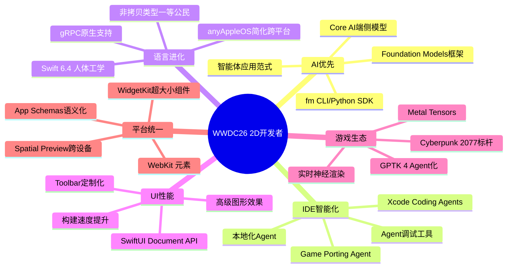

# Apple WWDC 2026 — 2D 领域开发者全方位洞察报告

> **分析范围**: 面向 2D 应用/游戏开发者，涵盖 IDE、语言、UI 框架、AI/ML、图形、平台服务、Web 技术等领域。
> **分析维度**: ① 开发者感知（提供了什么） ② 技术原理（怎么做到的）。
> **数据来源**: Apple Developer 官方 WWDC26 页面、What's New 页面、100+ Session 列表、9to5Mac 等媒体报道。
> **分析日期**: 2026-06-12

---

## 目录

1. [IDE & 开发工具链](#1-ide--开发工具链)
2. [语言：Swift 6.4](#2-语言swift-64)
3. [UI 框架：SwiftUI / UIKit / WidgetKit](#3-ui-框架swiftui--uikit--widgetkit)
4. [AI / ML：Foundation Models 框架与 Core AI](#4-ai--mlfoundation-models-框架与-core-ai)
5. [图形与游戏：Metal & Game Porting Toolkit 4](#5-图形与游戏metal--game-porting-toolkit-4)
6. [空间计算：visionOS 27](#6-空间计算visionos-27)
7. [平台服务：App Intents / Siri / Shortcuts / HealthKit](#7-平台服务app-intents--siri--shortcuts--healthkit)
8. [Web 技术：WebKit / Safari 27](#8-web-技术webkit--safari-27)
9. [测试、性能与 CI/CD](#9-测试性能与-cicd)
10. [总结与趋势研判](#10-总结与趋势研判)

---

## 1. IDE & 开发工具链

### Xcode 27

| 维度 | 内容 |
|------|------|
| **开发者感知** | **Coding Agents（编码智能体）**：Xcode 27 在编码助手中引入多阶段智能体——初始原型生成 → 实现细节填充 → 最终体验打磨。智能体在后台处理重复/机械任务，开发者聚焦架构、设计和关键决策。支持**所选模型**驱动。**SwiftUI Agent Skills**：内置 SwiftUI 最佳实践技能包，自动引导使用新 API。**本地化 Agent**：一键添加语言、更新 String Catalog、翻译字符串，支持复数变体审查。**Device Hub**：统一管理真机与模拟器，快速诊断/复现问题、检查设备状态。**Xcode Cloud** 增强自动化构建/交付。 |
| **技术原理** | Agent 框架基于 Xcode 的 Source Editor Extension 与 SourceKit-LSP 深度集成，通过 **模型无关的 Coding Agent 协议**支持 Apple 模型或第三方 LLM（Claude、Gemini 等）。Agent 拥有代码索引上下文 + 项目构建图（Build Graph）感知，做到增量式代码生成而非全文重写。本地化 Agent 利用 String Catalog 的 XLIFF 标准化格式 + 语言风格指南注入 prompt 约束。Device Hub 基于 CoreDevice 框架统一真机与 CoreSimulator 的通信通道。 |

### Game Porting Toolkit 4

| 维度 | 内容 |
|------|------|
| **开发者感知** | 开源**智能体编码技能**覆盖移植全流程（评估→编译→调试→优化），指导将 Windows 游戏移植到 Metal/Apple 平台。搭配 Cyberpunk 2077 Mac 版案例分享。 |
| **技术原理** | 基于 Metal Shader Converter 的 IR 翻译层（DXIR → Metal IR），结合 Wine/Crossover 兼容层的评估模式，GPTK 4 将 Agent 接入移植流程的每个阶段——Shader 分析、API 映射建议、性能反模式检测——全部通过开源 Skill 包分发。 |

---

## 2. 语言：Swift 6.4

| 维度 | 内容 |
|------|------|
| **开发者感知** | ① **`anyAppleOS` 可用性语法**：简化跨平台条件编译（告别 `#available(iOS 27, macOS 27, ...)` 冗长列表）。② **`@diagnose` 属性**：细粒度控制警告（类似 Rust `#[allow]` 但更结构化）。③ **`defer` 支持异步**：清理代码在函数返回/抛出时都能执行。④ **非拷贝类型迭代协议**：`Span`、`InlineArray` 等类型直接支持 `for-in`，零拷贝遍历。⑤ **Foundation 性能提升**：URL 解析快 4×。⑥ **Swift Testing ⇄ XCTest 互操作**：渐进式迁移。⑦ **gRPC 一等公民支持**：直接用 Swift 构建实时服务端/客户端。 |
| **技术原理** | `anyAppleOS` 是编译器内置宏，编译期展开为所有 Apple 平台 OS 版本枚举。`@diagnose` 基于 Swift 诊断引擎的 category-based 抑制机制。异步 `defer` 利用 Swift Concurrency 的 `withUnsafeCurrentTask` + 结构化并发 Job 生命周期，在函数退出路径（正常 return 和 throw）均注入清理闭包。非拷贝迭代协议引入 `NoncopyableSequence` 协议族，编译器通过所有权（Ownership）分析保证 `for-in` 循环体中不触发隐式 copy。gRPC 支持基于 SwiftNIO + Swift Protobuf 的 `grpc-swift` 正式进入 Apple 官方工具链。 |

---

## 3. UI 框架：SwiftUI / UIKit / WidgetKit

### SwiftUI

| 维度 | 内容 |
|------|------|
| **开发者感知** | ① **Toolbar 定制**：`visibilityPriority` 按空间保留关键项、`toolbarOverflowMenu` 低优先级项自动折叠、`topBarPinnedTrailing` 固定尾随操作（如分享按钮）、`toolbarMinimizeBehavior` 滚动时自动折叠导航栏。② **Document API 大升级**：`WritableDocument` / `ReadableDocument` 协议提供异步增量磁盘 I/O + `Progress` 进度报告，`DocumentCreationSource` 声明多来源新建文档按钮。③ **拖放增强**：跨 List/Grid 重排内容。④ **高级图形效果**：`Compose advanced graphics effects` 新 API 提供层级图形合成能力。⑤ **懒加载子视图**：预取内容实现平滑滚动。⑥ **构建速度与数据流性能显著提升**。⑦ **统一平台材质/排版/导航栏**（iPhone Mirroring 适配）。 |
| **技术原理** | Toolbar API 基于 `ToolbarContentBuilder` result builder + `CustomizableToolbarContent` 协议，配合 SwiftUI 布局引擎中的 `ViewThatFits` 自适应策略。Document API 利用 Swift Concurrency 的 `AsyncSequence` 实现流式磁盘读写，底层对接 `Foundation.FileHandle` 的非阻塞 I/O。图形效果基于 Core Animation 的 `CALayer` 合成管线 + Metal 自定义 Shader 注入点。懒加载预取基于 `LazyVStack`/`LazyHStack` 的 `PrefetchingDataSource` 协议，利用 UICollectionView 的 prefetch API 在滚动方向预测性加载。 |

### WidgetKit

| 维度 | 内容 |
|------|------|
| **开发者感知** | **超大小组件**（extra-large widget）支持 Home Screen / Today View；**App Intents 自定义**与**动态样式**能力。 |
| **技术原理** | 新增 `WidgetFamily.extraLarge` 枚举，对应更高网格单元。App Intents 参数化机制使 Widget 可在配置时通过 `IntentTimelineProvider` 注入参数，底层 Timeline 刷新策略不变（budgeted reloads）。 |

---

## 4. AI / ML：Foundation Models 框架与 Core AI

这是 WWDC26 最核心的战略级发布，对 2D 开发者影响深远。

### Foundation Models 框架

| 维度 | 内容 |
|------|------|
| **开发者感知** | ① **原生 Swift API 调用 Apple 端侧大模型**（与驱动 Apple Intelligence 同款）。② **任意模型接入**：Apple Foundation Models、Claude、Gemini 或任何遵守 `LanguageModel` 协议的自定义模型。③ **多模态 prompts**：图片+文本混合输入，模型可推理视觉内容。④ **工具调用**：Vision 框架工具（OCR、条码识别等）可被模型直接调用，全程端侧执行。⑤ **Dynamic Profiles**：会话中动态切换模型、工具和指令，自适应交互行为。⑥ **Agentic 体验**：构建智能体 AI 应用（工具链式调用、多步推理、状态管理）。⑦ **小型开发者免费额度**：App Store Small Business Program + 累计下载 <200 万 → Apple Foundation Model on Private Cloud Compute 免云 API 费用。⑧ **`fm` CLI 和 Python SDK**：脚本化 AI 工作流（非 Swift 技术栈也可用）。⑨ **Instruments 支持 Agent 调试与 Profile**。 |
| **技术原理** | `LanguageModel` 协议定义统一抽象层——`generate(prompt:tools:profile:)` async 接口，协议 witness 可桥接到本地 CoreML 模型、PCC (Private Cloud Compute) 端点或第三方 LLM API。多模态 prompts 通过 `VisionToolbox` 的 `CVPixelBuffer` → token embedding 通道注入视觉编码器。Dynamic Profiles 基于 `ModelProfile` 结构体运行时替换（类似 LLM 的 system prompt + tool schema 动态切换），不中断 `ModelSession`。端侧模型执行在 Apple Neural Engine (ANE) 上，PCC 路径通过端到端加密的 Apple Silicon 服务器集群。Agent 的 tool-use loop 由框架内置的 `ToolUsePlanner` 管理，支持 ReAct / Plan-Execute 范式。 |

### Core AI

| 维度 | 内容 |
|------|------|
| **开发者感知** | 端侧 AI 模型集成框架：将任何 CoreML 模型以统一 API 纳入 app。与 Foundation Models 框架互操作。 |
| **技术原理** | Core AI 是 CoreML 的上层抽象，提供 `AIModel` 协议 + 统一推理引擎，自动选择 ANE/GPU/CPU 后端，支持模型加密和 OTA 热更新。 |

### MLX（Mac 端侧）

| 维度 | 内容 |
|------|------|
| **开发者感知** | Mac 上运行本地 Agentic AI，分布式推理与训练。 |
| **技术原理** | MLX 基于统一内存架构（Apple Silicon 的 CPU/GPU 共享内存池），分布式通过 MPI-over-Thunderbolt / Ethernet 的 NCCL 式通信原语。 |

### Evaluations 框架

| 维度 | 内容 |
|------|------|
| **开发者感知** | 验证 AI 功能在动态条件下的行为正确性，超越单元测试的单点验证。 |
| **技术原理** | 基于属性测试（property-based testing）思想，自动生成 prompt 变体 / 输入扰动 / 工具组合，对比预期行为与模型实际输出，产出评估报告。 |

---

## 5. 图形与游戏：Metal & Game Porting Toolkit 4

### Metal

| 维度 | 内容 |
|------|------|
| **开发者感知** | ① **实时神经渲染管线**：将 ML 推理嵌入渲染流程（超分、降噪、材质生成）。② **Metal Tensors**：自定义 ML 算子优化（针对 GPU 张量运算）。③ **Metal 游戏性能分析工具增强**。 |
| **技术原理** | 神经渲染通过 `MPSNNGraph` 将 CoreML 模型作为 Metal RenderPass 的一个 sub-pass 执行，利用 tile-based deferred rendering 的 on-chip memory 避免 GPU↔CPU 来回拷贝。Metal Tensors 扩展 MPS (Metal Performance Shaders) 框架，支持 `MPSNDArray` 上的自定义运算，可直接接入 PyTorch/TensorFlow 导出的 CoreML 模型图。 |

### Game Porting Toolkit 4

| 维度 | 内容 |
|------|------|
| **开发者感知** | 开箱即用的移植工作流，agent 辅助 Shader 转换、API 映射、性能调优。Cyberpunk 2077 已登陆 Mac。 |
| **技术原理** | 见 §1 中的 GPTK 4 部分。底层基于 DXIR（DirectX Intermediate Representation）→ Metal IR 的转译器 + Wine/Crossover 运行时，Agent 通过静态分析着色器字节码提供移植建议。 |

---

## 6. 空间计算：visionOS 27

虽然 plan 主题是 2D 领域，但 visionOS 的几个新能力对 2D 应用开发有直接影响：

| 维度 | 内容 |
|------|------|
| **开发者感知** | ① **Spatial Preview 框架**：Mac 应用可在 Mac 上预览/编辑空间内容 → 无线传输到 Vision Pro 查看，SharePlay 协作。② **Reality Composer Pro 3**：更快的空间场景迭代。③ **RealityKit 增强**：物体追踪增强、USDKit（OpenUSD 原生支持）。④ **Foveated Streaming**（注视点流式传输）：将沉浸式内容按注视区域动态加载。⑤ **Quick Look 空间预览**：3D/USD 内容在 visionOS 上直接查看。 |
| **技术原理** | Spatial Preview 基于 AirPlay 的 low-latency 无线传输 + Quick Look 的 `QLPreviewController` 空间扩展，USD 实时编辑通过 `USDKit` 的 stage 层操作同步。Foveated Streaming 利用 Vision Pro 眼动追踪 → 仅以全分辨率渲染注视点周围的瓦片（瓦片化渲染），其余区域降分辨率，类似 DVS (Dynamically Variable Shading)。 |

---

## 7. 平台服务：App Intents / Siri / Shortcuts / HealthKit

### App Intents & Siri AI

| 维度 | 内容 |
|------|------|
| **开发者感知** | ① **App Schemas**（应用模式）：用声明式 Schema 描述应用能力，Siri 可深度理解并组合多 App 操作。② **高级 App Intents**：意图链式调用、复杂参数传递、Siri 上下文感知。③ **AppIntentsTesting**：意图测试框架。④ **Call Context**（通话上下文）：Siri AI 可理解通话内容并提供上下文建议。⑤ **Siri 独立 App** + 可定制语音。⑥ **视觉智能集成**：App 接入 Visual Intelligence。 |
| **技术原理** | App Schemas 是 Semantic Index 的进化——App 的 `AppSchema` 协议以结构化实体-关系-动作三元组描述功能，Siri 的推理引擎（基于 Apple Foundation Model + Google Gemini 协作）将其解析为可执行的意图链。AppIntentsTesting 基于 `XCTest` 扩展，mock Siri 请求并断言意图解析、参数提取、执行结果的正确性。Call Context 利用设备端语音识别 + LLM 提取通话关键信息（如预约时间、确认码），隐私保护通过 Neural Engine 本地处理。 |

### Shortcuts

| 维度 | 内容 |
|------|------|
| **开发者感知** | 增强的快捷指令，与 App Intents + Siri AI 深度联动。 |
| **技术原理** | Shortcuts 引擎升级为 App Intents 的 consumer，支持复杂条件分支和 AI 驱动的动态参数填充。 |

### HealthKit

| 维度 | 内容 |
|------|------|
| **开发者感知** | 运动区间（Workout Zones）集成：心率区间、功率区间等训练数据。 |
| **技术原理** | 基于 `HKWorkoutZone` 新类型，实时心率/功率 → 区间计算 → `HKWorkoutBuilder` 注入。 |

### 其他服务

- **StoreKit**：游戏内购 + 后台资产下载（Background Assets）。
- **MusicKit**：集成 Apple Music 曲库。
- **Music Understanding 框架**：端侧音频六维分析。
- **Now Playing 框架**：播放信息统一呈现（锁屏、控制中心、灵动岛、CarPlay）。

---

## 8. Web 技术：WebKit / Safari 27

| 维度 | 内容 |
|------|------|
| **开发者感知** | ① **1000+ 浏览器引擎改进**。② **Grid Lanes**：CSS Grid 新能力、**Customizable Select**：表单控件增强。③ **HTML `<model>` 元素**：原生 3D 模型嵌入网页。④ **Immersive Environments**：网页沉浸式空间（visionOS）。⑤ **Xcode Cloud 构建测试 Safari 扩展**：无需 Mac。⑥ **AI 标签整理** + 网站变更追踪。 |
| **技术原理** | `<model>` 元素基于 WebGPU 渲染管线加载 USD/USDZ，底层使用 `webkit.org` 的 Model API。Immersive Environments 通过 WebXR 的新 `immersive-web` 模式在 visionOS Safari 中创建全沉浸 3D 网页。Xcode Cloud 的 Safari Extension 构建基于 `safari-web-extension-converter` + CI 自动化签名。 |

---

## 9. 测试、性能与 CI/CD

| 领域 | 开发者感知 | 技术原理 |
|------|-----------|----------|
| **Swift Testing** | XCTest 互操作，渐进式迁移 | `Testing` 模块新增 `XCTest+Testing` bridge 扩展 |
| **AppIntentsTesting** | App Intents 专项测试框架 | 见 §7 |
| **MetricKit 新版本** | 性能指标收集与诊断 | 扩展 MetricKit payload 覆盖更多系统组件 |
| **Instruments** | Agent 行为 Profile / 响应性分析 | 新增 Agent Trace 模板，记录模型调用、工具执行、会话状态时间线 |
| **Xcode Cloud** | 构建/交付/自动化增强 | 改进并行构建调度 + macOS 27 托管 runner |
| **Device Hub** | 多设备统一管理/测试 | 见 §1 |

---

## 10. 总结与趋势研判

### 六大战略方向

### 关键趋势研判

1. **AI 成为操作系统级原语**：Foundation Models 框架将 LLM 能力融入每个 App 的开发范式——不再是"接入第三方 API"，而是像使用 Core Data 一样使用 AI。小型开发者**免费获得 PCC 云端 AI** 是巨大的降本激励。

2. **Agent 化是 IDE 进化的主旋律**：Xcode 27 的 Agent 不是简单的代码补全，而是分阶段承担不同层级的工作——原型→实现→打磨→本地化→性能分析。这对 2D 开发者意味着大量 boilerplate 和 glue code 将被自动化。

3. **Swift 进入成熟期**：Swift 6.4 的重点从"新增大功能"转向"打磨人体工学"——`anyAppleOS`、`@diagnose`、异步 `defer`、非拷贝迭代——反映语言团队正在清理长期存在的开发摩擦点，降低心智负担。

4. **跨平台统一加速**：iOS/macOS/visionOS/watchOS 的共享代码比例持续提升。SwiftUI 成为真正的统一 UI 层，`anyAppleOS` 语法让条件编译更优雅，Spatial Preview 开创 Mac↔Vision Pro 的无缝协作。

5. **游戏是 Apple 的战略增长极**：GPTK 4 Agent 化 + Cyberpunk 2077 登陆 + 神经渲染管线 → Apple 正在系统性地降低 AAA 游戏移植门槛。Metal Tensors 将 ML 推理能力嵌入渲染管线，开辟"AI 增强图形"的新赛道。

6. **测试与质量保障跟随 AI 进化**：Evaluations 框架填补了"AI 功能如何测试"的空白，AppIntentsTesting 让 Siri 集成可验证，Instruments 新增 Agent 专用模板——测试工具链与 AI 特性同步成长。

---

*报告生成基于 WWDC26 官方资料（developer.apple.com）、9to5Mac 等媒体报道。WWDC26 于 2026 年 6 月 8 日 Keynote 开幕，当前为 Beta 1 阶段，部分 API 可能在正式版中调整。*
