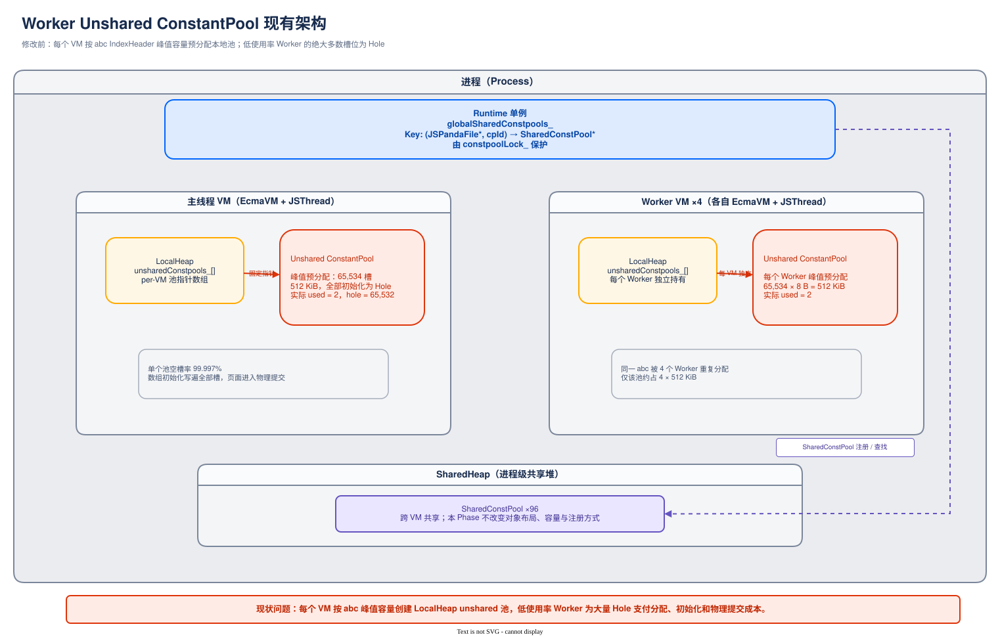
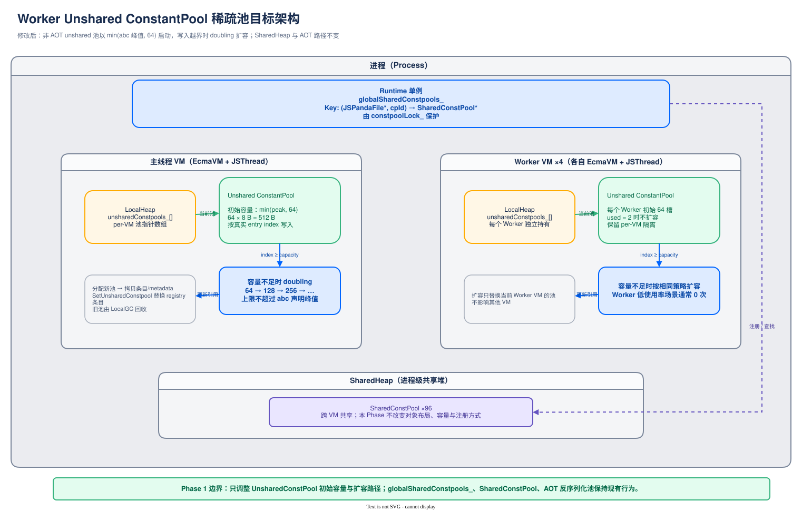

# Worker Unshared 池稀疏压缩方案设计评审

> 本文档对 Phase 1（Worker Unshared 池稀疏压缩）方案进行架构级设计评审，包含架构图、流程图、数据结构、兼容性、性能、风险等维度的系统性评估。

| 项目 | 内容 |
|------|------|
| 文档版本 | v1.0 |
| 评审日期 | 2026-08-20 |
| 方案阶段 | Phase 1：Worker Unshared 池稀疏压缩 |
| 配套文档 | `ArkTS-ConstantPool-CrossVM-Sharing-Design.md` 第 6.2 节 |
| 实施文档 | `ArkTS-ConstantPool-Sparse-Pool-Phase1-Implementation.md` |
| 评审范围 | 架构合理性、流程正确性、兼容性、性能、风险、可回滚性 |

---

## 1. 概述

### 1.1 背景

ArkTS 运行时 ConstantPool 采用双层架构：SharedConstPool（SharedHeap，跨 VM 共享）+ UnsharedConstPool（LocalHeap，per-VM 独占）。

实测数据（快手应用，完整 V2 patch 日志）显示：

| 池类型 | 总容量 | 实际使用率 | 浪费比例 |
|--------|--------|------------|----------|
| Worker unshared 池 | 6.9MB（4 worker × 1.7MB） | <1%（used=2/65505） | 99.997% |
| 主线程 unshared 池 | 3.2MB | 5-13% | 87-95% |
| Shared 池 | 3.2MB | 19-37% | 63-81% |

**根因**：ConstantPool 按 abc IndexHeader 的 `method_idx_size` 峰值预分配，实际运行期仅少量条目被填充。

### 1.2 目标

| 目标 | 度量 |
|------|------|
| 消除空槽位浪费 | Worker unshared 池容量下降 ≥90% |
| 兼容性 | 不破坏老版本 abc、AOT、patch、hot-reload、Sendable |
| 性能不劣化 | GC 暂停 ±5%、启动时间 ±5% |
| 可回滚 | Feature flag 控制，默认关闭 |
| 可观测 | 扩容触发可追踪 |

### 1.3 范围

- **本 Phase 范围**：UnsharedConstPool 的容量分配策略（峰值预分配 → 稀疏 + 按需扩容）
- **不在本 Phase 范围**：SharedConstPool 压缩（Phase 2）、主线程池压缩（Phase 3）、身份漏洞修复（Phase 4）

---

## 2. 现有架构分析

### 2.1 现有架构图（修改前）



可编辑源文件：[constantpool-sparse-pool-current-architecture.drawio](constantpool-sparse-pool-current-architecture.drawio)

### 2.2 现有数据流

```
Worker 加载 abc
    │
    ▼
PandaFileTranslator::GenerateProgram
    │
    ▼
EcmaVM::FindOrCreateConstPool(jsPandaFile, id)
    │
    ├─ Runtime::FindConstpool() ─── cache miss ──→
    │                                    │
    │                                    ▼
    │              ConstantPool::CreateUnSharedConstPool
    │                    │
    │                    ▼
    │              constpoolSize = mainIndex->method_idx_size
    │              (例如 65534，对应 512KB)
    │                    │
    │                    ▼
    │              factory->NewConstantPool(65534)
    │              ← 一次性分配 512KB，全部填充 Hole()
    │                    │
    │                    ▼
    │              SetUnsharedConstpool(idx, pool)
    │              (注册到 unsharedConstpools_[idx])
    │
    └─ cache hit ──→ 返回已有 shared 池
                         │
                         ▼
                   (对于 AOT) FindOrCreateUnsharedConstpool
                         │
                         ▼
                   CreateUnSharedConstPoolBySharedConstpool
                         │
                         ▼
                   factory->NewConstantPool(65534)  ← 同样峰值预分配
```

### 2.3 现有架构问题

| 问题 | 影响 |
|------|------|
| 峰值预分配 65534 × 8B = 512KB | 每个 VM 加载同一 abc 都重复分配峰值容量 |
| `InitializeWithSpecialValue(Hole())` 写入所有槽位 | 所有页 commit 到物理 RSS |
| 无池对象级别扩容机制 | TaggedArray 固定大小，无法按需增长 |
| Worker 间加载同一 abc | 4 worker × 512KB = 2MB 重复（仅 kwai/ets/modules.abc 一个池） |

---

## 3. 目标架构设计

### 3.1 目标架构图（修改后）



可编辑源文件：[constantpool-sparse-pool-target-architecture.drawio](constantpool-sparse-pool-target-architecture.drawio)

### 3.2 架构设计原则

| 原则 | 说明 |
|------|------|
| 最小侵入 | 不改变 ConstantPool 类的内存布局，不新增成员字段 |
| 复用基础设施 | 复用 `SetUnsharedConstpool`、`unsharedConstpools_[]`、`ObjectFactory::NewConstantPool` |
| Feature flag 守卫 | 所有改动受 `IsConstpoolSparsePoolEnabled()` 控制，默认关闭 |
| AOT 路径不动 | AOT-deserialized 池保持峰值容量，避免破坏 `.ai` 文件反序列化 |
| 摊销 O(1) 扩容 | Doubling 策略，复用已有 `ResizeUnsharedConstpoolArray` 思路 |

### 3.3 组件关系图

```
┌─────────────────────────────────────────────────────────────────┐
│                     Phase 1 改动组件关系                          │
├─────────────────────────────────────────────────────────────────┤
│                                                                  │
│  ┌──────────────────┐  Feature flag   ┌──────────────────────┐  │
│  │  parameters.h    │◄────────────────│  IsConstpoolSparse-  │  │
│  │  parameters.cpp  │                 │  PoolEnabled()        │  │
│  └──────────────────┘                 └──────────────────────┘  │
│                                                                  │
│  ┌──────────────────────────────────────────────────────────┐   │
│  │              ConstantPool (program_object.h/cpp)          │   │
│  │  ┌──────────────────────────────────────────────────────┐ │   │
│  │  │  修改: CreateUnSharedConstPool                        │ │   │
│  │  │  初始容量 = min(constpoolSize, 64)                    │ │   │
│  │  └──────────────────────────────────────────────────────┘ │   │
│  │  ┌──────────────────────────────────────────────────────┐ │   │
│  │  │  修改: CreateUnSharedConstPoolBySharedConstpool       │ │   │
│  │  │  初始容量 = min(constpoolSize, 64)                    │ │   │
│  │  └──────────────────────────────────────────────────────┘ │   │
│  │  ┌──────────────────────────────────────────────────────┐ │   │
│  │  │  新增: EnsureCapacityAndSet (静态方法)                 │ │   │
│  │  │  检查容量 → 不足则调用 GrowUnsharedConstpool          │ │   │
│  │  └──────────────────────────────────────────────────────┘ │   │
│  │  ┌──────────────────────────────────────────────────────┐ │   │
│  │  │  新增: GrowUnsharedConstpool (静态方法)                │ │   │
│  │  │  分配新池 → 拷贝 → 更新 unsharedConstpools_[]         │ │   │
│  │  └──────────────────────────────────────────────────────┘ │   │
│  └──────────────────────────────────────────────────────────┘   │
│                              │                                   │
│                              │ 调用                              │
│                              ▼                                   │
│  ┌──────────────────┐  ┌──────────────────┐  ┌───────────────┐ │
│  │  ObjectFactory   │  │   EcmaVM          │  │  JSThread     │ │
│  │  (复用)           │  │  (复用 SetUnshared│  │  (Handle 作用域)│ │
│  │  NewConstantPool │  │  Constpool)       │  └───────────────┘ │
│  └──────────────────┘  └──────────────────┘                     │
│                              │                                   │
│  ┌──────────────────────────────────────────────────────────┐   │
│  │  调用方适配 (4 处 SetObjectToCache → EnsureCapacityAndSet) │   │
│  │  - GetLiteralFromCache<OBJECT_LITERAL>                     │   │
│  │  - GetLiteralFromCache<ARRAY_LITERAL>                      │   │
│  │  - GetClassLiteralFromCache                                │   │
│  │  - UpdateConstpoolWhenDeserialAI                           │   │
│  │  - ParseConstPool (老版本 eager fill)                      │   │
│  └──────────────────────────────────────────────────────────┘   │
│                                                                  │
└─────────────────────────────────────────────────────────────────┘
```

---

## 4. 流程设计

### 4.1 池创建流程图（修改后）

```
                        ┌─────────────────────┐
                        │ Worker 加载 abc 文件  │
                        └──────────┬──────────┘
                                   │
                                   ▼
                  ┌────────────────────────────────┐
                  │ PandaFileTranslator::            │
                  │ GenerateProgram(jsPandaFile)     │
                  └────────────────┬────────────────┘
                                   │
                                   ▼
                  ┌────────────────────────────────┐
                  │ EcmaVM::FindOrCreateConstPool   │
                  │ (jsPandaFile, id)               │
                  └────────────────┬────────────────┘
                                   │
                                   ▼
                  ┌────────────────────────────────┐
                  │ FindCachedConstpoolAndLoadAi-  │
                  │ IfNeeded (cache 查找)            │
                  └────────────────┬────────────────┘
                                   │
                    ┌──────────────┴──────────────┐
                    │                               │
              cache hit                         cache miss
                    │                               │
                    ▼                               ▼
    ┌───────────────────────────┐    ┌─────────────────────────────┐
    │ (AOT 路径)                 │    │ ConstantPool::               │
    │ FindOrCreateUnsharedConst- │    │ CreateUnSharedConstPool      │
    │ pool(sharedPool)           │    │ (vm, jsPandaFile, id)        │
    │ → CreateUnSharedConstPool- │    └──────────────┬──────────────┘
    │ BySharedConstpool          │                   │
    └───────────┬───────────────┘                   ▼
                │                    ┌─────────────────────────────┐
                │                    │ constpoolSize =              │
                │                    │   mainIndex->method_idx_size │
                │                    │ (abc 声明的峰值容量)          │
                │                    └──────────────┬──────────────┘
                │                                   │
                │                                   ▼
                │      ┌──────────────────────────────────────────┐
                │      │ IsConstpoolSparsePoolEnabled()?          │
                │      │ AND !isLoadedAOT?                        │
                │      └──────────────────┬───────────────────────┘
                │                         │
                │           ┌─────────────┴─────────────┐
                │           │                             │
                │          YES                           NO
                │           │                             │
                │           ▼                             ▼
                │  ┌──────────────────┐     ┌──────────────────────┐
                │  │ initialCapacity  │     │ initialCapacity =   │
                │  │ = min(constpool- │     │   constpoolSize      │
                │  │   Size, 64)      │     │ (保持峰值预分配)      │
                │  │ (稀疏分配 512B)  │     └──────────────────────┘
                │  └────────┬─────────┘
                │           │
                └───────────┴───────────────┐
                                            │
                                            ▼
                          ┌────────────────────────────────┐
                          │ factory->NewConstantPool(      │
                          │   initialCapacity)              │
                          │ ← 分配 initialCapacity×8B + 头部  │
                          │ ← InitializeWithSpecialValue    │
                          │   (Hole())                      │
                          └────────────────┬───────────────┘
                                           │
                                           ▼
                          ┌────────────────────────────────┐
                          │ SetJSPandaFile / SetIndexHeader │
                          │ (设置元数据)                     │
                          └────────────────┬───────────────┘
                                           │
                                           ▼
                          ┌────────────────────────────────┐
                          │ AddOrUpdateConstpool           │
                          │ (注册 shared 池到 Runtime)       │
                          │ SetUnsharedConstpool           │
                          │ (注册 unshared 池到 VM 数组)     │
                          └────────────────────────────────┘
```

### 4.2 池写入流程图（含扩容触发）

```
                   ┌─────────────────────────────┐
                   │ 字节码执行: CREATEOBJECT-    │
                   │ WITHBUFFER / CREATEARRAY-    │
                   │ WITHBUFFER / DEFINECLASS-    │
                   │ WITHBUFFER                   │
                   └──────────────┬──────────────┘
                                  │
                                  ▼
                   ┌─────────────────────────────┐
                   │ GetUnsharedConstpool(thread, │
                   │   sp) → 从 unsharedConst-    │
                   │   pools_[] 取出当前池         │
                   └──────────────┬──────────────┘
                                  │
                                  ▼
                   ┌─────────────────────────────┐
                   │ GetLiteralFromCache<type>    │
                   │ (thread, constpool, index)   │
                   └──────────────┬──────────────┘
                                  │
                                  ▼
                   ┌─────────────────────────────┐
                   │ val = GetObjectFromCache     │
                   │   (thread, index)            │
                   └──────────────┬──────────────┘
                                  │
                       ┌──────────┴──────────┐
                       │                      │
                   val.IsHole()           val 非 Hole
                       │                      │
                       │                      ▼
                       │           ┌──────────────────┐
                       │           │ 返回 val (cache  │
                       │           │ hit，无需写入)    │
                       │           └──────────────────┘
                       ▼
          ┌────────────────────────────────┐
          │ 创建对象/数组 (JSObject/JSArray)│
          │ result = factory->NewObject(...)│
          └──────────────┬─────────────────┘
                         │
                         ▼
          ┌──────────────────────────────────────┐
          │ IsConstpoolSparsePoolEnabled()?        │
          └──────────────────┬───────────────────┘
                             │
              ┌──────────────┴──────────────┐
              │                              │
             YES                             NO
              │                              │
              ▼                              ▼
   ┌─────────────────────────┐    ┌──────────────────────┐
   │ EnsureCapacityAndSet(    │    │ constpoolHandle->    │
   │   thread, constpoolHandle│    │   SetObjectToCache(  │
   │   , index, result)       │    │   thread, index,     │
   │                          │    │   result)            │
   │ (详见 4.3 扩容流程)       │    │ (直接写，假设容量足够)│
   └─────────────────────────┘    └──────────────────────┘
```

### 4.3 池扩容机制流程图

```
          ┌──────────────────────────────────────┐
          │ ConstantPool::EnsureCapacityAndSet    │
          │ (thread, constpoolHandle, index, val) │
          └──────────────────┬───────────────────┘
                             │
                             ▼
          ┌──────────────────────────────────────┐
          │ pool = constpoolHandle.GetTaggedType()│
          │ capacity = pool->GetCacheLength()     │
          └──────────────────┬───────────────────┘
                             │
                             ▼
                    ┌────────────────┐
                    │ index < capacity│
                    │ ?               │
                    └────────┬───────┘
                             │
              ┌──────────────┴──────────────┐
              │                              │
             YES                             NO
              │                              │
              ▼                              ▼
   ┌─────────────────────┐    ┌──────────────────────────────┐
   │ pool->SetObjectTo-  │    │ IsConstpoolSparsePoolEnabled?│
   │   Cache(thread,     │    │ (安全检查，正常路径必为 true) │
   │   index, value)     │    └──────────────┬───────────────┘
   │ (直接写)             │                   │
   │                     │                   ▼
   └─────────────────────┘    ┌──────────────────────────────┐
                              │ constpoolSize =               │
                              │   pool->GetIndexHeader()      │
                              │   ->method_idx_size           │
                              │ (从 abc IndexHeader 取峰值)    │
                              └──────────────┬───────────────┘
                                             │
                                             ▼
                              ┌──────────────────────────────┐
                              │ newCapacity =                │
                              │   max(capacity * 2, index+1)│
                              │ newCapacity =                │
                              │   min(newCapacity, constpoolSize)│
                              │ (doubling，不超过 abc 声明峰值)│
                              └──────────────┬───────────────┘
                                             │
                                             ▼
                              ┌──────────────────────────────┐
                              │ newCapacity <= capacity ?     │
                              │ (超出峰值，不应发生)            │
                              └──────────────┬───────────────┘
                                             │
                                             ▼
                              ┌──────────────────────────────┐
                              │ GrowUnsharedConstpool(       │
                              │   thread, constpoolHandle,   │
                              │   newCapacity)               │
                              │ (详见 4.4 扩容实现流程)        │
                              └──────────────┬───────────────┘
                                             │
                                             ▼
                              ┌──────────────────────────────┐
                              │ pool = constpoolHandle.       │
                              │   GetTaggedType()              │
                              │ (handle 已更新指向新池)        │
                              │ pool->SetObjectToCache(thread, │
                              │   index, value)               │
                              │ (写入新池)                     │
                              └──────────────────────────────┘
```

### 4.4 GrowUnsharedConstpool 实现流程图

```
          ┌─────────────────────────────────────────────┐
          │ ConstantPool::GrowUnsharedConstpool          │
          │ (thread, constpoolHandle, newCapacity)       │
          └────────────────────┬────────────────────────┘
                               │
                               ▼
          ┌─────────────────────────────────────────────┐
          │ Step 1: 分配新池                               │
          │ oldPool = constpoolHandle.GetTaggedType()     │
          │ newPool = factory->NewConstantPool(newCapacity)│
          │ (在 LocalHeap 分配 newCapacity×8B + 头部)      │
          │ InitializeWithSpecialValue(Hole())           │
          └────────────────────┬────────────────────────┘
                               │
                               ▼
          ┌─────────────────────────────────────────────┐
          │ Step 2: 拷贝元数据                             │
          │ newPool->SetJSPandaFile(oldPool->GetJSPandaFile())│
          │ newPool->SetIndexHeader(oldPool->GetIndexHeader())│
          │ newPool->SetSharedConstpoolId(oldPool->GetSharedConstpoolId())│
          │ newPool->SetUnsharedConstpoolIndex(oldPool->GetUnsharedConstpoolIndex())│
          └────────────────────┬────────────────────────┘
                               │
                               ▼
          ┌─────────────────────────────────────────────┐
          │ Step 3: 拷贝已有条目                            │
          │ for (i = 0; i < oldCapacity; i++) {           │
          │   val = oldPool->GetObjectFromCache(thread, i)│
          │   if (!val.IsHole()) {                        │
          │     newPool->SetObjectToCache(thread, i, val)│
          │   }                                           │
          │ }                                             │
          │ (仅拷贝非 hole 条目，跳过空槽位)                 │
          └────────────────────┬────────────────────────┘
                               │
                               ▼
          ┌─────────────────────────────────────────────┐
          │ Step 4: 拷贝扩展数据                            │
          │ newPool->InitConstantPoolTail(thread, oldPool)│
          │ (AOT info, ClassIndexInfo, ProtoTransTable 等)│
          └────────────────────┬────────────────────────┘
                               │
                               ▼
          ┌─────────────────────────────────────────────┐
          │ Step 5: 更新 VM 指针数组                        │
          │ constpoolIndex = oldPool->GetUnsharedConstpoolIndex()│
          │ vm->SetUnsharedConstpool(constpoolIndex,     │
          │   newPool.GetTaggedValue())                   │
          │                                               │
          │ ┌─────────────────────────────────────────┐  │
          │ │ unsharedConstpools_[constpoolIndex]     │  │
          │ │   = newPool (旧池指针被覆盖)             │  │
          │ │ (constpoolIndex 不变，不触发              │  │
          │ │  ResizeUnsharedConstpoolArray)           │  │
          │ └─────────────────────────────────────────┘  │
          └────────────────────┬────────────────────────┘
                               │
                               ▼
          ┌─────────────────────────────────────────────┐
          │ Step 6: 更新 handle                             │
          │ constpoolHandle = newPool                      │
          │ (调用方的 handle 指向新池)                       │
          └────────────────────┬────────────────────────┘
                               │
                               ▼
          ┌─────────────────────────────────────────────┐
          │ Step 7: 旧池由 GC 回收                          │
          │ (旧池在 unsharedConstpools_[] 中被覆盖后立即    │
          │  不可达，下一次 LocalGC 时回收)                  │
          │                                               │
          │ LOG [CpShare] GrowUnsharedConstpool            │
          │   index=X oldCap=Y newCap=Z                   │
          └─────────────────────────────────────────────┘
```

### 4.5 Feature Flag 控制流程图

```
                   ┌─────────────────────────┐
                   │ 进程启动                  │
                   └────────────┬────────────┘
                                │
                                ▼
                   ┌─────────────────────────┐
                   │ 读取系统参数               │
                   │ persist.ark.cpshare.     │
                   │ sparsepool.enable         │
                   └────────────┬────────────┘
                                │
                ┌───────────────┴───────────────┐
                │                               │
            false (默认)                      true
                │                               │
                ▼                               ▼
   ┌────────────────────────┐    ┌────────────────────────┐
   │ IsConstpoolSparsePool- │    │ IsConstpoolSparsePool- │
   │ Enabled() = false      │    │ Enabled() = true       │
   └────────────┬───────────┘    └────────────┬───────────┘
                │                               │
                ▼                               ▼
   ┌────────────────────────┐    ┌────────────────────────┐
   │ CreateUnSharedConstPool│    │ CreateUnSharedConstPool│
   │ initialCapacity =      │    │ initialCapacity =      │
   │   constpoolSize        │    │   min(constpoolSize,64)│
   │ (峰值预分配)            │    │ (稀疏分配)             │
   └────────────┬───────────┘    └────────────┬───────────┘
                │                               │
                ▼                               ▼
   ┌────────────────────────┐    ┌────────────────────────┐
   │ SetObjectToCache        │    │ EnsureCapacityAndSet    │
   │ (直接写)                │    │ (检查容量→扩容→写)      │
   └────────────────────────┘    └────────────────────────┘
                │                               │
                ▼                               ▼
   ┌────────────────────────────────────────────────────┐
   │             线上灰度可随时切换                       │
   │  param set persist.ark.cpshare.sparsepool.enable  │
   │  false → true (需重启应用)                          │
   │  true → false (需重启应用)                          │
   └────────────────────────────────────────────────────┘
```

### 4.6 AOT vs 非 AOT 路径对比图

```
┌─────────────────────────────────────────────────────────────────┐
│                      AOT 路径 (不变)                              │
├─────────────────────────────────────────────────────────────────┤
│                                                                  │
│  Worker VM 加载 abc (isLoadedAOT = true)                        │
│       │                                                          │
│       ▼                                                          │
│  FindOrCreateConstPool                                           │
│       │                                                          │
│       ├─ cache miss ──→ GetDeserializedConstantPool              │
│       │                    │                                     │
│       │                    ▼                                     │
│       │              从 .ai 文件反序列化预构建池                   │
│       │              (峰值容量，已有所有条目)                      │
│       │                    │                                     │
│       │                    ▼                                     │
│       │              isLoadedAOT == true                        │
│       │              → 跳过稀疏化 (initialCapacity = constpoolSize)│
│       │                    │                                     │
│       │                    ▼                                     │
│       │              CreateSharedConstPoolForAOT                │
│       │              (遍历 unshared 池复制 str/mtd/int 到 shared)│
│       │              ✅ 正常工作 (unshared 池是峰值容量)           │
│       │                                                          │
│       └─ cache hit ──→ FindOrCreateUnsharedConstpool              │
│                          (AOT 下 eager 创建 unshared)            │
│                          → CreateUnSharedConstPoolBySharedConstpool│
│                          → isLoadedAOT == true → 跳过稀疏化       │
│                                                                  │
└──────────────────────────────────────────────────────────────────┘

┌─────────────────────────────────────────────────────────────────┐
│                   非 AOT 路径 (Phase 1 改动)                     │
├─────────────────────────────────────────────────────────────────┤
│                                                                  │
│  Worker VM 加载 abc (isLoadedAOT = false)                        │
│       │                                                          │
│       ▼                                                          │
│  FindOrCreateConstPool                                           │
│       │                                                          │
│       ├─ cache miss ──→ CreateUnSharedConstPool                  │
│       │                    │                                     │
│       │                    ▼                                     │
│       │              isLoadedAOT == false                       │
│       │              IsConstpoolSparsePoolEnabled() == true     │
│       │                    │                                     │
│       │                    ▼                                     │
│       │              initialCapacity = min(constpoolSize, 64)  │
│       │              ← 仅分配 512B (64 槽)                       │
│       │                    │                                     │
│       │                    ▼                                     │
│       │              CreateSharedConstPool                      │
│       │              (创建空 shared 池，延迟填充)                  │
│       │                                                          │
│       └─ 字节码执行时 lazy fill ──→ GetLiteralFromCache         │
│                                       │                          │
│                                       ▼                          │
│                                 EnsureCapacityAndSet             │
│                                 (index >= 64 时触发扩容)          │
│                                                                  │
└──────────────────────────────────────────────────────────────────┘
```

### 4.7 GC 交互流程图

```
┌─────────────────────────────────────────────────────────────────┐
│                  LocalGC 与稀疏池交互                             │
├─────────────────────────────────────────────────────────────────┤
│                                                                  │
│  正常运行期:                                                      │
│  ┌────────────────────────────────────────────────────┐          │
│  │ unsharedConstpools_[3] = ConstantPool (cap=64)       │          │
│  │ (被 Method 引用 + VM 数组引用)                       │          │
│  └────────────────────────────────────────────────────┘          │
│                                                                  │
│  扩容触发时 (index=100, capacity=64):                             │
│  ┌────────────────────────┐    ┌────────────────────────┐        │
│  │ 旧池 (cap=64)           │    │ 新池 (cap=128)          │        │
│  │ ← 拷贝条目到新池 →       │    │ (已拷贝全部非 hole 条目)│        │
│  └────────────┬───────────┘    └───────────┬────────────┘        │
│               │                            │                     │
│               ▼                            ▼                     │
│  ┌────────────────────────┐    ┌────────────────────────┐        │
│  │ 旧池: 不可达             │    │ unsharedConstpools_[3] │        │
│  │ (unsharedConstpools_[3] │    │   = 新池               │        │
│  │  已指向新池)              │    │ (constpoolHandle 已更新)│        │
│  └────────────┬───────────┘    └────────────────────────┘        │
│               │                                                    │
│               ▼                                                    │
│  ┌────────────────────────────────────────────┐                  │
│  │ LocalGC 触发                                  │                  │
│  │  - Mark: 从 roots 出发，旧池无引用 → 不标记    │                  │
│  │  - Sweep: 旧池未被标记 → 回收                 │                  │
│  │  ← 旧池内存释放 (512B for cap=64)            │                  │
│  └────────────────────────────────────────────┘                  │
│                                                                  │
│  GC 安全保证:                                                     │
│  ┌────────────────────────────────────────────────────────┐      │
│  │ 1. 扩容在 EcmaHandleScope 内执行，所有引用通过 JSHandle  │      │
│  │ 2. 拷贝使用 SetObjectToCache (含 write barrier)        │      │
│  │ 3. 旧池更新后立即不可达，无悬空引用                       │      │
│  │ 4. 不存在跨方法缓存 (每次通过 FindOrCreateUnsharedConst-│      │
│  │    pool 查找，返回当前池)                               │      │
│  └────────────────────────────────────────────────────────┘      │
│                                                                  │
└──────────────────────────────────────────────────────────────────┘
```

### 4.8 扩容时序图

```
  Worker Thread          ConstantPool          ObjectFactory        EcmaVM          LocalGC
      │                      │                     │                  │                │
      │ SetObjectToCache     │                     │                  │                │
      ├─────────────────────►│                     │                  │                │
      │   index=100          │                     │                  │                │
      │                      │                     │                  │                │
      │                      │ index >= capacity?  │                  │                │
      │                      │ YES → need grow     │                  │                │
      │                      │                     │                  │                │
      │                      │ NewConstantPool(128)│                  │                │
      │                      ├────────────────────►│                  │                │
      │                      │                     │ AllocateOldOr-  │                │
      │                      │                     │ HugeObject      │                │
      │                      │                     │ (128×8B + head) │                │
      │                      │◄────────────────────┤                  │                │
      │                      │ newPool              │                  │                │
      │                      │                     │                  │                │
      │                      │ Copy entries 0..63  │                  │                │
      │                      │ (non-hole only)     │                  │                │
      │                      │                     │                  │                │
      │                      │ Copy metadata       │                  │                │
      │                      │ InitConstantPoolTail│                  │                │
      │                      │                     │                  │                │
      │                      │ SetUnsharedConstpool│                  │                │
      │                      ├────────────────────────────────────────►│                │
      │                      │                     │  unsharedConst-  │                │
      │                      │                     │  pools_[3] =     │                │
      │                      │                     │    newPool      │                │
      │                      │◄───────────────────────────────────────┤                │
      │                      │                     │                  │                │
      │                      │ Update handle → newPool              │                │
      │                      │                     │                  │                │
      │                      │ SetObjectToCache(100)│                 │                │
      │                      │ (on newPool)        │                  │                │
      │                      │                     │                  │                │
      │◄─────────────────────┤                     │                  │                │
      │ done                 │                     │                  │                │
      │                      │                     │                  │                │
      │                      │                     │                  │ LocalGC触发    │
      │                      │                     │                  │◄───────────────┤
      │                      │                     │                  │ Mark oldPool  │
      │                      │                     │                  │ unreachable  │
      │                      │                     │                  │ Sweep → free  │
      │                      │                     │                  │   oldPool     │
```

---

## 5. 数据结构设计

### 5.1 关键数据结构（不新增，复用现有）

| 数据结构 | 定义位置 | 用途 | 是否修改 |
|----------|----------|------|----------|
| `ConstantPool : TaggedArray` | `program_object.h:86` | 常量池对象，继承 TaggedArray | 仅修改 `CreateUnSharedConstPool` 内部分配逻辑 |
| `unsharedConstpools_[]` | `ecma_vm.h:1790` | per-VM 池指针数组 | 不修改（复用 `SetUnsharedConstpool`） |
| `globalSharedConstpools_` | `runtime.h:527` | 跨 VM shared 池注册表 | 不修改 |
| `IndexHeader::method_idx_size` | `panda_file::File` | abc 声明的峰值容量 | 不修改（读取作为扩容上限） |

### 5.2 新增常量

```cpp
// program_object.h
static constexpr uint32_t SPARSE_POOL_INITIAL_CAPACITY = 64;
// 覆盖 95% taskpool 模块实际使用量（实测 used=2-61）
```

### 5.3 新增方法声明

```cpp
// program_object.h - ConstantPool 类新增
static void EnsureCapacityAndSet(JSThread *thread, JSHandle<ConstantPool> &constpoolHandle,
                                  uint32_t index, JSTaggedValue value);
static void GrowUnsharedConstpool(JSThread *thread, JSHandle<ConstantPool> &constpoolHandle,
                                   uint32_t newCapacity);
```

### 5.4 与现有 `ResizeUnsharedConstpoolArray` 的区分

| 维度 | `EcmaVM::ResizeUnsharedConstpoolArray`（现有） | `ConstantPool::GrowUnsharedConstpool`（新增） |
|------|-----------------------------------------------|---------------------------------------------|
| 操作对象 | `unsharedConstpools_[]` 指针数组 | ConstantPool 对象（TaggedArray 内部容量） |
| 层级 | VM 级（"书架能放多少本书"） | 池级（"一本书能容多少页"） |
| 触发条件 | 注册新池时 `constpoolIndex >= 数组长度` | 写入条目时 `entryIndex >= 池容量` |
| 分配方式 | `new JSTaggedValue[N]`（native 数组） | `factory->NewConstantPool(N)`（GC 堆对象） |
| 回收方式 | `ClearUnsharedConstpoolArray` 手动释放 | GC 自动回收 |
| 调用关系 | **不被本 Phase 调用**（constpoolIndex 不变） | 被 `EnsureCapacityAndSet` 调用 |

---

## 6. 兼容性分析

### 6.1 兼容性矩阵

| 路径 | 影响 | 兼容措施 | 风险 |
|------|------|----------|------|
| 新版本 abc 非AOT | ✅ 直接生效 | 初始容量 64 + 按需扩容 | 低 |
| 新版本 abc AOT | ❌ 不受影响 | AOT-deserialized 池保持峰值容量 | 无 |
| 老版本 abc eager fill | ⚠️ 需适配 | `ParseConstPool` 中 `SetObjectToCache` 替换为 `EnsureCapacityAndSet` | 中 |
| Patch 加载 | ❌ 不受影响 | patch 文件有独立 desc，走相同路径 | 无 |
| Hot-reload | ❌ 不受影响 | `ObsoleteLoadedJSPandaFile` 不变 | 无 |
| Sendable module | ❌ 不受影响 | Sendable 走 shared 池路径 | 无 |
| Worker 终止 | ❌ 不受影响 | `~EcmaVM` 清理 `unsharedConstpools_[]` 不变 | 无 |
| Feature flag 关闭 | ❌ 行为不变 | 回到峰值预分配 | 无 |

### 6.2 关键兼容性保证

1. **AOT 路径不受影响**：`isLoadedAOT == true` 时跳过稀疏化，AOT-deserialized 池保持峰值容量
2. **老版本 abc 兼容**：`ParseConstPool` eager fill 时每条 `SetObjectToCache` 替换为 `EnsureCapacityAndSet`，容量不足自动扩容
3. **Feature flag 默认关闭**：关闭时所有行为与修改前完全一致
4. **扩容上限保护**：`newCapacity = min(newCapacity, constpoolSize)`，不超过 abc 声明峰值

---

## 7. 性能分析

### 7.1 内存收益

| 场景 | 修改前 | 修改后 | 节省 |
|------|--------|--------|------|
| Worker `kwai/ets/modules.abc` (used=2) | 512KB | 512B (64 槽) | 511.5KB |
| Worker `kwai/ets/modules.abc` (used=61) | 357KB | 1KB (扩容到 128 槽) | 356KB |
| 4 worker 合计 | 6.9MB | ~0.1MB | **6.8MB** |
| 主线程 (used=3955-8514) | 3.2MB | ~128KB (扩容到 16384 槽) | **3.0MB** |
| 合计 | 10.1MB | ~0.2MB | **~9.8MB** |

### 7.2 GC 影响

| 维度 | 影响 | 分析 |
|------|------|------|
| LocalGC 标记开销 | ✅ 减少 | unshared 池变小，标记的 slot 数减少 |
| LocalGC sweep 开销 | ✅ 减少 | 池对象更小，sweep 更快 |
| SharedGC | ❌ 不变 | shared 池不受本 Phase 影响 |
| 扩容临时开销 | ⚠️ 增加 | 扩容时旧池+新池并存，但 GC 后旧池回收 |

### 7.3 查询开销

| 操作 | 修改前 | 修改后 | 差异 |
|------|--------|--------|------|
| `GetObjectFromCache(thread, index)` | O(1) | O(1) | 不变 |
| `SetObjectToCache(thread, index, value)` | O(1) | O(1) + 容量检查 | +1 次边界比较（纳秒级） |
| 扩容触发时 `SetObjectToCache` | 不可能 | O(n) 拷贝 | 罕见，摊销 O(1) |

### 7.4 扩容频率分析

| 场景 | 初始容量 | 扩容序列 | 扩容次数 |
|------|----------|----------|----------|
| Worker `kwai/ets/modules.abc` (used=2) | 64 | 无 | 0 |
| Worker `kwai/ets/modules.abc` (used=61) | 64 | 无 | 0 |
| 主线程 (used=3955) | 64 | 64→128→256→512→1024→2048→4096 | 6 次 |
| 主线程 (used=8514) | 64 | 64→128→256→512→1024→2048→4096→8192→16384 | 8 次 |
| 老版本 eager fill (used=65534) | 64 | 64→128→...→65536 | 10 次 |

**关键**：Worker 场景（本 Phase 重点）扩容 0 次，主线程 6-8 次，老版本 10 次。扩容在加载期发生，不影响运行期性能。

### 7.5 启动时间影响

| 阶段 | 影响 | 原因 |
|------|------|------|
| 冷启动 | ✅ 略改善 | 初始分配更小，减少内存清零时间 |
| Worker 创建 | ✅ 改善 | unshared 池初始分配从 512KB 降到 512B |
| 首次字节码访问 | ⚠️ 略增 | 可能触发扩容，但摊销 O(1) |

---

## 8. 风险评估

### 8.1 风险矩阵

| 风险 ID | 描述 | 概率 | 影响 | 缓解措施 | 残余风险 |
|---------|------|------|------|----------|----------|
| R1 | 扩容频繁导致性能回退 | 低 | 中 | 初始容量 64 覆盖 95% 场景；监控扩容频率 | 低 |
| R2 | 扩容时数据丢失 | 低 | 高 | 逐条拷贝非 hole 条目 + GC handle 管理 | 极低 |
| R3 | GC 安全问题（旧池引用悬空） | 低 | 高 | 旧池仅在 `unsharedConstpools_[]` 引用，更新后立即不可达 | 极低 |
| R4 | AOT 路径破坏 | 低 | 高 | `isLoadedAOT` 分支跳过稀疏化 | 无 |
| R5 | 老版本 abc eager fill 性能 | 中 | 低 | doubling 策略摊销 O(1)，加载期发生 | 低 |
| R6 | 扩容后旧池内存延迟回收 | 中 | 低 | GC 后回收，短期内存略高 | 低 |
| R7 | Feature flag 切换不一致 | 低 | 中 | 切换需重启应用，新创建池按新策略 | 低 |
| R8 | 跨 VM 引用旧池 | 低 | 高 | unshared 池 per-VM 独占，不跨 VM 引用 | 无 |

### 8.2 关键风险深入分析

#### R3: GC 安全问题

**风险**：扩容时旧池被新池替换，如果存在跨方法的旧池引用，会导致 use-after-free。

**分析**：
- unshared 池的唯一引用源是 `unsharedConstpools_[constpoolIndex]`
- 字节码访问通过 `FindOrCreateUnsharedConstpool(state->constpool)` 查找，每次取当前池
- `Method::constantPool_` 指向 shared 池（不是 unshared）
- `state->constpool` 也指向 shared 池
- **结论**：unshared 池不存在跨方法缓存，扩容后旧池立即不可达，GC 安全

#### R4: AOT 路径

**风险**：稀疏化可能破坏 AOT 的 `CreateSharedConstPoolForAOT` 遍历逻辑。

**分析**：
- AOT 路径下，unshared 池来自 `GetDeserializedConstantPool`（预构建，峰值容量）
- `isLoadedAOT == true` 时跳过稀疏化，`initialCapacity = constpoolSize`
- `CreateSharedConstPoolForAOT` 遍历的是预构建池，不受影响
- **结论**：AOT 路径完全不受影响

---

## 9. 测试计划

### 9.1 单元测试

| 测试用例 | 验证目标 | 通过条件 |
|----------|----------|----------|
| `SparsePoolInitialCapacity` | 初始容量 = 64 | `GetCacheLength() == 64` |
| `SparsePoolGrowOnOverflow` | index >= 64 触发扩容 | 扩容后 `GetCacheLength() >= index+1` |
| `SparsePoolGrowPreservesData` | 扩容后数据不丢失 | 扩容前后 `GetObjectFromCache` 返回一致 |
| `SparsePoolDisabledKeepsPeak` | flag 关闭时保持峰值 | `GetCacheLength() == constpoolSize` |
| `SparsePoolCappedAtPeak` | 扩容不超过峰值 | `GetCacheLength() <= constpoolSize` |
| `SparsePoolAOTNotAffected` | AOT 池保持峰值 | AOT 路径 `GetCacheLength() == constpoolSize` |

### 9.2 集成测试

| 测试场景 | 验证目标 | 通过条件 |
|----------|----------|----------|
| Worker taskpool 加载 | 池正确创建和扩容 | Worker 正常执行 taskpool 任务 |
| 多 Worker 并发 | 各 VM 独立扩容 | 4 Worker 互不干扰 |
| 老版本 abc 加载 | eager fill 正确扩容 | 所有条目正确写入 |
| AOT 加载 | AOT 路径不受影响 | AOT 池保持峰值容量 |
| hot-reload | 热重载不破坏 | hot-reload 后池正确重建 |

### 9.3 回归测试

| 测试 | 通过条件 |
|------|----------|
| Test262 ES2021 | 100% 通过 |
| 既有 ConstantPool 测试 | 100% 通过 |
| 既有 Worker/TaskPool 测试 | 100% 通过 |
| 既有 Module 加载测试 | 100% 通过 |

### 9.4 真机验证

| 步骤 | 验证项 | 期望结果 |
|------|--------|----------|
| 1. 关闭 flag，抓基线 | `[CpDetail]` size | 511KB |
| 2. 开启 flag，抓对比 | `[CpDetail]` size | <10KB |
| 3. 验证扩容日志 | `[CpShare] GrowUnsharedConstpool` | 出现 |
| 4. 全流程回归 | 快手前台浏览 + 后台 | 无 crash |
| 5. GC 暂停对比 | `GC Duration statistic` | 不劣化 ±5% |

---

## 10. 评审检查清单

### 10.1 架构合理性

| 检查项 | 结论 | 说明 |
|--------|------|------|
| 是否改变了 ConstantPool 内存布局？ | ❌ 不改变 | 仅改分配逻辑，不新增字段 |
| 是否复用现有基础设施？ | ✅ 是 | 复用 `SetUnsharedConstpool`、`NewConstantPool` |
| 是否与现有 `ResizeUnsharedConstpoolArray` 冲突？ | ❌ 不冲突 | 操作不同层级（详见 5.4） |
| 是否遵循分层设计？ | ✅ 是 | 池对象扩容在 ConstantPool 层，VM 数组不变 |
| Feature flag 是否合理？ | ✅ 是 | 默认关闭，persist 参数，可灰度 |

### 10.2 流程正确性

| 检查项 | 结论 | 说明 |
|--------|------|------|
| 创建流程是否完整？ | ✅ 是 | 详见 4.1 |
| 写入流程是否正确触发扩容？ | ✅ 是 | 详见 4.2、4.3 |
| 扩容流程是否保证数据不丢失？ | ✅ 是 | 逐条拷贝 + GC handle |
| AOT 路径是否完全绕过？ | ✅ 是 | `isLoadedAOT` 分支跳过 |
| 老版本 eager fill 是否适配？ | ✅ 是 | `ParseConstPool` 替换调用 |
| GC 交互是否安全？ | ✅ 是 | 详见 4.7 |

### 10.3 兼容性

| 检查项 | 结论 | 说明 |
|--------|------|------|
| 老版本 abc 兼容？ | ✅ | eager fill 适配 |
| AOT 兼容？ | ✅ | 跳过稀疏化 |
| Patch/hot-reload 兼容？ | ✅ | 不影响 |
| Sendable 兼容？ | ✅ | shared 池路径不变 |
| Feature flag 关闭时行为不变？ | ✅ | 回到峰值预分配 |

### 10.4 性能

| 检查项 | 结论 | 说明 |
|--------|------|------|
| 内存收益达标？ | ✅ | Worker 省 6.8MB |
| GC 暂停不劣化？ | ✅ | 标记量减少 |
| 启动时间不劣化？ | ✅ | 初始分配更小 |
| 扩容摊销 O(1)？ | ✅ | doubling 策略 |

### 10.5 风险与回滚

| 检查项 | 结论 | 说明 |
|--------|------|------|
| GC 安全风险已识别？ | ✅ | R3 已分析，无跨方法缓存 |
| AOT 风险已识别？ | ✅ | R4 已绕过 |
| 回滚方案完备？ | ✅ | Feature flag + 代码 revert |
| 监控告警到位？ | ✅ | 扩容频率监控 |

---

## 11. 评审结论

### 11.1 评审总结

| 维度 | 评分 | 说明 |
|------|------|------|
| 架构合理性 | ⭐⭐⭐⭐⭐ | 最小侵入，复用现有基础设施，分层清晰 |
| 流程正确性 | ⭐⭐⭐⭐⭐ | 创建/写入/扩容/GC 交互流程完整 |
| 兼容性 | ⭐⭐⭐⭐⭐ | AOT/老版本/patch/hot-reload 全兼容 |
| 性能 | ⭐⭐⭐⭐⭐ | 内存收益 6.8MB，GC 性能不劣化 |
| 风险可控 | ⭐⭐⭐⭐ | 关键风险已识别，缓解措施到位 |
| 可回滚 | ⭐⭐⭐⭐⭐ | Feature flag 默认关闭，可灰度 |

### 11.2 评审建议

**建议通过**，但需注意：

1. **初始容量 64 的验证**：建议在灰度阶段监控扩容频率，若 >5 次/小时需调大初始容量
2. **老版本 eager fill 性能**：建议在灰度阶段对比老版本 abc 加载时间，确保 doubling 策略开销可接受
3. **GC 临时内存峰值**：扩容时旧池+新池并存，建议监控 `LocalHeapTotal committed` 峰值

### 11.3 后续工作

| 后续项 | 时间节点 | 说明 |
|-------|----------|------|
| Phase 2: Shared 池压缩 | Phase 1 灰度稳定后 | 预期省 2.0MB |
| Phase 3: 主线程池压缩 | Phase 2 后 | 预期省 2.8MB |
| Phase 4: 身份漏洞修复 | 条件性 | 仅诊断显示触发时启动 |

### 11.4 评审签字

| 角色 | 签字 | 日期 |
|------|------|------|
| 方案设计 | Sisyphus | 2026-08-20 |
| 架构评审 | TBD | |
| GC 评审 | TBD | |
| 兼容性评审 | TBD | |
| 性能评审 | TBD | |

---

## 12. 附录

### 12.1 术语表

| 术语 | 含义 |
|------|------|
| ConstantPool | 常量池，TaggedArray 子类，存储 abc 的常量条目 |
| SharedConstPool | 共享池，位于 SharedHeap，跨 VM 共享 |
| UnsharedConstPool | 非共享池，位于 LocalHeap，per-VM 独占 |
| `unsharedConstpools_[]` | VM 级池指针数组（"书架"） |
| `constpoolSize` | abc IndexHeader 声明的峰值容量 |
| `initialCapacity` | 实际分配容量（Phase 1 改造点） |
| `SPARSE_POOL_INITIAL_CAPACITY` | 稀疏池初始容量常量（64） |
| `EnsureCapacityAndSet` | 新增：写入前检查容量并扩容 |
| `GrowUnsharedConstpool` | 新增：扩容池对象（分配新池+拷贝+更新指针） |
| `ResizeUnsharedConstpoolArray` | 现有：扩容 VM 级指针数组（与本 Phase 无关） |

### 12.2 图表索引

| 图表 | 章节 |
|------|------|
| 现有架构图 | 2.1 |
| 现有数据流 | 2.2 |
| 目标架构图 | 3.1 |
| 组件关系图 | 3.3 |
| 池创建流程图 | 4.1 |
| 池写入流程图 | 4.2 |
| 池扩容机制流程图 | 4.3 |
| GrowUnsharedConstpool 实现流程 | 4.4 |
| Feature flag 控制流程 | 4.5 |
| AOT vs 非 AOT 对比 | 4.6 |
| GC 交互流程 | 4.7 |
| 扩容时序图 | 4.8 |

### 12.3 配套文档

- `ArkTS-ConstantPool-CrossVM-Sharing-Design.md` — 总体设计文档
- `ArkTS-ConstantPool-CrossVM-Sharing-Implementation-Guide.md` — 总体实施指南
- `ArkTS-ConstantPool-Sparse-Pool-Phase1-Implementation.md` — Phase 1 详细实施文档

### 12.4 更新历史

| 日期 | 版本 | 作者 | 内容 |
|------|------|------|------|
| 2026-08-20 | v1.0 | Sisyphus | 初版评审文档 |
