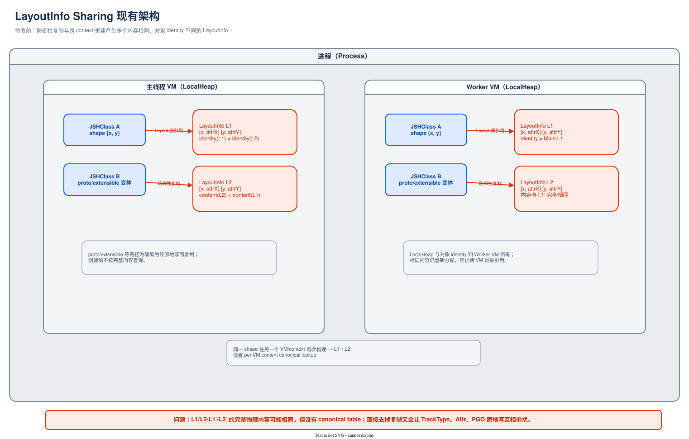
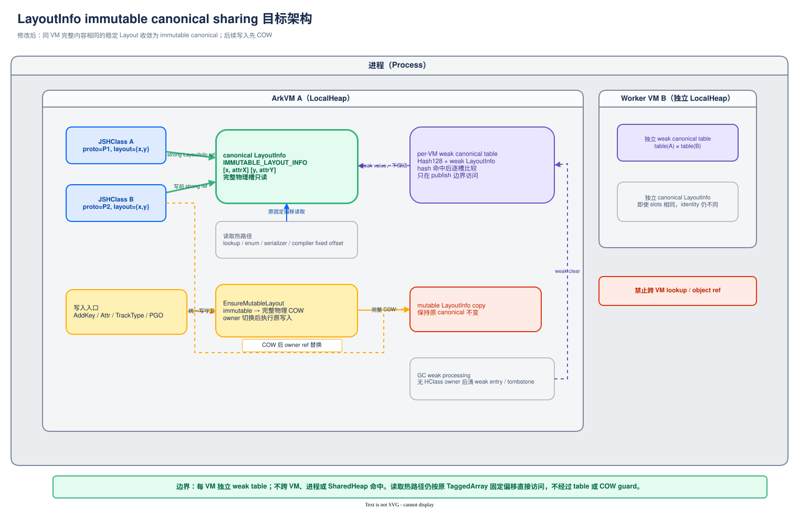

# LayoutInfo immutable canonical sharing —— 方案设计评审

> 本文档为方案设计评审文档，包含修改前/修改后架构图、关键流程图、数据结构变更、兼容性、性能、风险等维度的系统性评估。

| 项目 | 内容 |
|------|------|
| 文档版本 | v3.0 |
| 评审日期 | 2026-08-25 |
| 冻结源码 | `ets_runtime@f04900cf951c66c2ea18b2bab5b591d5336c34b9` |
| 配套文档 | [01-背景.md](01-背景.md)、[02-需求.md](02-需求.md)、[05-源码与数据证据.md](05-源码与数据证据.md) |
| 评审范围 | 架构合理性、流程正确性、兼容性、性能、风险、可回滚性 |

---

## 1. 概述

### 1.1 背景

LayoutInfo 是 JSHClass 的属性描述表（物理格式与读写现状见 01-背景 §2–§5）。运行时 HClass Dump 打点（Section #22，43,418 个 HClass）实测：**冗余 LayoutInfo 23,692 个**（占 55%），冗余 HClass 23,528 个。防复制的原因是 LayoutInfo 存在原地写入点（TrackType/Attr/PGO 标志等，01-背景 §4），父子共享数组会互相串扰。

重复 Top 形态全部是 0–1 属性的微型 Layout：`Object+constructor` 6,149 实例、`Function+length` 5,345 实例（含 Flags 分裂变体）、`Object+无属性` 1,187 实例。中大型 Layout（3+ 属性）重复率显著低于快照分析中的估计。

### 1.2 目标

| 目标 | 度量 |
|------|------|
| 消除完整内容重复 | 快手 GC 后 LayoutInfo 净 shallow ≥2.0 MiB 且 ≥基线 15% |
| 读取热路径零改动 | 查找/枚举/compiler 固定偏移路径不加任何查表/锁/间接层 |
| 零 hash、零碰撞 | 精确结构键匹配（interned key 指针元组），无 hash 计算、无碰撞处理 |
| 兼容性 | 属性语义、TrackType 演化、AOT/PGO、serializer、snapshot 结果与基线一致 |
| 可回滚 | build flag + runtime feature flag，默认关闭，关闭即现状 |
| 可观测 | publish 命中/未命中、COW 次数、weak 表规模可统计 |

### 1.3 范围

- **范围内**：同 VM 内 LocalHeap LayoutInfo 的完整内容 canonicalization（immutable canonical + per-VM 精确键匹配表 + 写时复制）；
- **范围外**：跨 VM/Realm/进程共享、SharedHeap 迁移、prefix-chain/parent+delta 结构、PropertyAttributes 打包（另案 `../layoutinfo-attr-packing/`）、ConstantPool/Native Interop。

---

## 2. 现有架构分析（修改前）

### 2.1 现有架构图



可编辑源文件：[layoutinfo-sharing-current-architecture.drawio](layoutinfo-sharing-current-architecture.drawio)

### 2.2 现有数据流（三条代表性路径）

**加属性 transition**（容量内追加 / 容量不足扩容）：

```text
p.y = 2
   │
   ▼
AddPropertyToNewHClass (js_hclass-inl.h:426-454)
   │
   ├─ 容量足够 → 向当前（可能与父 HClass 共用的）数组 AddKey
   │             写 key/Attr/sortedIndex，ExtraLength+1   ← 原地写
   └─ 容量不足 → ExtendLayoutInfo / CopyAndReSort → 新数组上 AddKey
```

**proto / extensible transition**（内容不变仍复制）：

```text
Object.setPrototypeOf(o, proto) / Object.preventExtensions(o)
   │
   ▼
JSHClass::Clone + CopyLayoutInfo (js_hclass.cpp:439/473)
   │
   ▼
新 HClass 持有逐字节相同的新 LayoutInfo   ← 防御性复制
（原因：Layout 有原地写入点，共享会把 TrackType/PGO 标志串到父 HClass）
```

**属性元数据更新**（复制整组改一槽）：

```text
Object.defineProperty(o, 'y', {writable:false})
   │
   ▼
runtime CopyAndUpdateObjLayout (runtime_stubs.cpp:593-615)
   │
   ▼
CopyLayoutInfo → 新数组 SetNormalAttr(entry, attr)   ← 复制 2×capacity 槽只改 1 槽
```

### 2.3 现有架构问题

| 问题 | 影响 |
|------|------|
| 无内容寻址，相同内容多对象并存 | HClass Dump #22 冗余 Layout 23,692 个；冗余 HClass 23,528 个 |
| 每个类 prototype / 每个函数独立创建同 shape | `Object+constructor` ×6,149、`Function+length` ×5,345 |
| Flags 分裂（同 Layout 不同 HClass Flags） | 5,345 个 `length` HClass 因 IsStable/IsCallable 分裂为 4+ 变体 |
| 原地写入点存在 → 不能简单去掉防御复制 | 直接共享会串扰 TrackType/PGO/Attr 状态 |

---

## 3. 目标架构设计（修改后）

### 3.1 目标架构图



可编辑源文件：[layoutinfo-sharing-target-architecture.drawio](layoutinfo-sharing-target-architecture.drawio)

### 3.2 架构设计原则

| 原则 | 说明 |
|------|------|
| 精确结构键 | 匹配键 = (NumberOfProps, key 指针有序元组, attr word 有序元组, capacity)；零 hash、零碰撞、确定性比较 |
| 热路径零侵入 | canonicalization 只发生在 publish 边界；查找/枚举/compiler 不经过 table |
| weak 不保活 | 表项为 weak value；canonical 的存活由 owner HClass 的强引用决定 |
| 不可变优先 | canonical 一经发布只读；一切变更先完整 COW |
| Feature flag 守卫 | build flag + runtime flag 双开关，默认关闭 |
| 最小侵入 | 不改 TaggedArray 物理布局、`JSHClass::LAYOUT_OFFSET`、compiler 固定偏移 ABI |
| GC 天然稳定 | 键为 key 指针元组，移动 GC 更新指针后键与表项同步一致，无 stale hash 问题 |

### 3.3 组件关系图

```text
┌─────────────────────────────────────────────────────────────────┐
│                     改动组件关系                                  │
├─────────────────────────────────────────────────────────────────┤
│  ┌────────────────┐  type-state  ┌──────────────────────────┐   │
│  │ global_env /   │─────────────►│ MUTABLE_LAYOUT_INFO      │   │
│  │ object_factory │              │ IMMUTABLE_LAYOUT_INFO    │   │
│  │ (新增 2 个      │              │ (HClass/type-state)      │   │
│  │  Layout HClass) │              └──────────────────────────┘   │
│  └────────────────┘                                             │
│  ┌──────────────────────────────────────────────────────────┐   │
│  │ LayoutInfo (layout_info.h/-inl.h)                        │   │
│  │  新增: FreezeAndIntern   构建/变更完成后 publish          │   │
│  │  新增: EnsureMutableLayout  写入口 COW 守卫               │   │
│  │  修改: AddKey/SetNormalAttr/SetSortedIndex/UpdateTrack-  │   │
│  │        TypeAttr/SetIsPGODumped/SetIsNotHole 等写入口收口  │   │
│  └──────────────────────────────────────────────────────────┘   │
│                              │ 调用                              │
│  ┌────────────────┐  ┌───────▼────────┐  ┌──────────────────┐   │
│  │ JSHClass       │  │ EcmaVM          │  │ ObjectFactory    │   │
│  │ transition 路径│  │ 持有 per-VM     │  │ CopyFullPhysical │   │
│  │ (Clone 复用不变│  │ canonical table │  │ Layout (COW 复制) │   │
│  │  + 构建结束点  │  │ + feature flag  │  │                  │   │
│  │  挂 publish)  │  └────────────────┘  └──────────────────┘   │
│  └────────────────┘                                             │
│  ┌──────────────────────────────────────────────────────────┐   │
│  │ 调用方适配（publish 触点）                                 │   │
│  │  - class literal / builtin HClass 构建完成                 │   │
│  │  - AOT/PGO HClass descriptor 恢复完成                      │   │
│  │  - proto/extensible/IC 复制与 Attr 更新完成                │   │
│  │  - transition family 停止容量内追加（稳定）                 │   │
│  └──────────────────────────────────────────────────────────┘   │
│  ┌──────────────────────────────────────────────────────────┐   │
│  │ GC（weak 处理器接入 table：clear/移动更新，复用既有机制）    │   │
│  └──────────────────────────────────────────────────────────┘   │
└─────────────────────────────────────────────────────────────────┘
```

---

## 4. 流程设计

### 4.1 Publish 流程（FreezeAndIntern）

```text
              ┌────────────────────────────────┐
              │ Layout 构建/变更完成            │
              │ (class literal 完成 / AOT 恢复  │
              │  / proto·extensible·IC 复制完成 │
              │  / family 停止追加)             │
              └───────────────┬────────────────┘
                              ▼
              ┌────────────────────────────────┐
              │ IsLayoutSharingEnabled()?       │
              │ AND !仍在增长的 transition      │
              │     family?                     │
              └───────┬───────────────┬────────┘
                 NO   │               │  YES
                      ▼               ▼
        ┌──────────────────┐  ┌──────────────────────────┐
        │ 保持 mutable      │  │ N = layout.NumberOfProps  │
        │ (现状行为)        │  │ keys = [key₀..keyₙ₋₁]     │
        └──────────────────┘  │ attrs = [attr₀..attrₙ₋₁] │
                              │ cap = layout.capacity     │
                              └────────────┬─────────────┘
                                           ▼
                              ┌──────────────────────────┐
                              │ ExactMatchTable.Lookup   │
                              │ (N, keys, attrs, cap)     │
                              │                          │
                              │ ① 取 N 桶                │
                              │ ② 按 key₀ 子桶查找        │
                              │ ③ 候选内精确比较           │
                              │   remaining keys +       │
                              │   attrs + capacity       │
                              └───────┬──────────┬───────┘
                                 hit  │          │  miss
                                      ▼          ▼
                     ┌────────────────┐  ┌────────────────────┐
                     │ owner->SetLay- │  │ layout 转为         │
                     │ out(existing   │  │ IMMUTABLE_LAYOUT   │
                     │ canonical)     │  │ table.InsertEntry  │
                     │ (当前 layout    │  │ (N, keys, layout)  │
                     │  变为不可达，   │  │                     │
                     │  GC 回收)      │  │                     │
                     └────────────────┘  └────────────────────┘

    零 hash 计算：键就是 key 指针元组，天然存在，无需计算
    零碰撞：指针比较确定性，不存在假阳性
    Lookup 成本：
      ① 桶索引（NumberOfProps）         O(1)
      ② key₀ 子桶（利用已有 string hash） O(1)
      ③ 候选精确比较（key 指针序列）     O(N) 指针比较
      ④ attr word 确认                  O(N) 整数比较（仅 key 序列匹配后）
      典型 N≤2 时总成本 ≈ 4-6 cycle
```

### 4.2 写入 COW 流程（EnsureMutableLayout 守卫）

```text
   任意 Layout 写入口                      修改前               修改后
   (AddKey/SetNormalAttr/              ┌────────────┐   ┌────────────────┐
    SetSortedIndex/UpdateTrack-        │ 直接原地写  │   │ EnsureMutable  │
    TypeAttr/SetIsPGODumped/           │ Layout 槽   │   │ Layout(owner)  │
    SetIsNotHole/class extractor/      └────────────┘   └───────┬────────┘
    runtime stub/AOT·PGO 恢复/                            ▼
    shared-HClass 增量属性)                  ┌────────────────────────┐
                                             │ layout.IsMutable()?    │
                                             └────┬─────────────┬────┘
                                             YES  │             │  NO
                                                  ▼             ▼
                                        ┌──────────────┐  ┌───────────────────┐
                                        │ 直接写        │  │ copy = CopyFull-  │
                                        │ (现状行为)    │  │ PhysicalLayout    │
                                        └──────────────┘  │ (2×capacity 槽,   │
                                                          │  mutable 态)      │
                                                          │ owner->SetLayout  │
                                                          │ (copy)            │
                                                          └─────────┬─────────┘
                                                                    ▼
                                                          ┌───────────────────┐
                                                          │ 在 copy 上执行写   │
                                                          │ (原逻辑不变)       │
                                                          └───────────────────┘
                                        immutable 直写 → debug 构建断言拦截
```

### 4.3 加属性 transition 流程（修改后）

```text
p.y = 2
   │
   ▼
AddPropertyToNewHClass
   │
   ├─ family 仍在增长（容量内追加/扩容）
   │     → 不 publish；共用数组上 AddKey（现状行为）
   │
   └─ 该 family 稳定（不再作为后代 AddKey 目标）
         → 构建完成点触发 FreezeAndIntern（见 4.1）
```

### 4.4 TrackType 子树传播流程（修改后）
0500
```text
TrackType 需要沿 transition 子树传播
   │
   ▼
确定全部目标 owner（子树上引用同一 canonical 的 HClass 集合）
   │
   ├─ 多个 owner 语义上应继续共享同一新状态
   │     → 创建一个 mutable family copy，统一切换，再写
   │
   └─ 只影响单分支
         → 仅该分支 EnsureMutableLayout + 写
   │
   ▼
原 immutable canonical 保持不变（其他家族视图不受影响）
```

### 4.5 GC 与 weak table 交互

```text
┌─────────────────────────────────────────────────────────────────┐
│ 正常运行期                                                        │
│  canonical Layout ←强─ owner HClass ×N      ←weak─ table entry   │
│  （存活由 owner 决定；表项不产生额外存活）                         │
├─────────────────────────────────────────────────────────────────┤
│ Layout 死亡（最后一个 owner 死亡）                                 │
│  GC mark: Layout 不可达，不标记                                   │
│  GC weak 处理: 表项 value 置空 → bucket 转 tombstone              │
│  table 增量清理 tombstone；装载率超限 rehash                       │
├─────────────────────────────────────────────────────────────────┤
│ 移动 GC                                                           │
│  canonical Layout 被搬运 → weak 处理器更新表项指针                 │
│  （复用 TransitionsDictionary 弱值同款机制，禁裸指针）             │
├─────────────────────────────────────────────────────────────────┤
│ GC 安全保证                                                       │
│  1. publish/COW 在 EcmaHandleScope 内，引用经 JSHandle            │
│  2. owner->SetLayout 使用 synchronized accessor + write barrier  │
│  3. 未命中转 immutable 的当前 layout 无并发写（构建线程私有阶段）  │
└─────────────────────────────────────────────────────────────────┘
```

### 4.6 Publish 时序图

```text
 Worker/主线程          LayoutInfo          weak table         EcmaVM        GC
     │                    │                    │                │            │
     │ 构建完成            │                    │                │            │
     ├───────────────────►│                    │                │            │
     │                    │ N, keys, attrs, cap  │               │            │
     │                    │ (精确键，无 hash)    │                │            │
     │                    ├───────────────────►│ FindWeak       │            │
     │                    │                    │ AndCompare     │            │
     │                    │◄───────────────────┤ hit/miss       │            │
     │                    │                    │                │            │
     │        [miss] 转 IMMUTABLE + InsertWeak │                │            │
     │                    ├───────────────────►│                │            │
     │                    │                    ├───────────────►│ 表容量统计  │
     │        [hit] owner 改指 canonical       │                │            │
     │                    │  (旧 layout 不可达) │                │            │
     │◄───────────────────┤ done               │                │            │
     │                    │                    │                │            │
     │                    │                    │                │◄───────────┤
     │                    │                    │                │ 后续 GC:   │
     │                    │                    │                │ 清理死表项  │
```

### 4.7 Feature Flag 控制流程

```text
进程启动 → 读 persist.ark.layoutshare.enable（示例名，默认 false）
   │
   ├─ false：全部路径为现状行为（构建/复制/原地写），零额外指令
   └─ true ：构建完成点执行 FreezeAndIntern；写入口经 EnsureMutable
             运行期可按 VM / HClass 类别关闭；hash 冲突、非法状态、
             weak 异常 → 一律不收敛（回退独立 LayoutInfo）
切换需重启应用；线上可灰度。
```

---

## 4.8 构造期防重分层实施（A / B / C）

§4.1 的 exact-match table 是**事后去重**：先让重复的 LayoutInfo 产生，再在 publish 边界收敛。本节给出三条**构造期防重**路径，在重复产生之前就让新 HClass 拿到已有的 LayoutInfo。三者互相独立、可分别开关、均**不需要 exact-match table**，因此不引入表查找、不引入 weak 表、不涉及任何 hash 结构。

覆盖依据来自 HClass Dump #22 的重复组明细（`LayoutInfo_Identical_Groups.md`，1,995 组 / 23,765 冗余 LayoutInfo）：每组给出属性数、属性名、Attr Raw、Order、SortedIndex 逐行完全一致的证据，以及「不同 PD 指针数 = HClass 数」表明每个 HClass 持有独立 LayoutInfo 对象。

### 4.8.1 方案 A —— GlobalEnv 预建内建 shape singleton

**目标形态**：属性名与 Attr 在引擎内部完全固定、不依赖用户代码的 shape。这类 shape 的内容是编译期常量，可在 VM 初始化时预建唯一实例。

**对应重复组与判定证据**：

| 组 | HClass 数 | 冗余 | 属性 | 判定为 A 的证据 | 示例代码 |
|---|---:|---:|---|---|---|
| 1 | 6,149 | 6,148 | `constructor` Attr Raw `75`, Order 0, SortedIndex 0 | 属性名与 Attr 全组逐字一致；`constructor` 是引擎为每个 class prototype 固定写入的内建属性，不含任何用户定义字段 | `class Foo {}` / `class Bar {}` / `class Baz {}` — 每条 class 声明各自产生一个 prototype，引擎写入同一 `constructor` |
| 4 | 1,279 | 1,278 | 无属性（N=0） | TaggedArray 类 HClass 无属性描述；组内「不同 PD 指针数 = 124」＜HClass 数 1,279，说明已部分共享，但仍有 124 个物理副本，理想值为 1 | `[]` / `new Array()` / `new Map()` / `new Set()` — 无属性的内建容器对象 |
| 27 / 50 / 67 / 71 / 80 等 | 各 13–36 | 合计 ~120 | 单属性内建名 | 同组 1 判定：N=1 且属性名为引擎内建 | `function f() {}` 产生的 `{length}` shape；`arguments` 对象的 `{callee}` shape 等 |

**实施**：

```cpp
// global_env.h 新增 singleton 槽（沿用 GlobalEnv 现有 JSTaggedValue 字段模式）
//   ClassPrototypeHClass : shape = {constructor}, Attr Raw = 0x75
//   EmptyLayoutInfo      : N = 0 的唯一空 LayoutInfo

// object_factory / builtins 初始化阶段一次性建好；
// DefineClass 建 prototype 时不再 CreateLayoutInfo + AddKey，
// 直接 NewJSObject(globalEnv->GetClassPrototypeHClass())
```

**为何不需要 COW**：

1. 给 prototype 加方法（`Foo.prototype.bar = fn`）走 `AddPropertyToNewHClass`（`js_hclass-inl.h:426-454`），产生**新 HClass + 新 LayoutInfo**，singleton 自身的 Layout 槽从未被写。
2. `constructor` 槽的 Attr 为 `Rep: 3`（TaggedValue），已是 TrackType 格（`Int → Number → Tagged`）的顶，`UpdateTrackTypeAttr` 无处可粗化，永不触发原地写。
3. `SetIsPGODumped` 是单调置位，且其清位由 TrackType 变化驱动——TrackType 既然不变，此位也不会被清后重置。

**风险与控制**：debug 构建对 singleton LayoutInfo 的任意写方法加断言（复用 R1 的 immutable 断言机制），确保上述三条假设若被未来改动破坏能立即暴露。

### 4.8.2 方案 B —— proto / extensible transition 共享 Layout + COW

**目标形态**：transition **不改变任何 Layout 内容**，现有实现却出于防御目的整份复制。

**对应重复组与判定证据**：

| 组 | HClass 数 | 冗余 | 属性 | 判定为 B 的证据 | 示例代码 |
|---|---:|---:|---|---|---|
| 2 | 3,569 | 3,568 | `length` `10000074` / `name` `f4` / `prototype` (Accessor) `20000178` | 三属性均为引擎为每个 function 固定写入；组内对象总数 7,154、总字节 504 KB（全表唯一的大字节非零 Object/Function 组），说明这些 HClass 有真实实例，来自运行期 transition 而非纯静态构建 | `function fn() {}` — 引擎为每个 function 写入 `{length, name, prototype}`；每次将 `fn` 挂到不同 prototype（`Object.setPrototypeOf(fn, p)`）触发 `TransitionProto` → `CopyLayoutInfo` |
| 3 | 1,550 | 1,549 | 组 2 三属性 + `identity` `300001e7` | 前三属性与组 2 逐字相同，第 4 属性为框架追加；说明同一 function 基础 shape 之上叠加了一个属性后再次被整份复制 | 同组 2 后再执行 `fn.identity = someValue` — 框架追加第 4 属性后整份再次复制 |
| 7 | 251 | 250 | 组 2 三属性 + `__fromPlain__` `200001f5` | 同组 3 判定；`prototype` 的 Attr Raw 为 `30000178`（SortedIndex 3，与组 2 的 `20000178`/SortedIndex 2 不同），证明 SortedIndex 随属性数变化而重排，是 transition 产物而非独立构建 | 同组 2 后再执行 `fn.__fromPlain__ = true` |

判定 B 而非 A 的关键：这三组的基础 shape `{length, name, prototype}` 本应由引擎 singleton 提供（ArkVM 已有此类 function HClass），既然仍出现 3,568 份副本，来源只能是**Layout 内容不变但仍复制**的路径。冻结源码中符合此特征的只有两处：

- `TransitionProto`（`js_hclass.cpp:473`）—— `Object.setPrototypeOf` / 每个 function 挂到不同 prototype 时触发
- `TransitionExtension`（`js_hclass.cpp:439`）—— `Object.preventExtensions` / freeze 类操作触发

两者都在 `Clone` 之后**显式调用 `CopyLayoutInfo`**，复制出逐字节相同的数组（01-背景 §5 已列此事实）。

**实施**：

```text
TransitionProto / TransitionExtension（修改后）
   │
   ▼
Clone 出新 HClass（proto 或 extensible 位不同）
   │
   ▼
不调用 CopyLayoutInfo；新 HClass 直接指向原 LayoutInfo
   │
   ▼
原 LayoutInfo 转 IMMUTABLE_LAYOUT_INFO（若尚未转）
   │
   ▼
后续任一 owner 触发写入 → EnsureMutableLayout(owner) 整组 COW（§4.2）
```

**与 §4.1 的关系**：B 复用 §4.2 的 COW 守卫与 §5.2 的 type-state，但**不使用 exact-match table**——共享对象由 transition 关系直接给出，无需查找。

**风险**：这是 A/B/C 中唯一需要 COW 的一项，因此 R1（漏写入口）在 B 的作用域内必须完全关闭。控制手段同 R1：写入口清单机械扫描 + immutable 断言 + type-state 拒绝。

### 4.8.3 方案 C —— class extractor 复用 transition tree

**目标形态**：属性名含**用户/框架定义字段**，因此无法预建 singleton，但同一基类的所有子类 prototype 走的是完全相同的属性添加序列。

**对应重复组与判定证据**：

| 组 | HClass 数 | 冗余 | 属性 | 判定为 C 的证据 | 示例代码 |
|---|---:|---:|---|---|---|
| 5 | 822 | 821 | `constructor` `10000075` / `applyPeer` `200000f5` / `checkObjectDiff` `175` | `applyPeer`、`checkObjectDiff` 是 ArkUI 框架方法名（非引擎内建），排除 A；组内对象总数 = HClass 数 822、字节 0，说明这些 prototype 无实例，是纯静态构建产物，排除 B（B 的组 2 有 7,154 实例） | `@Component struct MyComp extends ViewPU { applyPeer() {} checkObjectDiff() {} }` — 每个 `@Component` 子类从空 HClass 独立重建同一属性序列 |
| 6 | 761 | 760 | `constructor` `10000075` / `applyPeer` `f5` | 组 5 的两属性前缀；`applyPeer` 的 Attr Raw 为 `f5`（SortedIndex 0）而组 5 中为 `200000f5`（SortedIndex 2），SortedIndex 差异证明两组是同一添加序列在不同长度处的截断 | 同组 5，但子类只声明 `applyPeer` 一个方法（未声明 `checkObjectDiff`）——截断序列中间状态的 HClass |
| 8 | 209 | 208 | `init` `30000077` / `$super` `200000f7` / `high` `177` / `low` `100001f7` | `$super` 是 ArkTS 编译器为 class 继承生成的字段，`init`/`high`/`low` 为用户类字段，确认为框架/用户定义 shape；对象数 = HClass 数、字节 0，同组 5 判定 | `class MyView { init() {} $super() {} high = 0; low = 0 }` — ArkTS 编译器生成 `init`/`$super` + 用户字段 `high`/`low` |
| 9 / 11 / 15–17 / 22 / 24 等 | 各 16–170 | 合计 ~800 | 2–8 个混合内建+框架属性 | 同上判定：含非内建属性名、对象数 ≈ HClass 数、字节 0 | 含 2–8 个混合内建+框架属性的 ArkTS/ArkUI 子类，每次 `DefineClassFromExtractor` 独立构建相同属性序列 |

**关键证据链**：组 5 和组 6 的 `constructor` Attr Raw 完全相同（`10000075`），而组 1 的 `constructor` 为 `75`。差异位说明组 5/6 的 `constructor` 携带了不同的 offset/SortedIndex——即它们不是从组 1 的 singleton 出发，而是**从空 HClass 独立重建**的。这直接指向 `ClassHelper::DefineClassFromExtractor` 从 class literal 一次性构造 prototype、不沿 transition tree 走的实现方式。

**实施**：

```text
DefineClassFromExtractor（修改后）
   │
   ▼
取基类 prototype 的 HClass 作为 transition 起点
   （@Component → ViewPU.prototype 的 HClass；ArkTS class → 父类 prototype HClass）
   │
   ▼
按 literal 中的属性顺序逐个走 AddPropertyToNewHClass
   （transition tree 天然复用：第 2..N 个同基类子类全程命中已有 HClass + Layout）
   │
   ▼
第一个子类建出完整链；后续子类零新分配
```

**为何不需要 COW**：transition tree 复用是 ArkVM **现有机制**（`js_hclass.cpp:227-269` 的 `Clone` 复用 + `js_hclass-inl.h:426-454` 的容量内追加），其父子共享数组的语义与 COW 无关——追加发生在 `NumberOfElements` 之后的空槽，不修改已有 owner 可见的槽。C 只是让 class extractor 走上这条既有路径，不新增共享语义。

**风险**：属性添加顺序必须与 literal 声明顺序严格一致，否则 transition tree 不命中（退化为现状，无正确性问题）。需要用例覆盖同名不同序的 class。

### 4.8.4 三方案覆盖与收益汇总

| 方案 | 覆盖组 | 冗余条目 | 需要 COW | 需要 exact-match table | hash 暴露 |
|---|---|---:|:---:|:---:|:---:|
| A | 1、4、27、50、67、71、80 及同类 | ~13,500 | ❌ | ❌ | 无 |
| B | 2、3、7 | ~5,367 | ✅（仅这一项） | ❌ | 无 |
| C | 5、6、8、9、11、15–17、22、24 及同类 | ~1,800 | ❌ | ❌ | 无 |
| **A+B+C** | 前 8 大组全覆盖 | **~20,667（87%）** | 仅 B | ❌ | **无** |
| D（§4.1 表） | 组 82 之后的长尾 | ~3,100 | ✅ | ✅ | 存在 |

字节收益按 `self_size = 16 + 16 × capacity` 估算，capacity 取紧分配（=N）与松分配（向上取 4 的倍数）两端：

| 组 | N | 冗余 | 紧分配 | 松分配 |
|---|---:|---:|---:|---:|
| 1 | 1 | 6,148 | 197 KB | 480 KB |
| 2 | 3 | 3,568 | 221 KB | 278 KB |
| 3 | 4 | 1,549 | 120 KB | 217 KB |
| 4 | 0 | 123 | 2 KB | 2 KB |
| 5 | 3 | 821 | 51 KB | 64 KB |
| 6 | 2 | 760 | 36 KB | 59 KB |
| 7 | 4 | 250 | 20 KB | 35 KB |
| 8 | 4 | 208 | 16 KB | 29 KB |
| A/B/C 覆盖的其余小组 | 1–4 | ~7,240 | ~110 KB | ~350 KB |
| **合计** | | **~20,667** | **~773 KB** | **~1,514 KB** |

A+B+C 的表成本为零（无 exact-match table、无 weak 表），故条件净收益 = 毛收益，即 **~0.8–1.5 MB**。

D 类长尾的 ~3,100 冗余条目全部落在 HClass 数 ≤ 12 的组（组 82 起，明细中字节列均为 0），字节收益接近零。

### 4.8.5 实施顺序建议

| 序 | 项 | 依赖 | 理由 |
|---|---|---|---|
| 1 | A | 无 | 收益最大单项（组 1 独占 6,148 冗余）；零 COW、零表，风险最低 |
| 2 | C | 无 | 走既有 transition tree，不新增共享语义；不命中即退化为现状 |
| 3 | B | §4.2 COW 守卫 + §5.2 type-state | 需要完整关闭 R1；建议在 A/C 验证通过、COW 计数可观测后再开 |
| 4 | D（§4.1 表） | B 全部前置 | 收益接近零；仅在 A/B/C 实测收益不足预期时考虑 |

A、C 不依赖 §4.1 的表结构与 §4.2 的 COW，可独立于本方案主体先行落地。

---

## 5. 数据结构设计

### 5.1 关键数据结构（不新增字段，复用现有）

| 数据结构 | 定义位置 | 用途 | 是否修改 |
|----------|----------|------|----------|
| `LayoutInfo : TaggedArray`（私有） | `layout_info.h:25-35` | 属性描述表 | 槽格式不变；仅新增方法 |
| `Length / ExtraLength` | `tagged_array.h` | 2×capacity / NumberOfElements | 不修改（fingerprint 输入） |
| `JSHClass::Layout` 槽 | `js_hclass.h:2214-2225` | synchronized 强引用 | 不修改 |
| `ObjectFactory::CopyLayoutInfo` 等 | `object_factory.cpp:3483-3556` | 复制/扩容 | 补充 `CopyFullPhysicalLayout`（全槽含 slack 的复制） |

### 5.2 新增类型状态与常量

```cpp
// global_env / object_factory：Layout 专用 HClass/type-state
// 两者 IsTaggedArray()/DATA_OFFSET/对象大小完全一致，仅可写性语义不同
MUTABLE_LAYOUT_INFO      // 构建与变更阶段；允许统一写 API
IMMUTABLE_LAYOUT_INFO    // canonical 态；只读；exact-match table value
```

### 5.3 新增数据结构与核心方法

```cpp
// ═══════════════════════════════════════════════════════════════
// 精确结构键：interned key 指针的有序元组（非 hash）
// ═══════════════════════════════════════════════════════════════

// 匹配键 = Layout 的完整结构身份
// key 指针是 VM 内 interned 字符串/Symbol 的对象指针
//   → 同文本属性名 = 同指针（GetOrInternString 保证）
//   → 不同文本属性名 = 不同指针
//   → 指针比较是确定性的，零碰撞

struct ExactMatchKey {
    uint32_t numberOfProps;      // 属性数（桶索引）
    // 不存储完整 key 数组——直接从 LayoutInfo 对象中按需读取
    // 查找时用 LayoutInfo 的 key 槽做指针序列比较
};

// ═══════════════════════════════════════════════════════════════
// per-VM 精确匹配表：分层结构，无 hash 计算
// ═══════════════════════════════════════════════════════════════

class ExactMatchTable {
    // Layer 1: 属性数分桶
    //   buckets[N] = 该属性数的所有 canonical LayoutInfo 的 weak 引用集合
    //
    // Layer 2: 首 key 子桶（利用 interned string 已有的 hash）
    //   buckets[N] 内部按 first_key 指针分组
    //   子桶查找用 EcmaString 已缓存的 hashcode（GetKeyHashCode）
    //   → 零新增 hash 计算
    //
    // Layer 3: 候选精确比较
    //   子桶内线性比较：key 指针序列逐一比较
    //   key 序列匹配后，再比较 attr word 序列 + capacity
    //   全部为确定性比较，无假阳性

    struct SubBucket {
        // 按首 key 分组的 canonical 集合
        // 每项 = weak LayoutInfo*
        CUnorderedMap<JSTaggedType /*first_key_ptr*/,
                      CVector<WeakLayoutRef>> byFirstKey;
    };

    SubBucket buckets[MAX_PROPS_FOR_SHARING + 1]; // 属性数 0..MAX

    // Lookup 接口
    LayoutInfo* Lookup(uint32_t n, LayoutInfo* candidate);
    // ① 进入 buckets[n]
    // ② 用 candidate 的 key₀ 查 byFirstKey 子桶
    // ③ 对子桶内每个 canonical，逐一比较 key 指针序列
    // ④ key 匹配后比较 attr word 序列 + capacity
    // ⑤ 全部匹配 → 返回 canonical；否则 nullptr

    void Insert(uint32_t n, LayoutInfo* canonical);
    // 转入 IMMUTABLE 后登记；按首 key 插入对应子桶

    void Remove(LayoutInfo* dead);
    // GC weak 清理时调用
};

// ═══════════════════════════════════════════════════════════════
// 核心方法（layout_info.h 新增）
// ═══════════════════════════════════════════════════════════════

static LayoutInfo* FreezeAndIntern(JSThread*, JSHClass* owner, LayoutInfo* layout);
    // 构建完成点调用；精确匹配命中→owner 改指 canonical
    // 未命中→转 IMMUTABLE + InsertEntry

static MutableLayoutInfo* EnsureMutableLayout(JSThread*, JSHClass* owner);
    // 写入口守卫；immutable→CopyFullPhysicalLayout 后切换 owner

// 写入口收口（全部改为经 EnsureMutableLayout）：
// AddKey/SetKey/SetPropertyInit/SetSortedIndex/SetNormalAttr/SetIsNotHole/
// UpdateTrackTypeAttr/SetIsPGODumped/class extractor/runtime stub/
// AOT·PGO 恢复/shared-HClass 增量属性/Extend/CopyAndReSort/
// proto·extensible·IC 复制后的写入
```

### 5.4 查找成本模型（零 hash）

| 属性数 N | 子桶典型大小 | 比较次数 | 总 cycle（估） | 场景 |
|---------|-------------|---------|-------------|------|
| 0 | 1（唯一空 Layout） | 0（桶内唯一） | ~2 | `Object + 无属性` ×1,187 |
| 1 | 2-5 | 1-3 key ptr 比较 | ~4-6 | `constructor` ×6,149、`length` ×5,345 |
| 2 | 5-20 | 2-5 候选 × 2 key 比较 | ~8-15 | 中等频率 |
| 3-8 | 10-50 | 3-10 候选 × N key 比较 | ~20-50 | 较少 |
| >8 | 极少命中 | N key 比较 | ~O(N) | 大 Layout 重复率低 |

对比 Hash128 方案：hash 计算 O(N) + bucket 查找 ~2 cycle + 碰撞时 O(N) 全量比较 → 精确键方案省去 hash 计算且无碰撞路径。

### 5.5 与现有机制的区分

| 维度 | Clone 家族复用（现有） | TransitionsDictionary（现有） | 本方案 exact-match table（新增） |
|------|----------------------|------------------------------|-------------------------------|
| 目的 | transition 链上省一次复制 | transition 导航 | 跨家族内容去重 |
| 键 | 无（父子关系） | 属性 key（Number/对象） | (N, key 指针元组, attr 元组) |
| hash | 无 | 用属性 key hash | **零**（利用首 key 已有 hash 做子桶，无新增 hash） |
| 碰撞 | 不适用 | 不适用 | **不存在**（确定性指针比较） |
| 值 | 强引用 | 弱 value | **弱 value**（同款 GC 机制） |
| 写入 | 共用数组可继续追加 | 表结构可变 | canonical 只读，写先 COW |
| 关系 | **保留**，多 owner 不计新收益 | 不变 | 与前两者叠加生效 |
| GC 稳定性 | N/A | 弱值更新 | **天然稳定**（key 指针随 GC 更新即同步） |

---

## 6. 兼容性分析

| 路径 | 影响 | 措施 | 风险 |
|------|------|------|------|
| 属性查找/枚举（解释器+IC） | ❌ 不受影响 | 读取路径零改动（无 hash/锁/间接层） | 无 |
| compiler/stub 固定偏移 | ❌ 不受影响 | `LAYOUT_OFFSET`/`ATTR_INDEX_OFFSET` 不变；JIT 线程只读 | 无 |
| AOT/PGO | ⚠️ 触点适配 | descriptor 恢复完成后 publish；PGO dumped 位写前 COW；dump 结果与基线逐项对齐 | 中 |
| serializer/snapshot | ❌ 不受影响 | 多 HClass 指向同一 canonical 的边如实输出 | 无 |
| shared HClass / SharedHeap | ❌ 不进入 | 仅 LocalHeap；shared 路径现状不变，无新跨域边 | 无 |
| worker/多 VM | ❌ 不跨 VM | 每 VM 独立表；两 VM 同内容不互命中 | 无 |
| Transition-family 追加 | ⚠️ publish 时机 | 增长期不 publish；稳定点才收敛 | 中 |
| Feature flag 关闭 | ❌ 行为不变 | 回到现状分配/复制/写入 | 无 |

---

## 7. 性能分析

### 7.1 内存收益

| 口径 | 数据来源 | 冗余对象 | 毛重复 | 表成本 | 条件净 |
|------|---------|---------|--------|--------|--------|
| HClass Dump #22 | 运行时 `JSHClass::Dump` 打点 | Layout 23,692 / HClass 23,528 | ~2.3-5.8 MB | ~0.3 MB | **~2.0-5.5 MB** |
| TOP13 v2 快照 | 13 应用严格模型 | 69.64 MiB 毛重复 | 69.64 MiB | ~4.0 MiB | 65.61 MiB |

两种口径的差异：HClass Dump 是**单次终态**（同一 GC 时刻），更接近运行时实际可回收量；TOP13 快照含多次 GC 间残留。方案收益以 Dump 口径为主要参照（保守），TOP13 为理论上界。

**Dump 口径的分层收益**：

| 层 | 覆盖布局 | 冗余数 | 预估收益 | 备注 |
|---|---------|--------|---------|------|
| Layer 1（0-1 属性） | constructor / length / 无属性 | ~13,500 | **~1.2 MB** | 内建形状，精确键极短（1 指针） |
| Layer 2（2-8 属性） | 中型 Layout | ~6,000 | **~0.6 MB** | 精确键 = key 指针序列 |
| Layer 3（>8 属性） | 大型 Layout | ~4,200 | **~0.5-4.0 MB** | 精确键较长，重复率低 |
| Flags 分裂 | 同 Layout 不同 HClass Flags | ~13,000 HClass | **~1.1 MB**（HClass 本身） | 独立优化项，不依赖本表 |
| **合计** | | | **~3.4-6.9 MB** | |

### 7.2 GC 影响

| 维度 | 影响 | 分析 |
|------|------|------|
| 标记量 | ✅ 减少 | Layout 对象数下降（每 canonical 一份而非 N 份） |
| weak 处理 | ⚠️ 增加 | 表项 clear/移动更新；复用既有 weak 机制，规模 ≈ canonical 数（万级） |
| COW 副本 | ⚠️ 增加 | 写时短暂双份，GC 后旧副本（若被替换）回收 |
| remembered set | ❌ 不变 | 无新跨代/跨域边 |

### 7.3 查询与 publish 开销

| 操作 | 修改前 | 修改后 | 差异 |
|------|--------|--------|------|
| 属性查找/枚举 | O(N)/固定偏移 | 同左 | **零**（不经表） |
| 构建/复制 | CopyLayoutInfo O(2C) | + Lookup（O(1) 桶 + O(N) 精确比较） | publish 边界一次性，**无 hash 计算** |
| 写入（immutable 命中时） | O(1) 原地写 | + COW O(2C) | 见 7.4 |

与 Hash128 方案的 publish 开销对比：

| 维度 | Hash128 | 精确键 |
|------|---------|--------|
| hash 计算 | O(N) per publish | **零**（键 = 已有的 key 指针，无需计算） |
| 表查找 | hash → bucket → 逐槽比较 | 桶索引 → 首key子桶 → 精确比较 |
| 碰撞处理 | 碰撞时 O(N) 全量比较后拒绝 | **不存在碰撞** |
| GC 后 | hash 含指针 → stale（需稳定 hash 修复） | **天然稳定**（指针随 GC 更新） |

### 7.3.1 固定 4 属性且已有复合 hash 时的敏感性分析（独立假设）

本小节是对“已有可直接读取的 4 属性复合 hash，hash 命中后再做全属性确认”的**独立性能敏感性分析**，不改变本方案的正式口径。正式方案仍是 §5.4、§7.3 所述的“首 key 已有 hash + 指针元组精确比较”，不新增复合 hash。冻结源码也没有现成的 `(N, keys, attrs, capacity)` 复合 hash 接口；若采用本小节假设，复合 hash 的生成、缓存、失效和 per-VM 生命周期均属于方案级待实现。

#### 创建分母与冻结源码边界

普通 class 的源码可见主路径为：

```text
RuntimeCreateClassWithBuffer
  -> extractor / interface / AOT 分流
  -> DefineClassFromExtractor
       -> CreatePrototypeHClass
            -> CreateLayoutInfo
            -> 4 个属性的 AddKey
            -> prototype HClass
       -> prototype 对象、constructor HClass、constructor 函数
       -> prototype/constructor 属性物化
  -> RuntimeSetClassInheritanceRelationship
  -> LexicalEnv / Module / constructor length 等收尾写入
```

入口和分流在 `ecmascript/stubs/runtime_stubs-inl.h:1004-1066`；extractor、`DefineClassFromExtractor`、prototype/constructor 及函数物化在 `ecmascript/jspandafile/class_info_extractor.cpp:26-129,206-315,392-475`；继承关系和后续状态写入在 `ecmascript/stubs/runtime_stubs-inl.h:1167-1245`。`CreatePrototypeHClass` 不能简化为 4 次比较：`LayoutInfo` 每个属性占 key/Attr 两个物理槽（`ecmascript/layout_info.h:25-35`、`ecmascript/layout_info-inl.h:40-85`），因此 N=4 需要 8 个槽；`CreateLayoutInfo` 负责分配并初始化槽（`ecmascript/object_factory.cpp:3483-3490`），随后 4 次 `AddKey` 还要维护属性顺序（`ecmascript/layout_info-inl.h:332-358`）。constructor HClass 是另一个元数据创建阶段，不能从完整 class 分母中删除。

冻结源码已有的是单个字符串/Symbol key 的 hash 获取；`GetKeyHashCode` 会读取或触发 key hash 计算（`ecmascript/js_tagged_value-inl.h:1434-1442`、`ecmascript/string/base_string.h:829-850`）。这不等价于 4 个 key、4 个 Attr 和 capacity 的复合 hash。以下结果假设复合 hash 在进入表查找前已经生成并缓存；若发布时现算，必须另加 `H4`，不能继续使用表内的“已缓存 hash”数字。

#### 新增检查的操作模型

令 `K` 为 hash 桶中需要确认的候选数。对一个候选，最坏情况（完整命中或最后一个槽才发现不等价）至少包含：4 次 key 读取、4 次 key 指针比较、4 次 Attr 读取、4 次 Attr word 比较和 1 次 capacity 比较；另加 1 次 hash 桶定位。用“读取/比较各 1 个操作单元”的源码形状模型表示：

```text
D_K = 1 + K × (4 + 4 + 4 + 4 + 1) = 1 + 17K
D_1 = 18，D_2 = 35，D_4 = 69
```

这是操作单元模型，不是 CPU cycle 或 wall time。候选最早不匹配时可提前退出，平均成本低于 `D_K`；完整命中和最晚不匹配接近上述上界。若复合 hash 在发布边界现算，则：

```text
D'_K = D_K + H4
```

其中 `H4` 至少包含 4 个 key 的读取、4 个输入的混合以及 hash 缓存写入；其具体代价取决于 hash 宽度、混合算法、缓存位置和是否发生字符串内容 hash，当前没有冻结源码或 profile 数据可以把 `H4` 换算成 cycle。

#### 相对各层创建过程的理论占比

定义：

```text
B_P = CreatePrototypeHClass 的原有操作单元
B_M = prototype HClass + constructor HClass/函数元数据阶段的原有操作单元
R   = DefineClassFromExtractor 中 extractor、对象/函数物化、属性写入、继承和收尾的其余操作
```

为了给出可复算的边界，采用只统计源码可见分配/初始化/槽写入/排序访问的敏感性模型：`B_P∈[41,62]`、`B_M∈[71,105]`。这些区间是规划用的操作单元包络，不是测量结果；真实 allocator 延迟、写屏障、cache miss、分支预测和 GC 状态没有被折算进来。三种占比必须分开：

```text
相对旧分母的新增开销 = D / B
加入检查后的局部占比 = D / (B + D)
完整路径占比         = D / (B_M + R + D)
```

按 `D_K` 计算，单独相对 prototype HClass 子流程和 prototype+constructor 元数据阶段的范围如下：

| hash 候选数 K | D_K | 相对 B_P 的新增开销 | 加入检查后的局部占比 | 相对 B_M 的新增开销 | 加入检查后的元数据占比 |
|---:|---:|---:|---:|---:|---:|
| 1 | 18 | 29.0%–43.9% | 22.5%–30.5% | 17.1%–25.4% | 14.6%–20.2% |
| 2 | 35 | 56.5%–85.4% | 36.1%–46.1% | 33.3%–49.3% | 25.0%–33.0% |
| 4 | 69 | 111.3%–168.3% | 52.7%–62.7% | 65.7%–97.2% | 39.7%–49.3% |

这些数字说明：N=4 时，即使 hash 已缓存，4 key + 4 Attr 的精确确认相对局部 Layout 构建也不可忽略；K=2 时可能接近该子流程的一半，K=4 时可能超过一次 prototype Layout 构建。不能将 `D_1` 除以“整个 class 创建只有 4 个属性”的步骤数来宣称整体占比，因为完整创建还包含 extractor、constructor、对象/函数物化和继承收尾。

若令 `R = r × B_M`，完整创建路径的敏感性范围为：

| K | 其余路径规模 r=1 | r=4 | r=8 | r=16 |
|---:|---:|---:|---:|---:|
| 1 | 7.9%–11.2% | 3.3%–4.8% | 1.9%–2.7% | 1.0%–1.5% |
| 2 | 14.3%–19.8% | 6.3%–9.0% | 3.6%–5.2% | 1.9%–2.8% |
| 4 | 24.7%–32.7% | 11.6%–16.3% | 6.8%–9.7% | 3.7%–5.4% |

`r` 不是源码常量，只是显示完整路径分母不确定性的一组敏感性点；没有创建路径标签、clean A/B 和现场 profile 时，不能从中选择一个数字作为实际回退百分比。上述区间还没有计入 hash 现算或表插入成本。

#### 原方案发布时序下的净影响

原方案 §4.1 是**构建完成后的 publish 去重**：先由 class extractor 创建候选 `LayoutInfo` 和 HClass，再执行 `ExactMatchTable.Lookup`。因此，当前原方案在一次 class 创建事务中命中 canonical **不会倒扣已经发生的 `CreateLayoutInfo`、8 槽初始化或 4 次 `AddKey` 时间**；这些工作已经完成，命中主要减少后续存活的物理 LayoutInfo 副本和 GC 扫描对象。只有把 lookup 前移到 HClass/LayoutInfo 构建之前，才可能节省这部分创建工作；那是另一个方案级 fast path，不能把它的节省混入本节对原方案的性能结论。

令 `p_hit` 为可复用命中率，`E[K]` 为候选数均值，`C_insert` 为 miss 时表插入/扩容/weak-entry 管理成本，则原方案 publish 边界的平均新增时间模型为：

```text
E[ΔT_publish] = H_cached + 1 + 17E[K] + (1 - p_hit) × C_insert
```

若 hash 发布时现算，则改为：

```text
E[ΔT_publish] = H4 + H_cached + 1 + 17E[K]
                 + (1 - p_hit) × C_insert
```

其中 `H_cached` 表示 hash 桶探测和索引访问；`p_hit`、`E[K]`、`C_insert`、`H4` 均未由终态快照提供。故当前原方案的创建性能是“publish 边界增加正成本、物理内存和后续 GC 压力可能下降”，不能仅凭 hash 命中率宣称 class 创建加速。

如果要评估命中后的理论内存收益，应单独记为被避免的物理副本，不与创建时间收益混淆：`owner count` 是引用该 Layout 的 HClass 数，`distinct LayoutInfo pointer count` 是不同物理指针数，可消除副本数为 `distinct pointer count - canonical count`，而不是 owner 数。N=4 的本节只改变匹配成本，不改变 §7.1 已有的 owner/pointer/物理副本口径。

因此本假设下的性能评估为：单候选、hash 已缓存时，新增确认相对 prototype 元数据子流程不可忽略；相对完整 class 创建的占比取决于 extractor、constructor、对象/函数物化和继承收尾的真实耗时。多个候选会近似按 K 线性放大。上述百分比是源码形状驱动的操作单元敏感性范围，不是实测加速比或回退值；确认仍应只放在 publish 边界，不能进入属性读取、枚举、compiler fixed-offset 或其他热路径。

正式放行前必须增加创建路径标签和计数器：`p_hit`、`K` 分布、hash 已缓存/现算次数、`D_hit/D_miss`、`C_insert`、LayoutInfo 分配/释放数、COW 数和各阶段独立时钟；再用同镜像、同 workload、clean A/B 测量 class 创建 P50/P95、启动 P50/P95、LayoutInfo shallow、GC、Region used/committed 和 PSS。§7.5 的启动 `P50≤1%、P95≤2%` 是验收门槛，不是当前源码分析已经证明的结果。

### 7.4 COW 频率分析

| 触发源 | 频率特征 | 单次成本 |
|--------|----------|----------|
| TrackType 粗化 | 每属性 ≤ 类型格高度次（Int→Number→Tagged 单调） | O(2×capacity) |
| `SetIsPGODumped` | 每 canonical 每进程一次（dump 去重标记） | 同上 |
| `defineProperty` 等 Attr 更新 | 应用相关，常规低频 | 同上 |
| IsNotHole/record 初始化 | 构建期一次性（在 publish 之前完成，不触发 COW） | — |

COW 只发生在「命中 canonical 之后的首次写」，其后 owner 持有私有 mutable 副本；监控项：COW 次数/新增 Layout 比值（放行线见 §8）。

### 7.5 启动影响

| 阶段 | 影响 | 原因 |
|------|------|------|
| 冷启动 | ⚠️ 略增 | 构建完成点多一次精确匹配查找（O(N) key 比较/次） |
| 稳态运行 | ❌ 零 | 热路径不经过表 |
| 后台/重复场景 | ✅ 改善 | 跨 context 重建同 shape 命中 canonical |

门槛：启动中位数 ≤1%、P95 ≤2%。

---

## 8. 风险评估

### 8.1 风险矩阵

| ID | 描述 | 概率 | 影响 | 缓解 | 关闭证据（放行前置） |
|----|------|------|------|------|----------------------|
| R1 | 漏收口写入口 → canonical 被原地改 → 多 HClass 串扰 | 中 | 高 | 写入口清单冻结（05 §1.2）；immutable 直写 debug 断言 | 全仓写调用点机械扫描清单；属性语义/AOT/PGO/serializer/snapshot 与基线一致 |
| R2 | transition family 过早 publish → 后代追加触发大量 COW | 中 | 高 | 增长期不 publish；整族同步脱离 | publish 后 COW 计数；宽深 transition 树用例无串扰 |
| R3 | weak 表保活/悬挂 | 低 | 高 | 复用 GC weak 机制；禁裸指针 | young/full/concurrent GC 后表项正确清理；heap verifier 无错；survivor 无异常增长 |
| R4 | ~~Hash 冲突错误收敛~~ → **精确键方案下不存在此风险** | — | — | 确定性指针比较，无假阳性 | N/A（零碰撞是设计保证，非概率保证） |
| R5 | COW/表成本吞掉收益 | 中 | 中 | 全量计数表内各项 | 快手 GC 后净 shallow ≥2.0 MiB 且 ≥基线 15% |
| R6 | publish 启动开销回退 | 低 | 中 | 仅边界访问；分层表查找 ~5-50 cycle | 启动中位 ≤1%/P95 ≤2%；查找/枚举 ≤1% |
| R7 | shallow 未转化为物理收益 | 中 | 中 | 各口径分列 | Region used 同向下降；clean A/B PSS 中位为正 |
| R8 | 跨 VM/SharedHeap 非法命中 | 低 | 高 | per-VM 表；LocalHeap only | 两 VM 同内容不互命中；无新 local↔shared 边 |
| R9 | snapshot 条件净 shallow 被当成实现后物理收益 | 中 | 中 | shallow/Region/PSS 分列；表头、子桶、锁、COW 不隐去 | clean A/B 验证 Layout shallow、Region used/committed、PSS；未达门槛不放行 |
| R10 | 非 interned key 指针参与精确比较 → 语义不等价 | 低 | 高 | 属性 key 在 LayoutInfo 中必须已 intern（GetOrInternString 保证）；debug 构建断言 key IsInterned | 全量属性名 intern 验证用例 |

### 8.2 关键风险深入分析

**R1 漏写入口**：canonical 一旦被原地写，所有引用它的 HClass 立即读到错误状态。控制：① 05 §1.2 已冻结全仓 `CopyLayoutInfo`/`ExtendLayoutInfo`/`CopyAndReSort` 与 LayoutInfo 写方法调用点，实现前重新机械扫描；② immutable 态下所有写方法入口加 debug 断言；③ release 构建以 type-state 区分——写方法仅接受 `MUTABLE_LAYOUT_INFO`，类型不匹配走 COW。

**R2 过早 publish**：transition 链容量内追加时父子共用同一数组（01-背景 §5），此时发布 canonical 会把「仍要追加的数组」冻结。控制：publish 触点只设在「构建/变更完成」边界（class literal 完成、AOT 恢复完成、proto/extensible/IC 复制与 Attr 更新完成、family 稳定）；对已稳定 family 的多 owner 场景整族同步转 immutable（不产生去重收益，也不产生错误）。

**R3 weak 生命周期**：强引用表会把 Layout 和 key 的生命周期延长到表清理为止，直接吃掉收益；实现必须走 GC weak 处理器（ArkVM 已有 TransitionsDictionary 弱值先例），并在 heap verifier 增加表项一致性校验。

---

## 9. 测试计划

### 9.1 单元测试

| 用例 | 验证目标 | 通过条件 |
|------|----------|----------|
| `CanonicalizeIdenticalLayouts` | 相同内容两份收敛 | 第二次 publish 命中，两 HClass 指向同一对象 |
| `FingerprintIncludesSlack` | slack Hole/容量差异不误判 | capacity/ExtraLength 任一不同 → 不命中 |
| `FingerprintIncludesAttr` | Attr word 参与比较 | 仅 sortedIndex/PGO 位不同 → 不命中 |
| `ImmutableWriteAsserts` | 直写拦截 | immutable 态调任意写方法触发断言 |
| `COWIsolatesOwners` | COW 后互不影响 | 命中后写一个 owner，另一 owner 视图不变 |
| `TrackTypeFamilyCoherent` | 子树传播 | 传播后子树视图一致或仅分支 COW |
| `WeakClearOnDeath` | 表项生命周期 | 最后 owner 死亡后表项清空 |
| `FlagOffIdentity` | 回退等价 | flag 关闭路径与现状逐字节一致 |

### 9.2 集成测试

| 场景 | 通过条件 |
|------|----------|
| 多 context/worker 同 shape | 各 VM 独立收敛，互不可见 |
| proto/extensible/defineProperty 全矩阵 | 属性语义与基线一致 |
| AOT/PGO 构建与运行 | dump/反序列化结果与基线一致 |
| 移动/并发 GC 压力 | 表项更新正确，无悬挂 |
| 冲突注入 | 错误收敛被逐槽比较拒绝 |

### 9.3 回归与真机

Test262/既有 LayoutInfo·HClass·transition 用例 100%；快手前台浏览+后台驻留全流程；同镜像/版本/账号/温度/场景 clean A/B ≥5 次：LayoutInfo shallow、GC 指标、启动 P50/P95、PSS 中位数分列报告。

---

## 10. 评审检查清单

| 维度 | 检查项 | 结论 |
|------|--------|------|
| 架构 | 读取热路径是否零改动 | ✅ canonicalization 仅在 publish 边界 |
| 架构 | 物理布局/固定偏移 ABI 是否不变 | ✅ 不新增 header 字段/branch/间接层 |
| 架构 | 是否复用既有 weak 机制 | ✅ TransitionsDictionary 同款 |
| 流程 | publish 边界是否明确 | ✅ 四类触点（§4.1） |
| 流程 | 写入口是否全部收口 | ✅ 清单冻结 + 断言双保险 |
| 兼容 | AOT/PGO/serializer/snapshot | ✅ 结果不变，触点适配 |
| 兼容 | 跨 VM/SharedHeap | ✅ per-VM 表 + LocalHeap only |
| 性能 | 收益口径是否分层 | ✅ 严格模型/上界/风险扣减分列 |
| 回滚 | 双开关 + 异常不收敛 | ✅ 默认关闭 |

---

## 11. 评审结论

| 维度 | 评分 | 说明 |
|------|------|------|
| 架构合理性 | ⭐⭐⭐⭐ | 热路径零侵入；复用既有 weak 机制；publish 边界清晰 |
| 流程正确性 | ⭐⭐⭐⭐ | 写入口收口与 family 时机为主要关注点（R1/R2） |
| 兼容性 | ⭐⭐⭐⭐⭐ | 物理布局与 ABI 不变；AOT/PGO 触点适配 |
| 性能 | ⭐⭐⭐⭐ | Dump 口径条件净 2.0-5.5 MB（保守）；TOP13 理论上界 65.61 MiB；零 hash/零碰撞/GC 天然稳定 |
| 风险可控 | ⭐⭐⭐⭐ | 关闭证据逐项可验证 |
| 可回滚 | ⭐⭐⭐⭐⭐ | 双开关，默认关闭 |

**建议**：按 R1/R2/R3 关闭证据 gating 实施；快手净 shallow ≥4.0 MiB 作为收益放行线。

| 角色 | 签字 | 日期 |
|------|------|------|
| 方案设计 | | |
| 架构评审 | TBD | |
| GC 评审 | TBD | |
| 兼容性评审 | TBD | |
| 性能评审 | TBD | |

---

## 12. 附录

### 12.1 术语表

| 术语 | 含义 |
|------|------|
| LayoutInfo | JSHClass 的属性描述表（TaggedArray 私有解释，每属性 key+attr 两槽） |
| canonical LayoutInfo | 内容寻址收敛后的唯一实例，immutable 只读 |
| exact-match key | (NumberOfProps, key 指针有序元组, attr word 有序元组, capacity)；确定性精确比较 |
| publish / FreezeAndIntern | 构建完成点查表收敛或登记 canonical 的动作 |
| COW / EnsureMutableLayout | 写入口守卫：immutable 命中先整组复制为 mutable |
| per-VM exact-match table | VM 私有、weak-value 的精确匹配表，不保活，零 hash |
| transition family | 同一数组容量内追加形成的 HClass 家族（父子共用数组） |
| slack | capacity 中未用的尾部槽（Hole） |
| 条件净 shallow | 毛重复 − 表成本（未扣 COW/表头/锁，另列风险） |

### 12.2 图表索引

| 图表 | 章节 |
|------|------|
| 现有架构图 | 2.1 |
| 现有数据流（三条路径） | 2.2 |
| 目标架构图 | 3.1 |
| 组件关系图 | 3.3 |
| Publish 流程图 | 4.1 |
| 写入 COW 流程图 | 4.2 |
| 加属性 transition 流程 | 4.3 |
| TrackType 子树传播流程 | 4.4 |
| GC 与 weak table 交互 | 4.5 |
| Publish 时序图 | 4.6 |
| Feature flag 流程 | 4.7 |

### 12.3 配套文档

- [01-背景.md](01-背景.md) —— 现状、前置知识与示例
- [02-需求.md](02-需求.md) —— 目标、收益、工作量、验收
- [05-源码与数据证据.md](05-源码与数据证据.md) —— 冻结源码行号与数据集
- [06-收益数据.csv](06-收益数据.csv)、[07-TOP13现状与收益验证.md](07-TOP13现状与收益验证.md)
- `top13-v2-layoutinfo-census.json`、`top13-layoutinfo-sharing-validation.json`、`layoutinfo-sharing-census.json`（legacy 对照）、`kuaishou-v2-layoutinfo-census.json`

### 12.4 更新历史

| 日期 | 版本 | 内容 |
|------|------|------|
| 2026-08-25 | v3.0 | 人工意见驱动：Hash128 替换为精确结构键（interned key 指针元组）；零 hash/零碰撞/GC 天然稳定；收益口径补充 HClass Dump 打点数据（保守估计） |
| 2026-08-20 | v2.1 | TOP13 13 份 rawheap 统一重译为 v2，收益口径升级为完整 key/Attr 物理槽严格结果 |
| 2026-08-20 | v2.0 | 按架构评审模板重组：新增修改前/后架构图、流程图、数据结构变更章节 |
