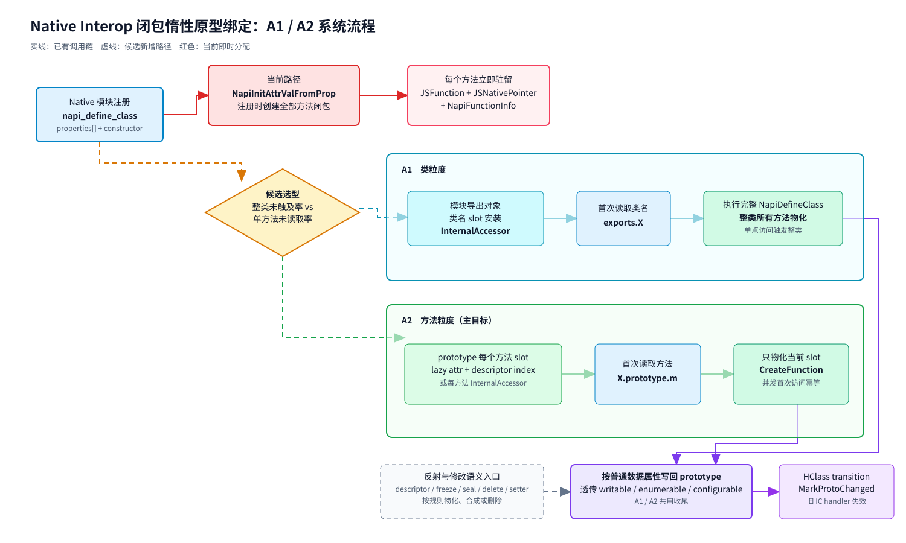
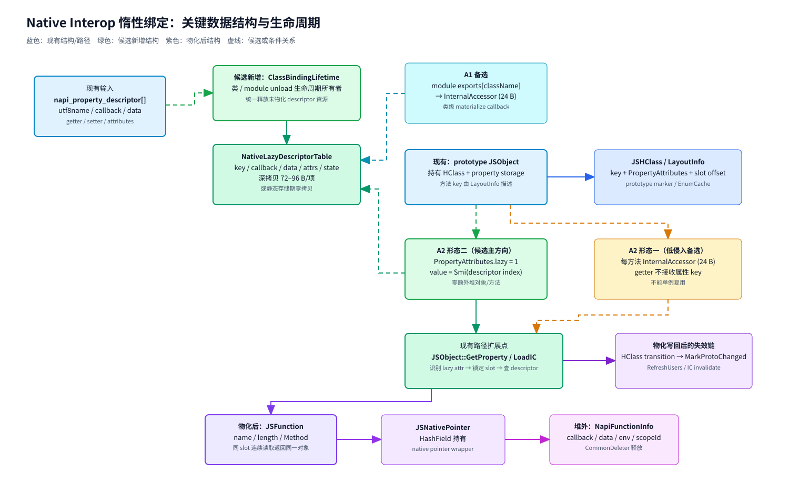

# Native Interop 闭包惰性原型绑定 —— 方案设计（按架构特性设计模板）

## 1、特性需求/问题/动机的来源与价值

**问题来源**：Top13 完整 Bucket C 为 505,444 个闭包、68.536 MiB，其中 prototype 普通/命名方法分量 447,707 个、61.474 MiB，constructor 分量 57,737 个、7.062 MiB。`napi_define_class` 即时绑定使未访问方法也常驻；当前 A2 只以方法分量为直接目标，constructor 分列且不计入 A2 收益。

**价值**：把方法闭包创建推迟到首次属性访问，消除未访问方法的确定性驻留；VM 已有内建对象惰性机制可复用（`SetLazyAccessor`/`InternalAccessor`/`BuiltinsLazyCallback`）。

**实现前 vs 实现后**：实现前每个 native 方法在类定义时即创建 JSFunction+JSNativePointer；实现后 prototype 方法 slot 首次被读取时才 materialize，之后与即时绑定完全一致。

## 2、特性影响分析

### 2.1 系统位置

NAPI 层（`napi_define_class` 注册链）+ VM property lookup（A2 粒度）+ IC（materialize 后失效）。

### 2.2 环境依赖

- NAPI 侧：descriptor 数组生命周期契约（深拷贝或静态存储期）；
- sendable 类排除；worker 继承宿主行为。

### 2.3 涉及模块

`foundation/arkui/napi`（native_api.cpp、ark_native_engine.cpp）、`ecmascript/napi/jsnapi_expo.cpp`、VM property lookup（`JSObject::GetProperty`/LoadIC handler/`GetOwnPropertyDescriptor`）、`builtins_lazy_callback.cpp`、GC/快照工具。

### 2.4 前后版本兼容性

- 不改变字节码格式、公开 API、`napi_define_class` 签名；
- 惰性 slot 是 accessor 形态，`getOwnPropertyDescriptor` 返回形态需兼容处理（按元数据合成数据属性描述符）；
- A1 新增模块注册契约时需版本管理。

### 2.5 外部用户感知

- `typeof X.prototype.m === 'function'`、`fn.name/length`、`proto.m === proto.m` 行为一致；
- 首次访问多一次 materialize 延迟（量级需实测）；
- 严格模式对 native 方法赋值（埋点）依赖惰性 slot 的 setter 实现。

### 2.6 性能影响

- 注册期：类定义时不再创建全部方法闭包（按 context 数倍增收益）；
- 首次访问：一次 accessor 慢路径 + attr 改写 + IC 失效（1–3 μs 估计，未测）；
- 稳态：全部方法被访问的类与即时绑定一致；IC 命中率需验证。

## 3、业界竞品分析

| 引擎 | 做法 |
|---|---|
| V8 | API 函数通过 `ApiFunction` 瘦身 + 惰性反馈向量，但 prototype 方法绑定仍即时 |
| JSC | 无对应惰性 prototype 绑定机制 |
| ArkVM 内建对象（现有） | `BuiltinsLazyCallback` 惰性初始化全局对象槽位（同机制先行者） |
| ArkVM（本方案） | 把内建惰性机制扩展到 NAPI 类 prototype 方法 |

## 4、本特性的设计/实现方案

### 4.1 架构总览

系统流程如下。红色路径是当前 `napi_define_class` 在注册期为全部方法创建闭包的实现；A1/A2 是插桩完成后的两个候选路径，二者共用 descriptor 生命周期管理、方法物化、属性写回和 IC 失效闭环。



可编辑源图：[`native-interop-lazy-binding-flow.drawio`](native-interop-lazy-binding-flow.drawio)。

关键数据结构关系如下。蓝色节点是现有结构或路径，绿色节点是候选新增结构，紫色节点是物化后的既有对象。`ClassBindingLifetime` 和 `NativeLazyDescriptorTable` 是设计名称，不是当前源码中已有类型。



可编辑源图：[`native-interop-lazy-binding-data.drawio`](native-interop-lazy-binding-data.drawio)。

两种粒度的结构边界：

- A1 在模块导出对象的类名 slot 上复用现有 `InternalAccessor` 机制，首次读取类名时执行完整 `NapiDefineClass`；需要新增模块级注册契约，类内任一访问会物化整类。
- A2 在 prototype 的方法 slot 上保存惰性状态。形态一为每方法一个 `InternalAccessor`；形态二为 `PropertyAttributes.lazy + Smi(descriptor index)`，需要扩展 property lookup、反射语义和 IC 路径，但不增加每方法堆对象。
- 两者都必须让 descriptor 活到首次访问或模块卸载，并由同一生命周期所有者处理未物化资源释放；物化后使用普通数据属性写回，触发现有 HClass transition、`MarkProtoChanged`、`RefreshUsers` 和 IC handler 失效链。

### 4.2 两种粒度

**A1 类粒度**：在模块导出对象上为每个类名安装 `InternalAccessor`，`napi_define_class` 推迟到类名首次读取。

- 残留：每类 24 B（一个 `InternalAccessor`）；
- 敏感度：类内任一方法/类对象被访问则整类 materialize（WIDE 档单类 20–134 方法，`session.start()` 一次即 134 闭包）。

**A2 方法粒度**：在 prototype 每个方法 slot 上装惰性标记，首次读取该 slot 才创建 JSFunction。

- 残留形态一：每方法一个 `InternalAccessor`（24 B，`InternalGetFunc` 签名不接收属性键，无法单例区分方法）；
- 残留形态二：`PropertyAttributes` 增加 lazy 位，值槽存指向 native descriptor 表的 Smi 索引（每方法零堆残留，需改 property lookup 全路径）。

### 4.3 具体改动（A1/A2 共用）

`napi_define_class` 当前读完 `properties` 即丢弃；惰性化后 descriptor 需活到首次访问——深拷贝 `napi_property_descriptor` 数组并挂到类生命周期（默认），或新增静态存储期契约入口。

### 4.4 兼容性处理

| 操作 | 处理 |
|---|---|
| `getOwnPropertyDescriptor` | 触发 materialize 或按元数据合成数据属性描述符 |
| `proto.m = f`（埋点） | 惰性 slot 提供 setter：丢弃元数据、按普通数据属性写入 |
| `Object.freeze/seal/preventExtensions` | 全部 materialize 后执行 |
| `delete proto.m` | configurable=1 时直接删除惰性 slot |
| sendable 类 | 排除（跨线程，保留即时路径） |
| 属性位 | `napi_writable/enumerable/configurable` 逐条透传，不沿用内建固定值 |

### 4.5 materialize 的 IC 失效机制（具体化）

惰性 slot materialize 等价于「原型对象属性重定义」，必须触发既有原型链失效链路，而不是只改 LayoutInfo：

1. 原型侧：materialize 写入按 `JSObject::SetProperty` 等价路径执行，使原型 HClass 走 transition/attr 更新并调用 `JSHClass::MarkProtoChanged`（`js_hclass-inl.h:379-399`）置 marker、失效 EnumCache；
2. 用户侧：已注册的原型监听（ProtoChangeDetails listener）经 `RefreshUsers` 链刷新持有旧 shape 的用户对象；
3. IC 侧：LoadIC/StoreIC 原型链 handler 依赖 marker 版本判断，marker 更新后旧 handler 自动不命中；MegaICCache 的裸缓存条目按现有 `Invalidate` 路径清理；
4. 「原地改共享 LayoutInfo attr」的实现必须与上述链路对齐（A2 形态二的风险点），禁止只改数组不动 marker。

验证：materialize 前后分别在循环中热访问原型属性（建立 IC），materialize 后旧值不得命中错误 handler。

### 4.6 descriptor 深拷贝的驻留成本（量化要求）

A2 惰性化后 `napi_property_descriptor` 数组须存活至首次访问或卸载。单个 descriptor（名称/方法指针/data/属性位）堆外约 72–96 B：按 Bucket C 涉及的类数 × 平均方法数估算，descriptor 驻留为**堆外新增成本**，直接抵扣收益。插桩阶段须同步输出该值，净收益口径为：

```text
净收益 = 消除的 (JSFunction + JSNativePointer + NapiFunctionInfo) − descriptor 深拷贝驻留
```

若 descriptor 驻留超过消除量的 20%，须评估静态存储期契约入口（零拷贝）作为主路径。

### 4.7 插桩设计（前置里程碑）

- Phase 1 在 `NapiDefineClass`/`NapiNativeCreateFunction` 创建侧以 `NapiFunctionInfo *` 登记外置 registry entry，在现有 `ArkNativeFunctionCallBack` 汇聚点标记调用；复用 `persist.hiviewdfx.napiprofiler.enabled` 和 NAPI 已链接的 `CountTraceEx`/`HITRACE_TAG_ACE`，只发固定名称的聚合 counters，不新增 TSV、HiSysEvent schema、hidumper 命令或显示；
- Phase 1 只能得到 callback 调用率和整类未调用率；调用率是读取率下界，未调用率是未读取率及收益上界，不能称作「未读取率」或直接作为期望收益；Bucket C 的零活实例仍由同一采样点 full-GC/rawheap 判定；
- Phase 2 读取打点必须覆盖解释器快路径、IC handler、compiler/AOT、prototype handler 与 descriptor/反射路径。不得用 `JSObject::GetProperty` 单点慢路径推导 `neverRead`；
- 读取形态单列：值读取（`X.prototype.m`）与 descriptor 形态（`getOwnPropertyDescriptor`/`freeze`/序列化），避免把能力探测误判为真实调用；
- 场景三档：冷启动完成 / 主流程 5 min / 后台驻留 30 min。属性读取全路径覆盖验收通过后，才输出「整类未触及占比」与「单方法未读取占比」用于 A1/A2 选型。具体可行 patch 与准入条件见 `05-插桩patch.md`。

### 4.8 方案利弊

| 方案 | 收益上限 | 代价 |
|---|---|---|
| A1 类粒度 | 「整类未触及」比例 | 新增模块注册契约；单点访问整类 materialize |
| A2 方法粒度 | 「单方法未读取」比例 | 改 property lookup 全路径 + IC + descriptor 语义 |

选型由插桩统计的两个比例决定：整类未触及占比 vs 单方法未读取占比。

## 5、DFX 分析

- 可诊断性：快照工具识别惰性 slot；materialize 后 dump 正常；
- 可运维性：descriptor 生命周期契约文档化；NapiFunctionInfo 释放时机（CommonDeleter）随惰性推迟，module unload 需验证不重复释放。

## 6、可信分析

- **可靠性**：per-slot 原子 materialize 状态机；并发首次访问幂等；异常重入处理；
- **安全性**：descriptor 深拷贝复制名称与 data 生命周期（data 资源所有权仍归模块）；
- **隐私/无害**：不涉及。

## 7、关键 DT 用例简述

| 测试用例名称 | 预置条件 | 用例关键步骤 | 预期结果 |
|--------------|----------|--------------|----------|
| 首次读取 materialize | 零实例类 | `typeof X.prototype.m` | 创建 JSFunction，第二次取同一对象 |
| getOwnPropertyDescriptor | 惰性 slot | `getOwnPropertyDescriptor(proto,'m')` | 数据属性描述符形态 |
| 严格模式赋值 | 惰性 slot | `proto.m = f` | setter 生效，按数据属性写入 |
| 并发首次访问 | 两线程 | 同时读同一方法 slot | 只 materialize 一次，幂等 |
| sendable 排除 | sendable 类 | define_class | 保留即时路径 |
| module unload | 未 materialize | 卸载模块 | descriptor 不重复释放 |

## 8、结论

方案设计完成，按「先插桩定收益 → 选 A1/A2」实施。遗留问题见 `04-review-log.md`。

## 附录一：可测试性设计

- 插桩统计（前置）：Phase 1 输出 callback 调用聚合，并以同次 rawheap 封顶当前存量；Phase 2 全路径覆盖后才导出 `(类,方法,是否被读取,首次读取时刻)`；
- property semantics 全矩阵（descriptor/赋值/freeze/seal/delete/proxy/反射拷贝）；
- IC 失效正确性；worker/sendable；异常/重入；module unload；GC；
- 两版快照 + clean A/B。

## 附录二：评审范围

影响 NAPI 注册与 property lookup 的 SR 级方案，需架构会议评审；可拆分子 AR（插桩统计 / A1 模块契约 / A2 property 路径）分 PR 上库。