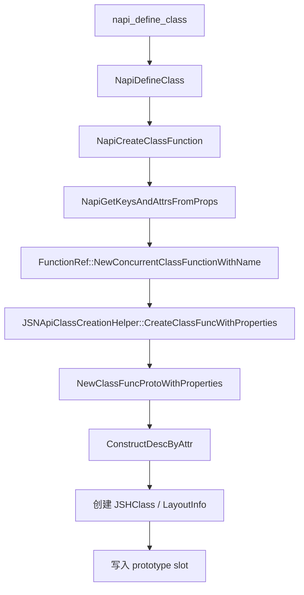
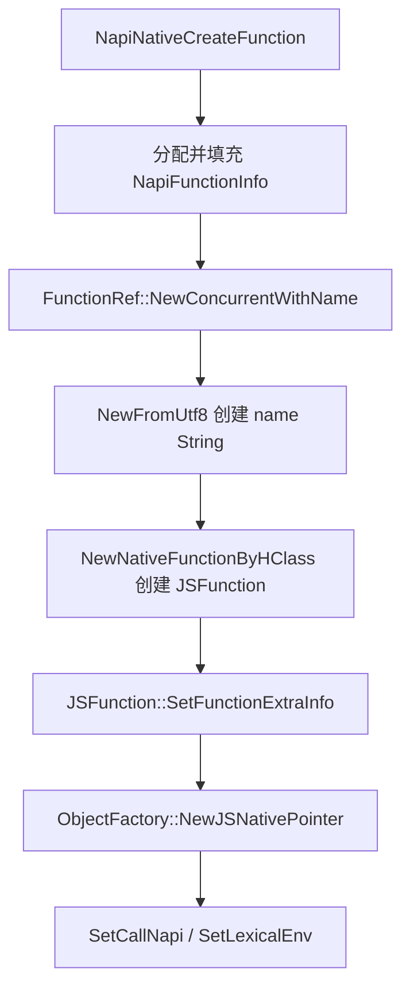
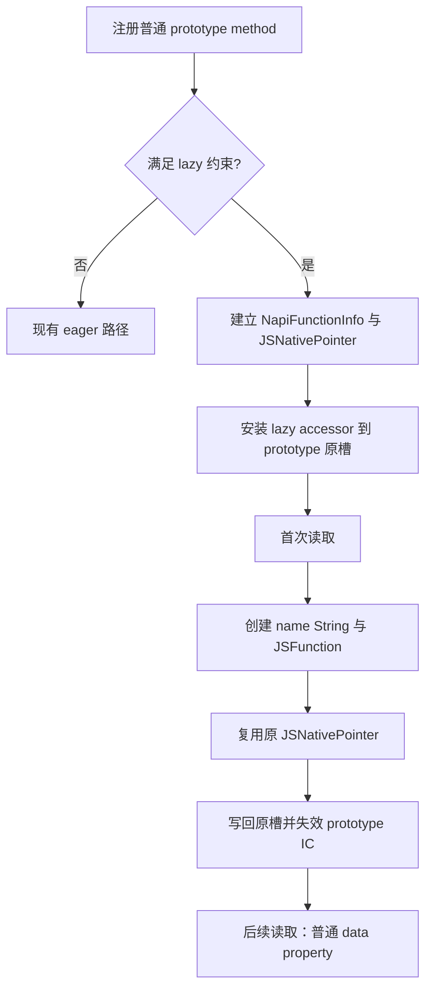
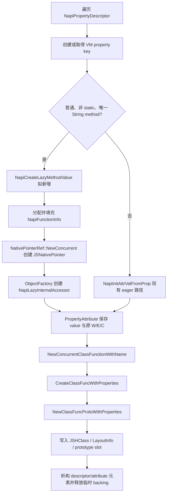
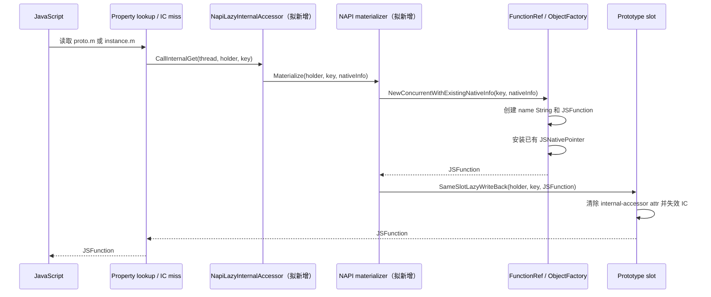
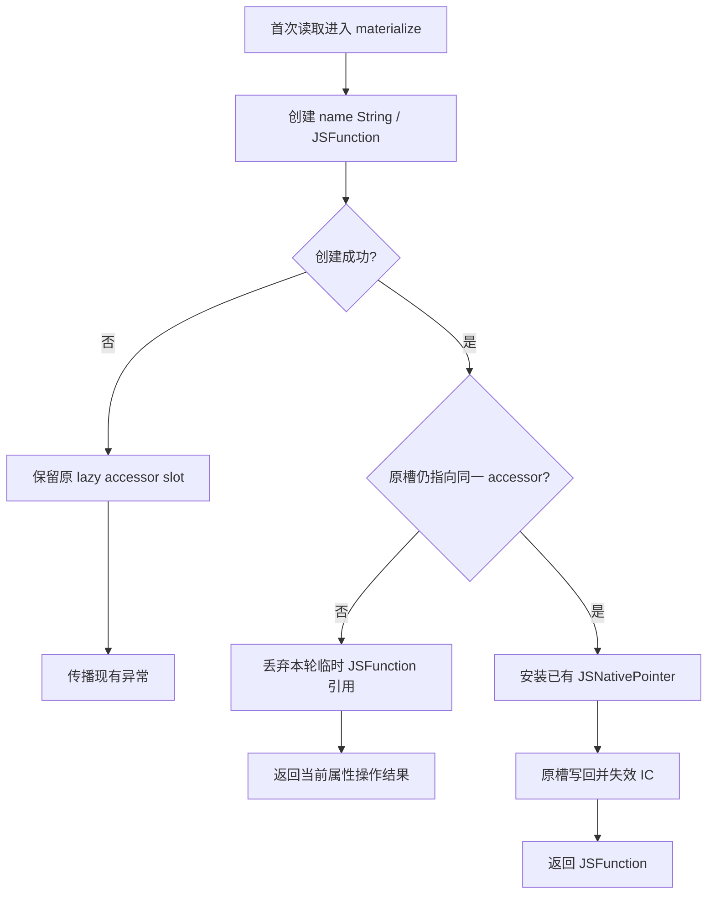

# Native Interop Prototype Method Lazy Materialization 方案设计

## 1. 背景与目标

`napi_define_class` 当前在类注册阶段为每个 native method 立即创建完整函数对象。对于启动阶段只注册但不读取的方法，`JSFunction` 及函数名 String 仍会进入堆并参与后续 GC。

本方案将普通 prototype method 的 `JSFunction` 与函数名 String 延迟到首次读取时创建。注册阶段仍创建 `NapiFunctionInfo` 与 `JSNativePointer`，以复用现有 GC/finalizer 生命周期，避免引入独立 native registry、逐槽状态机和环境卸载协调。

设计目标：

- 保持 `napi_define_class` 公共接口、调用方 descriptor 生命周期和普通 JavaScript 数据属性语义不变；
- 未读取方法不创建 `JSFunction` 与函数名 String；
- 首次读取后写回原 prototype slot，稳态对象形态和现有 eager method 一致；
- 只修改 NAPI class 注册、InternalAccessor 分发、原槽写回和对应 GC 类型支持；
- C1 候选不新增逐槽 CAS、generation token、native side registry、guard drain 或 cleanup hook；
- 允许收益小于延迟完整函数对象图的实现，以换取更少且边界明确的运行时修改点。

## 2. 范围

### 2.1 支持范围

只有同时满足以下条件的属性进入 lazy 路径：

- 由普通 `napi_define_class` 注册；
- `method != nullptr`；
- 非 `NATIVE_STATIC`；
- 属性键是唯一的 String key；
- prototype 使用 `CreateClassFuncProtoHClass` 创建的独立非共享 HClass/LayoutInfo；
- 在 EcmaVM owner thread 上注册、读取和修改。

`napi_writable`、`napi_enumerable`、`napi_configurable` 按注册值保留。

### 2.2 不支持范围

以下情况继续走现有 eager 路径：

- constructor callback；
- static method；
- getter、setter 和 value property；
- Symbol key、element-index key 和重复 key；
- Sendable class、共享对象和跨线程首次读取；
- 非 `napi_define_class` 创建的普通对象属性；
- 无法证明 prototype HClass/LayoutInfo 独占的 class。

方案不提供未物化 metadata 的跨 GC 即时 native 回收，也不承诺未访问类的全部 native metadata 消失。`data` 始终是 non-owning native pointer，其目标资源生命周期仍由模块保证。

## 3. 当前实现

当前普通类注册链为：



`NapiGetKeysAndAttrsFromProps` 当前对 method 调用 `NapiNativeCreateFunction`。该函数真实执行责任为：



`NapiFunctionInfo` 由 NAPI 层分配；`JSNativePointer` 由 `JSFunction::SetFunctionExtraInfo` 经 `ObjectFactory::NewJSNativePointer` 创建。两者不是同一个函数创建的对象。`CommonDeleter` 在 `JSNativePointer` 终结时删除 `NapiFunctionInfo`。

类创建使用的 `keys[]/attrs[]` backing 在 `NapiCreateClassFunction` 路径结束时释放。`PropertyDescriptor[]` backing 由 `FunctionRef::NewConcurrentClassFunctionWithName` 路径创建；descriptor/attribute 元素分别由 `DestructDesc`、`DestructAttr` 析构。

## 4. 候选架构与准入闸门

### 4.1 总体流程



| 评审先看什么 | 必须成立的规则 |
|---|---|
| 延迟的对象 | 注册阶段不得创建 `JSFunction` 或函数名 String；`NapiFunctionInfo` 与 `JSNativePointer` 仍在注册阶段创建。 |
| 一次性切换 | 只在首次 value read 时物化；物化后必须写回**同一个 prototype slot**。 |
| 语义边界 | JavaScript 侧始终表现为数据属性；key-only 枚举、删除和覆盖不得因读取旧值而意外物化。 |
| IC 正确性 | 写回同时清除 internal-accessor 标记并走既有 prototype IC 失效链；不能只替换 slot value。 |
| 回退路径 | static、accessor、Symbol、重复 key、Sendable 或无法证明 LayoutInfo 独占时保持 eager。 |

### 4.2 数据结构

以下类型和接口均为拟新增，不是当前 OpenHarmony 已有实现。

```cpp
// 拟新增：GC 管理的内部 accessor subtype。
// getter/setter 前缀与 InternalAccessor 的调用约定保持一致。
class NapiLazyInternalAccessor : public Record {
public:
    InternalGetFunc getter;
    InternalSetFunc setter;
    JSTaggedValue nativeInfo;  // strong tagged reference -> JSNativePointer
};
```

对象关系：

```text
prototype slot
  |
  +-- 未物化 --> NapiLazyInternalAccessor                 [拟新增，GC object]
  |                 |
  |                 +-- strong tagged reference
  |                       |
  |                       +--> JSNativePointer             [现有]
  |                              |
  |                              +-- data --> NapiFunctionInfo [现有]
  |                                           callback
  |                                           data (non-owning)
  |                                           env
  |                                           scopeId
  |
  +-- 已物化 --> JSFunction                               [现有]
                    |
                    +-- extra info --> 同一个 JSNativePointer
```

`LayoutInfo` 仍只保存 key 与 `PropertyAttributes`。其中不保存 callback、recipe、token、directory 或 native lifetime。函数名直接使用 property lookup 已定位的 VM String key，不复制调用方 `utf8name`，也不保存裸 `napi_value`。

对象尺寸必须通过目标 ABI probe 和 allocator measurement 得出。本文不把结构体字段推导值当作稳定 ABI 大小。

### 4.3 C1 准入闸门与回退

本章的数据结构和后续流程描述的是 C1：`NapiLazyInternalAccessor` 直接强引用 `JSNativePointer` 的简化候选。C1 不是已确认的实现基线；以下任一闸门不能通过时，不得按 C1 开发。

第 14 轮目标 Release 源码核验已确认：C1 不能在保持现有 `InternalAccessor` 结构、无 registry/guard 和无 key-aware 分发改造的前提下实现，因此 C1 不进入开发。正式实现基线为 C2；本节保留 C1 仅用于说明被排除的设计边界。核验依据见 [04-review-log.md](04-review-log.md)。

| 准入闸门 | 必须证明的事实 | 不通过时的处理 |
|---|---|---|
| GC 类型 | 新 subtype 的 `nativeInfo` 可被 visitor、verifier、dump 和 snapshot 路径正确扫描，且不改变现有 `InternalAccessor` 的裸字段约定。 | 转 C2，不引入带 tagged payload 的新 accessor subtype。 |
| 读取分发 | 所有解释器、IC、AOT 和 descriptor 读取路径都能在统一位置传入已定位的 VM key。 | 转 C2，使用外置 recipe/directory 保存物化所需信息。 |
| 卸载生命周期 | 未物化与已物化状态都能沿现有环境销毁和 finalizer 路径安全回收，`NapiFunctionInfo` 只删除一次。 | 转 C2，增加 VM-owned lifetime guard 与终态管理。 |
| IC 写回 | `NotifyAccessorChanged` 覆盖 prototype listener 和 MegaIC 失效链，热 IC 在物化后不再返回 accessor。 | 保持 eager，直到既有失效链得到可执行验证。 |

| 方案 | 核心做法 | 可行性判断 |
|---|---|---|
| C1：直接 strong reference | 新 GC accessor subtype 直接持有 `JSNativePointer`，首读写回原槽。 | 不进入开发：既有 `InternalAccessor` 无 tagged payload，getter 分发也不携带 key；补齐后等价于引入 C2 的专用对象与分发。 |
| C2：VM-owned recipe | 专用 lazy accessor 与外置最小 recipe、slot directory、lifetime guard 管理未物化状态。 | 正式实现基线；仍需完成 key-aware 分发和热 IC、GC、卸载验证。 |
| C3：eager | 保持现有 `NapiNativeCreateFunction` 路径。 | 语义与兼容性基线；任一收益或正确性闸门失败时使用。 |
| D1：仅堆外回调元数据按类合并 | 不改属性槽，把每函数独立 `NapiFunctionInfo` 改为每次 `napi_define_class` 一块 compact native table。 | 与 C2 正交的独立方向，只作用于堆外分量，不触碰属性查找、IC 与 GC。设计见 [07-堆外回调元数据压缩方案.md](07-堆外回调元数据压缩方案.md)。 |

评审结论与待验证证据见 [04-review-log.md](04-review-log.md)。

### 4.3 所有权与回收

| 对象 | Owner | 创建位置 | 回收位置 |
|---|---|---|---|
| `NapiFunctionInfo` | `JSNativePointer` 的 external data | NAPI 注册路径 | 现有 `CommonDeleter` |
| `JSNativePointer` | 未物化时由 lazy accessor 强引用；物化后由 `JSFunction` extra info 强引用 | NAPI 注册路径 | 现有 GC/finalizer |
| `NapiLazyInternalAccessor`（拟新增） | prototype slot | VM ObjectFactory | slot 被替换、覆盖或删除后由 GC 回收 |
| `JSFunction` | prototype slot 及 JavaScript 引用 | 首次读取 | 现有 GC |
| 函数名 String | `JSFunction` name property | 首次读取 | 现有 GC |
| `data` 指向的资源 | native module | 本方案不创建 | 本方案不释放 |

未物化属性被覆盖或删除时，slot 不再引用 lazy accessor；随后 accessor 与 `JSNativePointer` 按 GC 可达性回收，`CommonDeleter` 删除 `NapiFunctionInfo`。不增加 environment-scoped registry 或 cleanup hook。

## 5. 注册流程

### 5.1 真实函数链与集成点

注册继续使用现有调用链：

```text
napi_define_class
  -> NapiDefineClass
  -> NapiCreateClassFunction
  -> NapiGetKeysAndAttrsFromProps
  -> FunctionRef::NewConcurrentClassFunctionWithName
  -> JSNApiHelper::CreateClassFuncWithProperties
  -> NewClassFuncProtoWithProperties
  -> ConstructDescByAttr
  -> JSHClass / LayoutInfo / prototype slot
```

在 `NapiGetKeysAndAttrsFromProps` 的 method 分支增加 eligibility 判断：

- 非目标 property：调用现有 `NapiNativeCreateFunction`；
- 目标 property：调用 `NapiCreateLazyMethodValue`（拟新增），返回 `NapiLazyInternalAccessor` 对应的 `Local<JSValueRef>`；
- `PropertyAttribute` 继续保存原 W/E/C；
- `ConstructDescByAttr` 根据 lazy accessor value 把内部 accessor 标记写入目标 slot；
- key 的 intern、HClass/LayoutInfo 创建和 prototype slot 填充继续由现有 class creation helper 负责。

### 5.2 注册流程图



### 5.3 注册失败

- `NapiFunctionInfo` 分配失败：返回现有错误结果，不发布 slot；
- `JSNativePointer` 或 lazy accessor 分配触发异常：GC 回收已创建对象，未发布 prototype；
- class function/prototype 创建失败：沿现有异常路径析构 descriptor/attribute，并释放 `keys[]/attrs[]/descs[]` backing；
- eager 与 lazy property 任一失败时，整个 `napi_define_class` 不发布半成品 class。

## 6. 首次读取与写回

### 6.1 读取流程

解释器、runtime stub、IC miss 和 compiler slow path 已将内部 accessor 汇聚到 `CallInternalGet` / `CallInternalGetter`。拟新增 subtype 接入这一汇聚点，不在各级 fast path 分别实现 NAPI callback metadata 查找。



`CallInternalGet(thread, holder)` 当前不携带 key。实现需新增 key-aware overload 或把已定位 key 传给 NAPI lazy 分发；不能重新保存调用方名称指针。

### 6.2 函数创建

`NewConcurrentWithExistingNativeInfo`（拟新增）复用现有 `FunctionRef::NewConcurrentWithName` 的对象初始化顺序，但不调用 `JSFunction::SetFunctionExtraInfo` 创建第二个 `JSNativePointer`：

```text
NewConcurrentWithExistingNativeInfo（拟新增）
  -> NewFromUtf8 / property key 对应字符串创建 function name
  -> NewNativeFunctionByHClass 创建 JSFunction
  -> SetFunctionExtraInfoFromExisting（拟新增）
       -> 将已有 JSNativePointer 写入 JSFunction extra info
  -> SetCallNapi
  -> SetLexicalEnv
```

已有 `NapiNativeCreateFunction` 不承担该职责，仍用于 eager 路径。

### 6.3 原槽写回

`SameSlotLazyWriteBack`（拟新增）只作用于 `CreateClassFuncProtoHClass` 创建的独占 HClass/LayoutInfo：

1. 用 holder 与 key 重新定位当前属性；
2. 确认 slot value 仍是本次 lazy accessor；
3. 保持 key、W/E/C、offset、inline/out-of-line 和 `Representation::TAGGED` 不变；
4. 在独占 LayoutInfo 中清除 internal-accessor 标记；
5. 通过 GC write barrier 把原 slot value 替换为 `JSFunction`；
6. 调用现有 `JSHClass::NotifyAccessorChanged`，使 prototype marker/listener 链失效旧 IC handler。

不得通过 `TransitionForAttributeChanged` 把 prototype 转为 dictionary mode，也不得只替换 value 而遗漏 accessor 标记和 IC 失效。

### 6.4 失败回滚



函数对象在成功写回前只保存在当前 handle scope。创建失败不移动 `JSNativePointer` 所有权，slot 仍持有 lazy accessor，后续读取可重试。owner-thread 约束下不需要 CAS 或等待者队列。

## 7. JavaScript 可观察语义

未物化 slot 在 VM 内部使用 accessor 标记，但对 JavaScript 必须表现为普通数据属性。

| 操作 | 最终规则 |
|---|---|
| `proto.m`、`instance.m` | 首次读取物化并返回函数；后续直接读取同一个 `JSFunction` |
| `typeof proto.m`、调用、`Object.entries`、spread | 因读取 value 而物化 |
| `Object.keys`、`Object.getOwnPropertyNames`、`for...in` | 只枚举 key，不物化 |
| `getOwnPropertyDescriptor(proto, "m")` | 物化后返回真实数据属性 descriptor |
| `proto.m = f` | 不创建旧函数；若 writable，直接把 prototype 原槽转为普通数据属性并写入 `f` |
| `instance.m = f` | 按普通 prototype data property 语义在 receiver 建立或更新 own property，不改 prototype lazy slot |
| `defineProperty(proto, "m", desc)` | 按当前数据属性 descriptor 校验；不需要旧 value 时直接覆盖 lazy slot，需要比较/返回旧 value 时先物化 |
| `delete proto.m` | configurable 时直接删除，不物化；否则返回失败或按调用语义抛错 |
| `Object.seal` | 不读取 value；保留 lazy slot并把 configurable 置 false |
| `Object.freeze` | descriptor 查询会取得当前 value，因此先物化，再把 writable/configurable 置 false |
| `Object.preventExtensions` | 只修改 extensible 状态，不物化已有 slot |
| Proxy 包装 prototype | 由 Proxy trap 决定是否最终读取 target value；进入普通 target get 时再物化 |

赋值路径必须区分 holder 与 receiver。不得用一个修改 holder 的内部 setter 模拟全部写操作。

## 8. HClass、IC、GC 与生命周期影响

### 8.1 HClass 与 LayoutInfo

注册完成后：

- key、W/E/C、offset、inline/out-of-line 和 `TAGGED` representation 已固定；
- LayoutInfo 只增加内部 accessor 属性标记，不保存 NAPI metadata；
- prototype slot value 是 lazy accessor，而不是 `JSFunction`。

首次物化后：

- 清除内部 accessor 标记；
- 原 offset 写入 `JSFunction`；
- 不增加、删除或重排 property；
- 不创建新的普通属性，也不迁移为 dictionary mode。

`CreateClassFuncProtoHClass` 当前为每个 class prototype 新建 HClass 和 LayoutInfo，因此该原槽转换不会修改其他 prototype 的布局。实现必须用单元测试和 debug assertion 固化此不变量。

### 8.2 IC

- 未物化时，fast load 识别 accessor 标记并进入现有 internal getter slow path；
- 物化写回后调用 `JSHClass::NotifyAccessorChanged`，旧 prototype-chain handler 因 marker 变化失效；
- 后续 profile 重新生成普通 data-property handler；
- 不为 lazy subtype新增独立 MegaIC side table。

### 8.3 GC

- lazy accessor 的 `nativeInfo` 是 tagged strong reference，必须加入 object visitor；
- `JSNativePointer` 内部 native 字段继续由现有 visitor/finalizer 处理；
- 写回必须使用 write barrier；
- heap snapshot、dump 和 verifier 识别拟新增 JSType；
- snapshot 序列化不支持该 subtype 时，相关 class 禁用 lazy 路径，而不是序列化裸 native pointer。

### 8.4 Native lifetime

`NapiFunctionInfo` 从注册开始存活，直到其唯一 `JSNativePointer` 不再可达。物化只把 `JSNativePointer` 的强引用从 lazy accessor 转移到 `JSFunction`，不复制、删除或重建 `NapiFunctionInfo`。

环境卸载与 GC 并发关系沿用现有 `JSNativePointer/CommonDeleter`。本方案不增加 registry teardown、generation 校验或 guard drain。`env`、callback 和 non-owning `data` 必须满足现有 NAPI function lifetime 契约。

## 9. 运行时修改点

| 模块 | 修改内容 |
|---|---|
| `foundation/arkui/napi/native_engine/impl/ark/ark_native_engine.cpp` | eligibility 判断；注册期创建 `NapiFunctionInfo + JSNativePointer + lazy accessor`；保留 eager fallback |
| `ecmascript/napi/include/jsnapi_expo.h`、`jsnapi_expo.cpp` | 拟新增 lazy value 创建入口和复用已有 `JSNativePointer` 的 function materializer |
| `ecmascript/accessor_data.h` 及对象类型定义 | 拟新增 `NapiLazyInternalAccessor`、类型判断、visitor 与 dump |
| `ecmascript/object_factory.*` | 拟新增 lazy accessor factory |
| property lookup/runtime stub | key-aware internal getter 分发；只在统一 slow path识别 lazy subtype |
| property write/descriptor/integrity path | holder/receiver-aware 覆盖规则和需要 value 时的物化规则 |
| prototype slot helper | 拟新增原槽写回、accessor attr 清除和 IC 失效 |
| GC/snapshot/heap profiler | 新 JSType 的扫描、验证、dump；不支持的 snapshot 路径禁用 lazy |
| tests | NAPI、property semantics、IC、GC、异常与 clean A/B |

不修改公开 NAPI ABI、字节码格式、`LayoutInfo` 字段布局或 Sendable 路径。

## 10. 收益边界

每个未读取目标方法仍保留：

- 一个 `NapiFunctionInfo`；
- 一个 `JSNativePointer`；
- 一个 `NapiLazyInternalAccessor`。

延迟分配的是：

- `JSFunction`；
- function name String；
- `JSFunction` 创建所需的附属堆分配。

因此净收益必须按实测 allocator actual 计算：

```text
Net = avoided(JSFunction + name String + function adjunct allocations)
      - NapiLazyInternalAccessor actual allocation
      - 新类型带来的 GC / IC 成本
```

不得套用完整 native 函数对象图的历史闭包体积作为本方案收益。shallow、committed、RSS、PSS、Region 占用、native allocator 和 GC 成本分别报告。冷启动和首帧收益只以真机 clean A/B 结果为准。

当目标类的方法在启动阶段均被读取时，本方案主要增加首次访问开销，不产生长期堆收益。功能默认关闭，并使用精确 bundle allowlist；是否扩大范围由真机结果决定。

## 11. 风险与控制

| 风险 | 控制措施 |
|---|---|
| InternalAccessor 内部表示泄漏为 accessor descriptor | descriptor 查询统一先物化，并验证返回 data descriptor |
| receiver/holder 处理错误 | 单独覆盖 `proto.m = f` 与 `instance.m = f`，禁止统一 setter 改 holder |
| 原槽写回遗漏 IC 失效 | helper 内强制调用 `NotifyAccessorChanged`，增加热 IC 前后值一致性测试 |
| LayoutInfo 被其他对象共享 | eligibility 检查、debug assertion 和 HClass/LayoutInfo identity 测试；不满足即 eager |
| `JSNativePointer` 被重复拥有或重复删除 | 物化复用同一个 GC object，不重新调用 `NewJSNativePointer` |
| GC visitor 遗漏 payload | verifier、minor/full/compact GC 和 heap snapshot 测试 |
| 首次访问长尾 | 记录首次物化 P50/P95/P99；超过门限时关闭目标 bundle |
| 内存净收益为负 | 按类和 bundle 比较 allocator actual；不满足准入条件时保持 eager |
| snapshot/serialization 不认识新类型 | 不支持路径直接禁用 lazy，不序列化 native pointer |

## 12. 验证方案

### 12.1 功能与语义

- 首次读取创建函数，第二次读取返回同一对象；
- `name`、`length`、`typeof`、调用结果与 eager 对照一致；
- W/E/C 全组合；
- key-only 枚举不物化，value 读取型枚举物化；
- descriptor、prototype/instance 赋值、defineProperty、delete；
- seal、freeze、preventExtensions；
- Proxy get/defineProperty/deleteProperty；
- duplicate key、Symbol、static、accessor 和 Sendable 均验证 eager fallback；
- 函数创建异常后原 slot 可重试，无半物化值。

### 12.2 VM、IC 与 GC

- 解释器、baseline、AOT、JIT-free+AOT 和 PGO 路径分别验证；
- 物化前建立 prototype IC，物化后旧 handler 不得返回 accessor 或旧值；
- minor/full/compact GC 前后读取一致；
- 覆盖/删除未物化 slot 后 `JSNativePointer` 只终结一次；
- heap snapshot、dump、verifier 不崩溃且能区分未物化与已物化对象；
- 环境销毁时未物化和已物化方法均无 double free、UAF 或 callback 越界访问。

### 12.3 真机 clean A/B

A/B 必须使用同一源码、产品、编译配置、bundle、操作序列和采样点，分别测量：

- `napi_define_class` 注册耗时；
- 首帧、可交互时间和启动总时延；
- lazy eligible 数、未物化数、物化时点；
- 首次物化 P50/P95/P99；
- JS heap shallow/committed、Region、GC 次数与 pause；
- 进程 RSS/PSS；
- `NapiFunctionInfo`、`JSNativePointer`、lazy accessor 和 `JSFunction` 的 allocator actual。

前后台快照分别验证，不能用 host 字节码或对象编译结果替代整机启动验证。

## 13. 工作量与排期

| 阶段 | 工作内容 | 人日 |
|---|---|---:|
| 设计 | 类型布局、属性语义、GC/IC 接口细化 | 3 |
| 开发 | 注册路径与 factory | 5 |
| 开发 | 首次物化、已有 nativeInfo 安装、原槽写回 | 7 |
| 开发 | descriptor/write/integrity 与 snapshot fallback | 4 |
| 测试 | NAPI 与 JavaScript 语义矩阵 | 6 |
| 测试 | IC、GC、teardown、AOT/JIT-free | 5 |
| 测试 | 真机 clean A/B 与报告 | 3 |
| **合计** |  | **33** |

建议排期为 5 周：第 1 周完成设计和对象类型；第 2 周完成注册与物化主链；第 3 周完成属性语义和 GC/IC；第 4 周完成 DT；第 5 周完成真机 clean A/B、风险收敛和默认开关结论。

## 14. 结论

第 14 轮目标 Release 源码核验后，C1 直接 strong-reference 候选不进入开发。正式实现采用 C2 的 VM-owned recipe：注册期为目标方法建立专用 lazy accessor、最小 `{method, data}` recipe、slot directory 和 lifetime guard；首次读取时创建完整 native 函数对象图并写回原 prototype slot。

方案限定为普通、唯一 String key、非 static、非 Sendable 的 prototype method。其他属性继续使用现有 eager 路径。C2 必须通过 key-aware 分发、热 IC、GC 和卸载验证；收益不足或无法满足语义时保持 eager。

堆外分量另有一个与 C2 正交的独立方向 D1：属性槽语义、属性查找、IC 与 GC 全部不变，只把每函数独立分配的 `NapiFunctionInfo` 收敛为每次 `napi_define_class` 一块 compact native table。D1 的正式收益必须扣除每表 header，并以创建路径 census、allocator actual 和 clean A/B 为准；可独立于 C2 先行落地，设计见 [07-堆外回调元数据压缩方案.md](07-堆外回调元数据压缩方案.md)。