# NAPI Prototype Native 方法按需绑定设计方案

| 项目 | 内容 |
|------|------|
| 文档用途 | 最终设计方案 |
| 文档日期 | 2026-08-21 |
| 源码基线 | `OpenHarmony-7.0-Release@4ad97323...`；`arkcompiler_ets_runtime@f04900cf`；`foundation/arkui/napi@464170c9` |
| 设计范围 | `napi_define_class` 的 prototype native 方法注册、首次读取、属性语义、并发、卸载、GC 与 IC 正确性 |

## 1. 目标与范围

`napi_define_class` 当前在类注册期间为每个 native prototype 方法创建完整的 JavaScript 函数对象。即使方法从未被读取，这些对象仍由 prototype 属性强引用。

本设计将普通、非 Sendable 类的 prototype `method` 改为按需绑定：

1. 注册期创建 constructor、prototype、属性键和属性标志，但不创建目标方法的 `JSFunction`、`JSNativePointer` 与 `NapiFunctionInfo`；
2. 每个目标方法安装一个 VM 管理的 `NapiLazyAccessor`，并保存一个运行时自有的最小回调元数据记录 `{method, data}`；
3. 首次读取该属性时创建现有 native 函数对象图，将 prototype 属性写回为普通数据属性；
4. 后续读取、调用和 IC 行为与当前即时创建路径一致。

### 1.1 设计目标

- 未读取的方法不创建 native 函数对象图；
- 不改变公开 NAPI API、`napi_define_class` 签名或字节码格式；
- 函数名称、`length`、对象身份、属性标志和严格模式行为与当前实现一致；
- 属性写回保持 prototype HClass、`LayoutInfo` 和属性标志不变，并显式失效依赖惰性槽的 prototype/IC 缓存；
- 每个方法的回调元数据可在物化、覆盖或删除后单独释放；
- 环境销毁时不留下可调用的 native 回调或悬空 `data` 指针。

### 1.2 适用范围

按需绑定仅用于同时满足以下条件的属性：

- 通过 `napi_define_class` 注册；
- `property.method != nullptr`；
- 未设置 `NATIVE_STATIC`；
- 类不是 Sendable 类。

constructor、static method、getter、setter、普通 value 属性以及 Sendable 类保持当前即时创建流程。

## 2. 当前创建流程

### 2.1 调用链

当前 OpenHarmony 7.0 源码中的方法创建链为：

```text
napi_define_class                                  native_api.cpp:1643-1674
  -> NapiDefineClass                              ark_native_engine.cpp:333-369
     -> NapiCreateClassFunction                   ark_native_engine.cpp:288-330
        -> NapiGetKeysAndAttrsFromProps           ark_native_engine.cpp:250-285
           -> NapiInitAttrValFromProp             ark_native_engine.cpp:216-247
              -> NapiNativeCreateFunction         ark_native_engine.cpp:190-213
                 -> FunctionRef::NewConcurrentWithName
                                                    jsnapi_expo.cpp:3947-3978
```

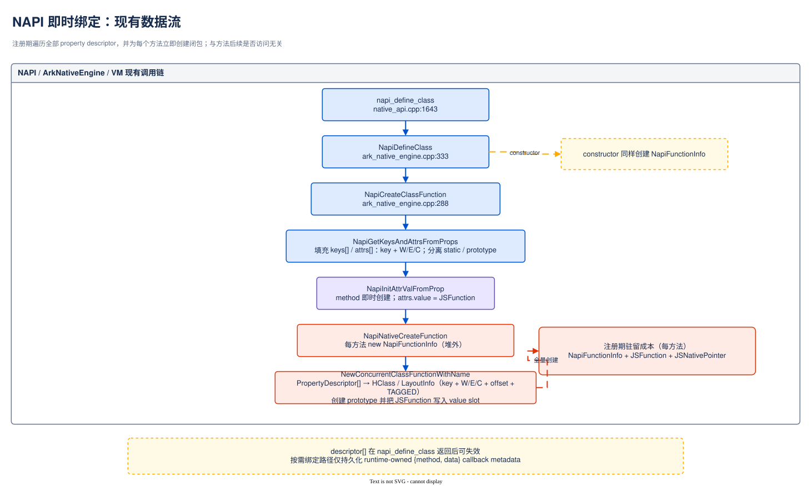

> 可编辑源文件：[napi-eager-binding-current-flow.drawio](napi-eager-binding-current-flow.drawio)

### 2.2 当前各阶段的职责

| 阶段 | 当前行为 | 产生的数据 |
|------|----------|------------|
| `NapiGetKeysAndAttrsFromProps` | 遍历所有 descriptor，区分 static 与 prototype 属性，构造 VM key 和 `PropertyAttribute` | 临时 `keys[]`、`attrs[]` |
| `NapiInitAttrValFromProp` | getter/setter 创建 accessor；method 直接创建 native 函数；value 直接转换 | 每个 method 的 `JSFunction` 引用 |
| `NapiNativeCreateFunction` | 分配并初始化 `NapiFunctionInfo` | `{callback, data, env, scopeId}` |
| `FunctionRef::NewConcurrentWithName` | 创建 `JSFunction`，并通过 extra info 关联 `JSNativePointer` 和 `NapiFunctionInfo` | 完整 native 函数对象图 |
| `NewConcurrentClassFunctionWithName` | 创建 constructor/prototype，并安装 static 与 prototype 属性 | prototype 数据属性强引用 `JSFunction` |

`napi_property_descriptor[]`、`utf8name` 和 `napi_value name` 都属于调用方输入。`napi_define_class` 返回后，按需路径不得继续引用这些临时数据。

## 3. 最终架构

### 3.1 方法级生命周期

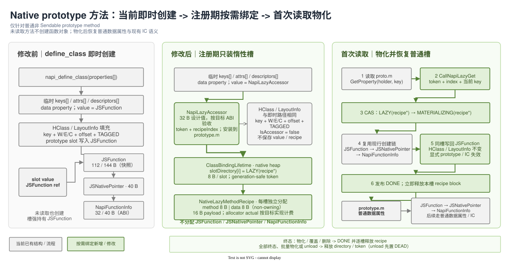

> 可编辑源文件：[napi-lazy-binding-method-before-after-core.drawio](napi-lazy-binding-method-before-after-core.drawio)

生命周期分为三个阶段：

- **注册完成**：prototype 属性保存 `NapiLazyAccessor`；runtime 保存独立 `{method, data}` 记录；native 函数对象尚未创建；
- **首次读取**：属性查找携带 holder 和当前 VM key 进入物化流程；创建 native 函数并写回 prototype；
- **稳态**：prototype 属性是普通数据属性，值为 `JSFunction`；不再经过惰性分发。

### 3.2 组件关系

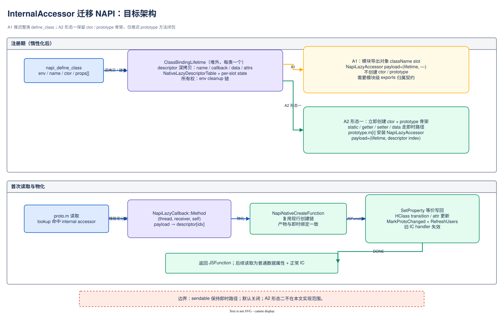

> 可编辑源文件：[napi-lazy-binding-target-architecture.drawio](napi-lazy-binding-target-architecture.drawio)

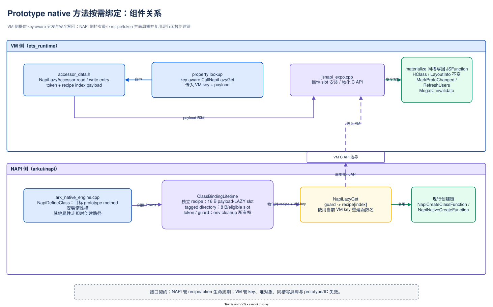

> 可编辑源文件：[napi-lazy-binding-component-relations.drawio](napi-lazy-binding-component-relations.drawio)

| 组件 | 职责 |
|------|------|
| NAPI class registration | 分类属性、建立最小回调元数据、创建 constructor/prototype、安装惰性方法槽 |
| VM property lookup | 识别 `NapiLazyAccessor`，传递 holder、receiver 和当前 VM key |
| Lazy method registry | 用 generation-safe token 定位 `ClassBindingLifetime`，返回受保护的 lifetime guard |
| Native function factory | 复用 `NapiNativeCreateFunction` 与 `FunctionRef::NewConcurrentWithName` 创建最终函数 |
| Property update path | 在同一 property slot 中把惰性值替换为 `JSFunction`，保持 HClass/LayoutInfo 不变并失效旧 IC handler |
| Environment cleanup | 发布 `DEAD`，等待在途 guard，释放未物化记录、状态目录和 registry token |

## 4. 注册期设计

### 4.1 流程修改

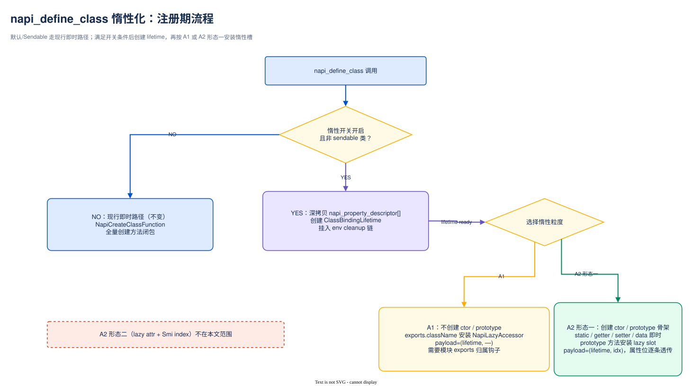

> 可编辑源文件：[napi-lazy-binding-registration-flow.drawio](napi-lazy-binding-registration-flow.drawio)

`NapiCreateClassFunction` 的属性准备与类对象填充阶段改为以下顺序：

1. 扫描 descriptor，统计目标 prototype method 数量并保持现有 static/prototype 排序规则；
2. 若数量非零，创建一个 `ClassBindingLifetime`、一个 `slotDirectory[N]` 和 generation-safe registry token；
3. 对每个属性按现有规则创建 VM String/Symbol key，并填充临时 `PropertyAttribute` 的 writable、enumerable、configurable；
4. 对目标 prototype method 单独分配 `NativeLazyMethodRecipe {method, data}`，创建 payload 为 `{token, recipeIndex}` 的 `NapiLazyAccessor`，并将其写入临时 `PropertyAttribute.value`；其他属性继续调用当前 `NapiInitAttrValFromProp` 创建即时值；
5. `NewConcurrentClassFunctionWithName` 将 `PropertyAttribute[]` 转成临时 `PropertyDescriptor[]`；两条路径都产生普通数据属性 descriptor，区别仅是目标方法的 `value` 为 `JSFunction` 或 `NapiLazyAccessor`；
6. `AddInlinedPropToHClass` 按相同顺序把 key、writable/enumerable/configurable、data-property 标志、inline/out-of-line 位置、slot offset 和 `TAGGED` representation 填入 prototype HClass/LayoutInfo；
7. `NewJSObjectWithInit` 按该 HClass 创建 prototype；随后 `SetPropertyInlinedProps` 或 `DefinePropertyOrThrow` 把 descriptor value 写入对应 property slot；
8. 将目录项发布为 `LAZY(recipe*)`。注册成功后，目标 property slot 保存 `NapiLazyAccessor`；当前即时路径则保存 `JSFunction`；
9. 任一步骤失败时，撤销已发布 token，并释放已分配的 recipe、目录和 lifetime，再沿当前异常路径返回。

注册成功后，调用方 descriptor、临时名称、`keys[]`/`attrs[]`/`PropertyDescriptor[]` 容器和 handle 均不进入持久状态。VM String/Symbol key、`PropertyAttributes` 和 prototype property slot 已复制到 VM 管理对象中。

### 4.2 注册期填充前后差异

注册期必须区分临时转换数据、HClass/LayoutInfo 属性元数据和 prototype 属性值。`LayoutInfo` 不保存 property value、callback、recipe 或 directory entry。

| 填充位置 | 当前即时创建 | 按需绑定注册完成 | 差异性质 |
|----------|--------------|------------------|----------|
| 调用方 `napi_property_descriptor` | 提供 name、method、data、attributes | 输入结构与 ABI 相同 | 不变；返回后均不再引用 |
| 临时 `keys[]` | 每属性创建 VM String/Symbol key | 相同 key、数量和 static/prototype 排序 | 不变 |
| 临时 `PropertyAttribute[]` 的 W/E/C | 从 descriptor attributes 填充 | 相同 | 不变 |
| 目标方法的 `PropertyAttribute.value` | 注册期创建并填入 `JSFunction` | 填入 `NapiLazyAccessor` | value 创建方式改变 |
| 临时 `PropertyDescriptor[]` | 普通数据属性；value 为 `JSFunction` | 普通数据属性；value 为 `NapiLazyAccessor` | 仅临时 value 不同 |
| prototype HClass | 加入全部 prototype key，确定属性数、inline capacity 和对象尺寸 | 相同 | HClass 填充内容不变 |
| prototype `LayoutInfo` | `key + PropertyAttributes` | 相同 key、W/E/C、`IsAccessor=false`、offset、inline 标志和 `TAGGED` representation | 属性元数据不变 |
| prototype property slot | 写入 `JSFunction` 引用 | 写入 `NapiLazyAccessor` 引用 | 持久 value 不同 |
| callback metadata | 创建 `JSNativePointer + NapiFunctionInfo` | 保存独立 `{method, data}` recipe、directory state 和 accessor payload | 持久回调表示改变 |

目标方法从注册完成起就是一个普通数据属性。`NapiLazyAccessor` 只是该数据属性 value slot 中的 VM 内部惰性值；它不得使 `JSTaggedValue::IsAccessor()` 返回 true，也不得使 `PropertyAttributes::IsAccessor` 置位。否则类创建中的 `PropertyAttributes(PropertyDescriptor)` 会把目标方法填成 accessor property，首次物化将被迫执行 accessor-to-data HClass transition，并改变可观察 descriptor 语义。

两条路径的注册完成状态为：

```text
当前即时创建：
  LayoutInfo[i] = { key: "m", attrs: data + W/E/C + offset + TAGGED }
  prototype.slot[i] = JSFunction

按需绑定：
  LayoutInfo[i] = { key: "m", attrs: data + W/E/C + offset + TAGGED }
  prototype.slot[i] = NapiLazyAccessor
  slotDirectory[j] = LAZY(NativeLazyMethodRecipe { method, data })
```

### 4.3 新增数据结构

```cpp
struct NativeLazyMethodRecipe {
    NapiNativeCallback method;
    void *data;
};
```

在 64 位 ABI 下，该记录包含两个指针，逻辑 payload 为 16 B、对齐为 8 B。每个未物化方法拥有一个独立 allocator block；`data` 是非拥有指针，释放 recipe 时不得释放 `data` 指向的资源。

```cpp
class NapiLazyAccessor : public Record {
    NativeReadEntry readEntry;
    NativeWriteEntry writeEntry;
    TaggedPayload payload;  // generation-safe token + recipe index
};
```

`NapiLazyAccessor` 是 VM 管理的专用惰性方法槽对象，不依赖内建对象初始化类型。设计目标为 32 B；最终对象大小、GC visitor 范围和 factory 分配大小必须由目标 ABI probe 共同确认。

```cpp
struct ClassBindingLifetime {
    std::unique_ptr<std::atomic<uintptr_t>[]> slotDirectory;
    uint32_t slotCount;
    uint32_t lazyCount;
    GenerationSafeToken token;
};
```

每个目录项占一个机器字，在 64 位目标上为 8 B，编码以下状态：

```text
LAZY(recipe*) -> MATERIALIZING(recipe*) -> DONE
       |                    |
       +---- failure -------+

LAZY / MATERIALIZING / DONE -> DEAD  (environment teardown)
```

具体 tag 编码必须满足 recipe 指针对齐要求。目录项是 recipe block 的唯一所有者；只有在终态发布后才能释放 recipe。

### 4.4 字段来源与所有权

| 数据 | 来源 | 持久位置 | 所有权与生命周期 |
|------|------|----------|------------------|
| property key / function name | `utf8name` 或 `napi_value name` | VM String/Symbol 与属性元数据 | VM 管理；物化时从当前 key 重建函数名 |
| writable/enumerable/configurable | descriptor attributes | `PropertyAttributes` | VM 管理；始终作为数据属性语义解释 |
| `method` | descriptor | `NativeLazyMethodRecipe` | 复制指针值；recipe 独立拥有该副本 |
| `data` | descriptor | `NativeLazyMethodRecipe` | 复制非拥有指针值；资源仍归 native 模块 |
| recipe identity | 注册顺序 | accessor payload 与 `slotDirectory` | token 防地址复用，index 在 lifetime 内稳定 |
| materialization state | registration/runtime | `slotDirectory[index]` | 原子发布；environment cleanup 统一终止 |

## 5. 首次读取与写回

### 5.1 首次读取流程

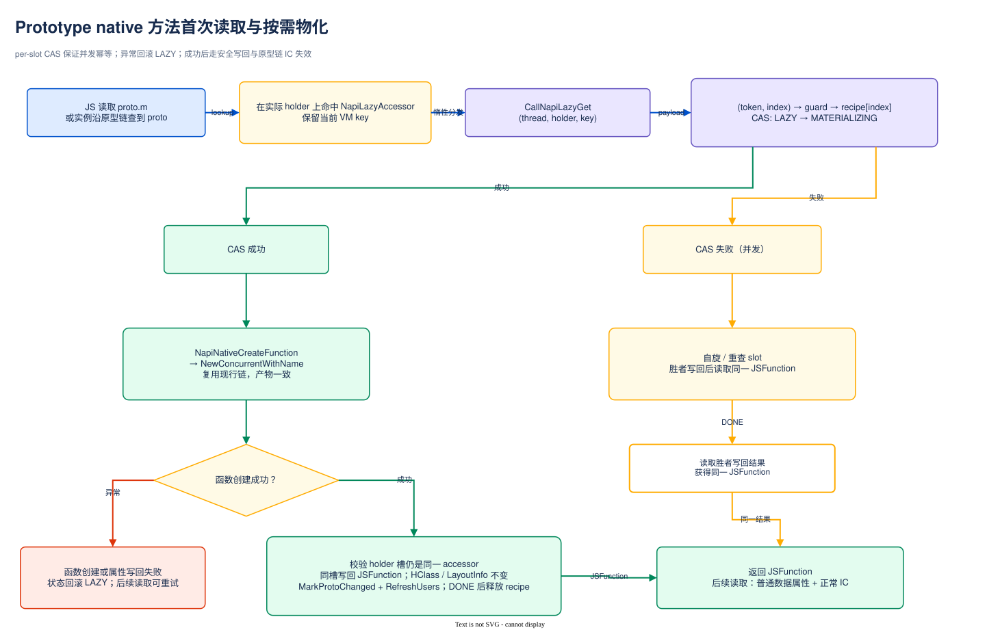

> 可编辑源文件：[napi-lazy-binding-materialize-flow.drawio](napi-lazy-binding-materialize-flow.drawio)

读取 `receiver.m` 时，属性查找必须保留实际持有属性的 `holder` 和当前 VM key：

1. lookup 在 `holder` 上命中 `NapiLazyAccessor`；
2. `CallNapiLazyGet(thread, receiver, holder, key, payload)` 解析 token/index，并取得 lifetime guard；
3. 对目录项执行 `LAZY(recipe*) -> MATERIALIZING(recipe*)` CAS；
4. 胜者使用当前 key、recipe.method 和 recipe.data 调用现有 native 函数创建链；
5. 写回前重新确认 holder 的属性仍是同一个 accessor，避免覆盖已发生的重定义或删除；
6. 在保持 key、writable/enumerable/configurable、offset、representation、HClass 和 LayoutInfo 不变的前提下，把 holder 的同一 property slot 从 `NapiLazyAccessor` 原子替换为 `JSFunction`；
7. 写回提交后发布 `DONE`，再释放该槽的 recipe block；
8. 返回新建的 `JSFunction`。后续读取走普通数据属性与正常 IC。

创建或写回失败时，目录项回滚为 `LAZY(recipe*)`，recipe 保持有效，异常按当前 NAPI/VM 路径传播。CAS 未获胜的线程重新读取属性；胜者写回后所有读取者得到同一个 `JSFunction`。

### 5.2 时序

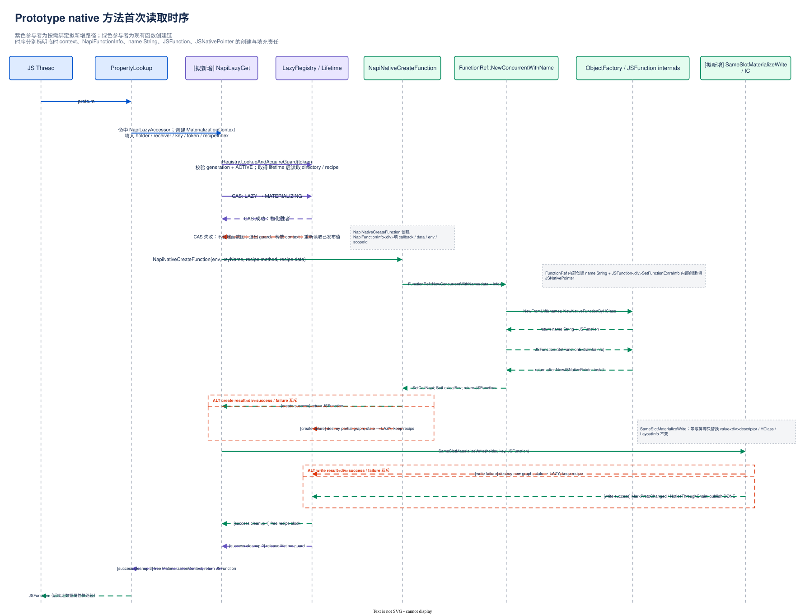

> 可编辑源文件：[napi-lazy-binding-first-access-sequence.drawio](napi-lazy-binding-first-access-sequence.drawio)

### 5.3 Prototype value 写回与 IC 失效

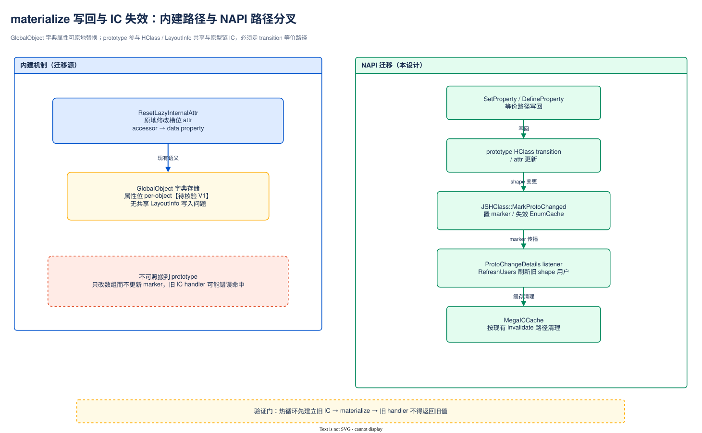

> 可编辑源文件：[napi-lazy-binding-ic-invalidation-flow.drawio](napi-lazy-binding-ic-invalidation-flow.drawio)

物化不增加、删除或重定义属性，也不修改共享 `LayoutInfo`。惰性值和最终 `JSFunction` 都是 `TAGGED` value，因此正常物化不需要 HClass transition：

1. 根据现有 HClass/LayoutInfo 取得目标 key、attributes 和 slot offset；
2. 校验 slot 仍保存当前 `NapiLazyAccessor`，然后通过带写屏障的专用路径替换同一 slot value；
3. prototype HClass identity、LayoutInfo identity、key、W/E/C、`IsAccessor=false`、offset 和 representation 保持不变；
4. 显式调用 `JSHClass::MarkProtoChanged`/`NoticeThroughChain` 并刷新 prototype users，因为不能依靠 HClass transition 自动失效依赖旧值的缓存；
5. 依赖惰性读取 handler 的 LoadIC、StoreIC 和 MegaIC 条目失效，新读取建立普通数据属性 handler。

物化专用写回不应被记录为一次 JavaScript 用户属性写入。若复用普通写入入口，必须验证 PGO `TrackType` 不会产生与即时创建路径不同的更新；否则应由专用写回跳过该 profiling 更新。

必须覆盖解释器、IC、runtime stub、compiler/AOT 和反射入口，保证任何读取路径都不会把 `NapiLazyAccessor` 本身作为 JavaScript 可观察值返回。

## 6. 属性语义

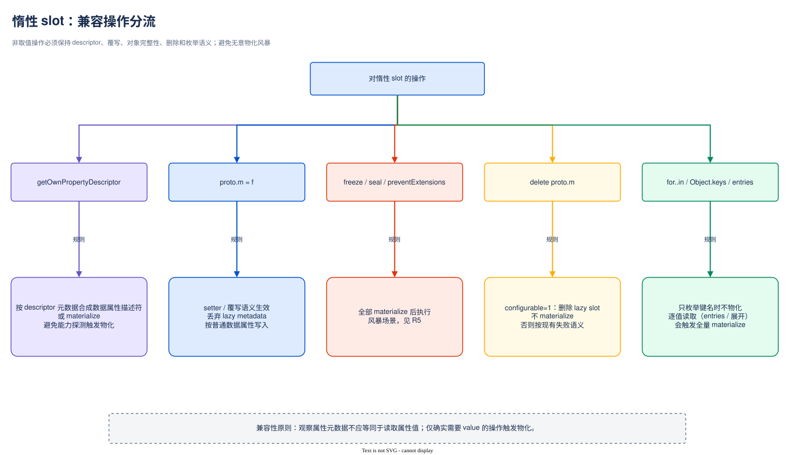

> 可编辑源文件：[napi-lazy-binding-compatible-operations-flow.drawio](napi-lazy-binding-compatible-operations-flow.drawio)

`NapiLazyAccessor` 只是 VM 内部表示，对 JavaScript 必须表现为普通数据属性。

| 操作 | 最终行为 |
|------|----------|
| `receiver.m` | 首次读取物化 holder 上的方法；返回 `JSFunction` |
| `Object.getOwnPropertyDescriptor(proto, "m")` | 先物化，再返回包含真实函数 value 的数据属性 descriptor |
| `holder.m = value` | `m` 是 holder 自有惰性槽时，writable 则直接用 value 替换并释放 recipe；不可写时沿当前严格/非严格模式处理 |
| `instance.m = value` | prototype 属性 writable 时在 receiver 上创建自有数据属性；prototype 惰性槽保持不变；不可写时沿当前失败语义处理 |
| `Object.defineProperty` 指定 value 或 accessor | 直接重定义并释放原 recipe |
| `Object.defineProperty` 仅修改 attributes | 先物化以保留原函数 value，再应用新 attributes |
| `delete proto.m` | configurable 时删除并释放 recipe；否则按当前删除失败语义处理 |
| `in`、`hasOwn`、`for...in`、`Object.keys` | 只查询属性或枚举键，不读取 value，不触发物化 |
| `Object.entries`、spread、序列化取值 | 读取到某个 value 时只物化对应方法；操作中断时不要求其余方法完成物化 |
| `freeze`、`seal` | 先物化该对象的全部自有惰性方法，再执行现有完整性操作，避免不可配置属性阻断后续内部写回 |
| `preventExtensions` | 只禁止新增属性；现有惰性方法保持不变，后续仍可物化为同一自有属性 |
| Proxy/Reflect | 底层目标遵循同一数据属性语义和 invariant 检查 |

覆盖或删除必须先发布终态，再释放 recipe。若操作作用于 receiver 而不是实际 holder，不得错误终止 prototype 上的惰性方法。

## 7. 生命周期与卸载

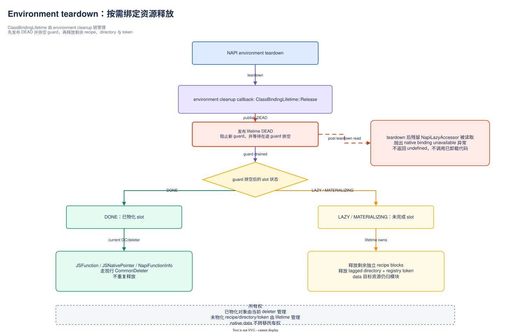

> 可编辑源文件：[napi-lazy-binding-unload-flow.drawio](napi-lazy-binding-unload-flow.drawio)

`ClassBindingLifetime` 由 NAPI environment cleanup 链管理：

1. environment teardown 发布 lifetime `DEAD`，阻止新的 lifetime guard 和物化操作；
2. 等待已取得的 guard 退出，确保没有线程仍读取 recipe；
3. 对未物化槽发布 `DEAD`，释放剩余独立 recipe block；
4. 释放 `slotDirectory` 和 registry token；
5. 已物化的 `JSFunction`、`JSNativePointer` 和 `NapiFunctionInfo` 继续由现有 GC 与 `CommonDeleter` 路径管理；
6. 不释放 recipe.data 指向的外部资源；
7. teardown 后的并发属性读取抛出 native binding unavailable 异常，不能返回 `undefined` 或调用已卸载代码。

清理路径与物化路径共享同一状态机和 guard 协议，避免重复释放、悬空回调和 token 地址复用造成的 ABA 问题。

## 8. 对象布局与成本口径

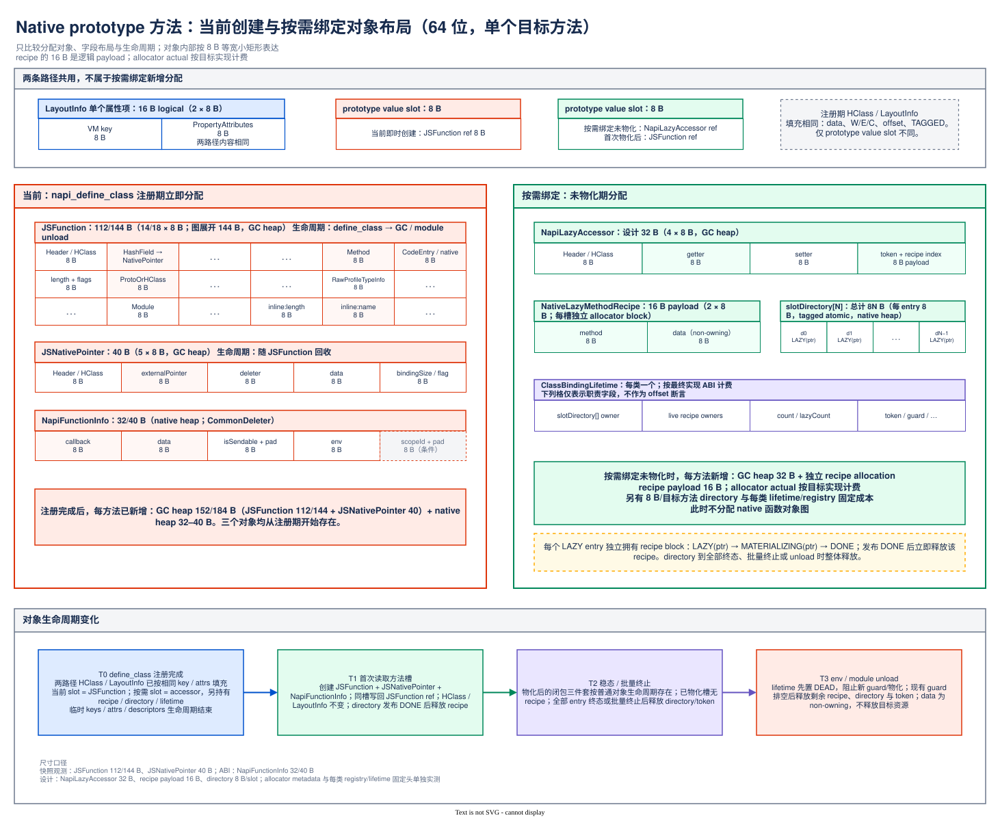

> 可编辑源文件：[napi-lazy-binding-object-layout-before-after.drawio](napi-lazy-binding-object-layout-before-after.drawio)

### 8.1 注册期分配变化

| 对象 | 当前即时创建 | 按需绑定注册完成且未物化 |
|------|--------------|--------------------------|
| `JSFunction` | 每方法创建 | 不创建 |
| `JSNativePointer` | 每方法创建 | 不创建 |
| `NapiFunctionInfo` | 每方法创建 | 不创建 |
| `NapiLazyAccessor` | 无 | 每目标方法一个；32 B 设计值，需目标 ABI 确认 |
| `NativeLazyMethodRecipe` | 无 | 每未物化方法一个独立 allocation；16 B 逻辑 payload |
| `slotDirectory` | 无 | 每目标方法一个 8 B entry |
| `ClassBindingLifetime`/registry | 无 | 每类一个固定成本 |
| prototype HClass | 注册期按全部 key/attributes 创建 | 相同属性数、capacity、对象尺寸和 identity |
| prototype `LayoutInfo` | 填充 key、W/E/C、data-property 标志、offset、`TAGGED` representation | 内容相同；不保存 recipe 或 lazy state |
| prototype property slot | 每目标方法保存 `JSFunction` | 每目标方法保存 `NapiLazyAccessor`；首次读取后同槽改为 `JSFunction` |

`LayoutInfo` 中已有的 key/attributes 和 prototype value slot 是两条路径共有的结构，不计为按需绑定新增分配。

### 8.2 生命周期成本

设类中共有 `N` 个目标方法，在检查点仍有 `U` 个未物化方法：

```text
net_shallow = sum(i in U)(avoided_eager_object_bytes(i)
                          - lazy_accessor_actual(i)
                          - recipe_allocator_actual(i))
              - directory_actual(N)
              - lifetime_registry_actual
```

计算与验证必须分开报告：

- recipe 的 16 B 逻辑 payload 与 allocator actual/usable bytes；
- accessor 的设计大小与最终 ABI 大小；
- 每类 directory、registry、guard 和 header；
- GC shallow/live bytes、Region used/committed、RSS/PSS；
- 首次读取时延、批量物化峰值和清理时延。

不得用逻辑字段大小替代 allocator 实际计费，也不得把 shallow bytes 直接等同于 committed 或 RSS/PSS 收益。

## 9. 兼容性与风险控制

| 风险 | 最终控制措施 | 验证要求 |
|------|--------------|----------|
| 读取快路径绕过物化 | 所有 lookup/IC/compiler/反射入口统一识别专用惰性槽 | 热解释器、IC、AOT、反射读取均返回函数而非内部对象 |
| prototype IC 在 HClass 不变时复用旧 handler | 同槽写回后显式进入 prototype invalidation 链，不能依赖 shape transition | 建立惰性 IC 后物化，旧 handler 不得返回内部槽或旧值 |
| descriptor 输入失效 | 仅复制 method/data；key/attrs 进入 VM 元数据 | define_class 返回后销毁输入缓冲仍可正确物化 |
| 并发或异常造成重复函数 | CAS 物化权；失败回滚；写回前校验 accessor identity | 多线程首读只发布一个函数；故障注入后可重试 |
| override/delete 与物化竞争 | 统一状态机；终态发布先于 recipe free | 覆盖、删除、defineProperty 与首读交错无 UAF/双释放 |
| environment teardown 竞争 | generation-safe token、guard drain、DEAD 后禁止新物化 | worker/env teardown 压测，无悬空 callback/data 读取 |
| 属性反射暴露内部表示 | descriptor 查询先物化，其他操作按数据属性语义分流 | descriptor、赋值、delete、freeze、proxy 测试通过 |
| Sendable 跨线程语义变化 | Sendable 类继续即时创建 | Sendable 回归无惰性槽 |
| 结构成本抵消收益 | 逐类计算真实 allocator 与固定成本，收益不成立时不启用 | clean A/B 分列结构成本和物理内存指标 |

功能默认通过注册期开关受控发布。关闭开关时，目标方法继续执行当前 `NapiNativeCreateFunction` 即时创建链，不改变已发布 NAPI 接口。

## 10. 测试设计

### 10.1 功能与属性语义

- 首次读取、重复读取和函数对象身份；
- string/symbol key 的函数名称与 `length`；
- own/inherited assignment、严格模式不可写属性；
- `getOwnPropertyDescriptor`、`defineProperty`、delete、键枚举和值枚举；
- freeze、seal、preventExtensions、Proxy 与 Reflect；
- constructor、static、getter、setter、value 和 Sendable 排除路径。

### 10.2 VM 与生命周期

- interpreter、LoadIC/StoreIC、MegaIC、runtime stub、compiler/AOT 全读取路径；
- 物化前建立 prototype-chain IC，物化后验证旧 handler 失效；
- 并发首读、异常回滚、override/delete 竞争；
- worker 创建/销毁、environment teardown、GC 和快照识别；
- allocator failure、函数创建失败、属性写回失败的完整回滚。

### 10.3 性能与内存

- 同构 clean A/B 的注册耗时、首次读取耗时和稳态吞吐；
- 每类 `N/U`、accessor actual、recipe allocator actual、directory 与固定头；
- full-GC 后 shallow/live bytes、Region used/committed 和 RSS/PSS；
- freeze/serialization 等批量物化场景的峰值时延和瞬时分配。

## 11. 实施工作量与排期

| 阶段 | 内容 | 人日 |
|------|------|-----:|
| 设计 | VM/NAPI 接口、对象布局、状态机、属性语义与错误传播定稿 | 4 |
| 开发 | 注册链与元数据所有权 | 6 |
| 开发 | VM 槽对象、key-aware lookup 与函数物化 | 8 |
| 开发 | prototype 写回、IC 失效与反射操作 | 7 |
| 开发 | lifetime registry、并发状态机与 environment cleanup | 6 |
| 测试 | 功能、property semantics、Sendable 与回归 DT | 7 |
| 测试 | IC/AOT、并发、异常、GC 与 teardown | 6 |
| 测试 | clean A/B、allocator 与物理内存验证 | 4 |
| **设计小计** |  | **4** |
| **开发小计** |  | **27** |
| **测试小计** |  | **17** |
| **总计** |  | **48 人日** |

按 2 名开发与 1 名测试并行安排，计划 6 周：第 1 周完成接口与布局；第 2-4 周完成注册、物化、属性语义和生命周期；第 3-5 周并行补齐 DT；第 6 周完成全路径回归与 clean A/B。

## 12. 设计结论

最终实现仅改变普通非 Sendable 类的 prototype native method：注册时安装专用惰性方法槽并持久化独立 `{method, data}` 记录，首次读取时复用现有函数创建链，随后写回普通数据属性。constructor 和其他属性类型保持当前流程。

方案成立的必要条件是：专用槽不对 JavaScript 可见、所有读取路径都进入物化、prototype 写回完整触发 IC 失效、每槽元数据按终态物理释放、environment teardown 在释放前排空 lifetime guard。上述条件由功能 DT、VM 全路径测试和 clean A/B 共同验收。

## 附录 A：源码锚点

| 事实 | 源码位置 |
|------|----------|
| public API 进入 `NapiDefineClass` | `foundation/arkui/napi/native_engine/native_api.cpp:1643-1674` |
| property key/attrs 构造和当前即时 value 创建 | `foundation/arkui/napi/native_engine/impl/ark/ark_native_engine.cpp:216-285` |
| constructor/prototype 创建 | `foundation/arkui/napi/native_engine/impl/ark/ark_native_engine.cpp:288-330` |
| class registration 入口 | `foundation/arkui/napi/native_engine/impl/ark/ark_native_engine.cpp:333-369` |
| `NapiFunctionInfo` 分配与 native function 创建 | `foundation/arkui/napi/native_engine/impl/ark/ark_native_engine.cpp:190-213` |
| `JSFunction`、name 和 extra info 创建 | `arkcompiler/ets_runtime/ecmascript/napi/jsnapi_expo.cpp:3947-3978` |
| prototype change marker | `arkcompiler/ets_runtime/ecmascript/js_hclass-inl.h:381-405` |

## 附录 B：术语

| 术语 | 含义 |
|------|------|
| 目标方法 | 满足本设计适用条件的非 static、非 Sendable prototype native method |
| 惰性方法槽 | 注册期安装、首次取值时被普通数据属性替换的 VM 内部属性表示 |
| 按需物化 | 根据回调元数据创建 `JSFunction` 对象图并写回属性的过程 |
| callback metadata recipe | 物化所需的最小运行时记录 `{method, data}` |
| slot directory | 每类的原子状态目录，连接 recipe 所有权与方法槽 index |
| lifetime guard | teardown 释放资源前用于保护在途物化操作的生命周期引用 |
| generation-safe token | 防止 registry entry 地址复用后旧 accessor 命中新 lifetime 的标识 |