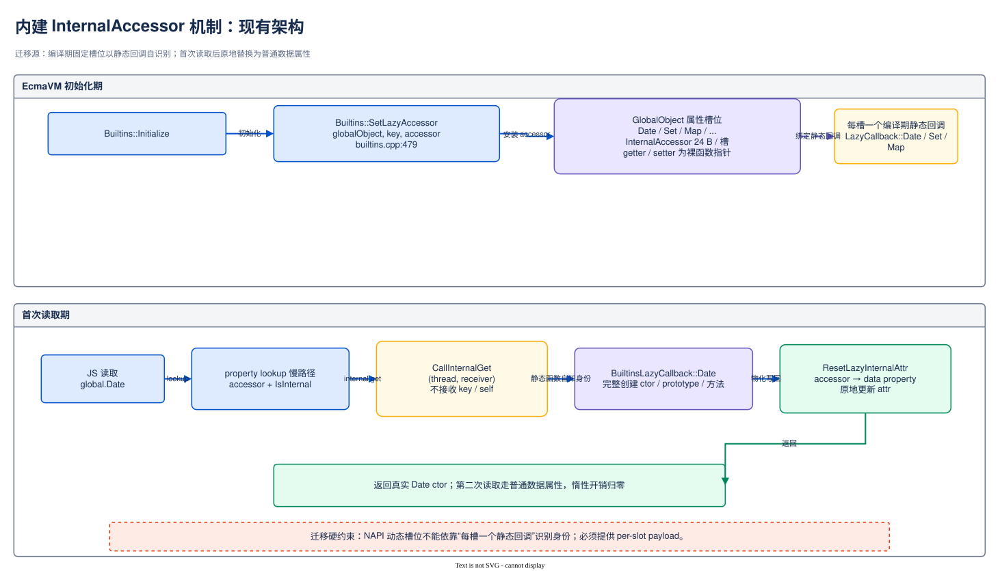

# Native Interop 惰性原型绑定 —— InternalAccessor 迁移 NAPI 设计评审

> 本文档对「把 VM 内建 InternalAccessor 惰性机制迁移到 NAPI 类注册链」的实现设计进行架构级评审，包含现有内建机制剖析、迁移架构图、流程图、数据结构、兼容性、性能、风险等维度的系统性评估。写作体例参照 `ArkTS-ConstantPool-Sparse-Pool-Phase1-Review.md`。

| 项目 | 内容 |
|------|------|
| 文档版本 | v1.0 |
| 评审日期 | 2026-08-20 |
| 方案阶段 | A1 类粒度 / A2 形态一（InternalAccessor 迁移路径）；A2 形态二（PropertyAttributes.lazy）不在本文范围 |
| 配套文档 | `01-背景.md`、`02-需求.md`、`03-方案设计.md`、`04-review-log.md`、`05-插桩patch.md` |
| 核验基线 | manifest `OpenHarmony-7.0-Release@4ad97323…`；`arkcompiler_ets_runtime@f04900cf`；`foundation/arkui/napi@464170c9`（沿用第 10 轮冻结基线） |
| 评审范围 | 内建机制可迁移性、迁移架构合理性、流程正确性、兼容性、性能、风险、可回滚性 |

---

## 1. 概述

### 1.1 背景

`napi_define_class` 在类定义时即时为 prototype 上每个方法创建 JSFunction + JSNativePointer + 堆外 NapiFunctionInfo，与方法是否被访问无关（`01-背景.md` §1–§2）。Top13 快照中零实例类 prototype 方法闭包 447,707 个、61.474 MiB（上界，非期望值，见 `01-背景.md` §4）。

VM 已有一套**内建对象惰性初始化机制**：

| 组件 | 锚点 | 作用 |
|------|------|------|
| `Builtins::SetLazyAccessor` | `ecmascript/builtins/builtins.cpp:479` | 在全局对象槽位安装惰性 accessor |
| `InternalAccessor` | `ecmascript/accessor_data.h:29` | 24 B（Record::SIZE=8 + getter 8 B + setter 8 B），存**裸函数指针**，非 JSFunction |
| `BuiltinsLazyCallback` | `ecmascript/builtins/builtins_lazy_callback.cpp` | Date/Set/Map/WeakMap 等逐槽惰性初始化回调 |
| `ResetLazyInternalAttr` | ets_runtime（物化写回点） | 首次读取后把惰性 accessor 槽位改回数据属性 |

本文回答的核心问题：**这套机制迁移到 NAPI 类注册链需要改什么、哪些部分能直接复用、哪些部分在 NAPI 场景下语义不成立**。

### 1.2 目标

| 目标 | 度量 |
|------|------|
| 消除未访问 native 方法的确定性驻留 | 每未访问方法节省堆内 ~184 B + 堆外 32–40 B，残留降为一个惰性 slot |
| 语义等价 | `typeof`、`fn.name/length`、`proto.m === proto.m`、descriptor 形态、严格模式赋值全兼容 |
| IC 正确 | materialize 后旧原型链 handler 不得命中（`03-方案设计.md` §4.5） |
| 可回滚 | 注册期开关控制，关闭时回到即时绑定 |
| 复用优先 | 最大化复用 SetLazyAccessor/CallInternalGet/ResetLazyInternalAttr 既有链路，最小化新增类型 |

### 1.3 范围

- **本文范围**：InternalAccessor 机制从内建对象迁移到 NAPI 的实现设计——A1（模块导出对象类名 slot）与 A2 形态一（prototype 方法 slot，每方法一个 accessor）；
- **不在本文范围**：A2 形态二（`PropertyAttributes.lazy` + Smi 索引，零堆残留但改 property lookup 全路径——第 2 轮已定为目标形态，形态一为过渡）；插桩统计（见 `05-插桩patch.md`）。

---

## 2. 现有架构分析

### 2.1 内建 InternalAccessor 机制架构图（现状，迁移源）



> 可编辑源文件：[napi-internal-accessor-current.drawio](napi-internal-accessor-current.drawio)

### 2.2 NAPI 即时绑定数据流（现状，迁移目标位置）


> 可编辑源文件：[napi-eager-binding-current-flow.drawio](napi-eager-binding-current-flow.drawio)

descriptor 数组（`napi_property_descriptor[]`）在 `napi_define_class` 返回后即被调用方丢弃——**这是迁移的第一个硬约束**：惰性化后 descriptor 必须活到首次访问或模块卸载（`03-方案设计.md` §4.3/§4.6）。

### 2.3 内建场景与 NAPI 场景的关键差异矩阵

迁移不是平移。内建机制的四个隐含前提在 NAPI 场景全部不成立：

| # | 维度 | 内建场景（机制原生环境） | NAPI 场景（迁移目标环境） | 迁移含义 |
|---|------|------------------------|--------------------------|----------|
| D1 | **槽位身份** | 槽位集合编译期固定（Date/Set/Map…），每槽一个静态回调函数，回调"自知身份"，`InternalGetFunc` 不需要属性键 | 类与方法运行期动态注册，数量无上界，不可能每方法一个静态回调 | 必须为 accessor 引入 **per-slot 运行期身份**（payload），这是 InternalAccessor 现有布局没有的能力 |
| D2 | **宿主对象属性存储** | 全局对象走慢字典模式（GlobalDictionary/PropertyBox，属性位 per-object），`ResetLazyInternalAttr` 原地改 attr 不涉及共享结构【待核验 V1】 | prototype 是普通对象，共享 HClass + LayoutInfo，参与原型链 IC | 原地改共享 LayoutInfo 会影响同 HClass 其他对象与已建 IC（第 2 轮/需求 §4 高风险项）——materialize 写回必须走 transition 等价路径 + `MarkProtoChanged`（`js_hclass-inl.h:379-399`），不能照搬内建的原地改写 |
| D3 | **回调闭包数据生命周期** | 回调只依赖 env/thread，无外部资源 | 回调依赖 `napi_property_descriptor`（方法指针/名称/data），原契约在 define_class 返回后失效 | 需要 descriptor 深拷贝（默认）或静态存储期契约，并有明确的卸载所有者 |
| D4 | **卸载/重入** | 内建永不卸载，初始化单线程 | 模块可卸载；worker/多 context 各自注册；首次访问可能并发、可能抛异常 | 需要 per-slot 原子 materialize 状态机 + module unload 时未物化资源的释放路径（第 4 轮闭环） |

**结论先行**：CallInternalGet 分发骨架、"accessor→数据属性"的物化范式、attributes 处理框架可复用；**槽位身份（D1）与写回路径（D2）必须重新设计**，这两点构成迁移的全部实质工作量。

---

## 3. 目标架构设计

### 3.1 目标架构图（迁移后）


> 可编辑源文件：[napi-lazy-binding-target-architecture.drawio](napi-lazy-binding-target-architecture.drawio)

### 3.2 架构设计原则

| 原则 | 说明 |
|------|------|
| 复用分发骨架 | 惰性 slot 命中、CallInternalGet 分发、"accessor→数据属性"物化范式沿用内建机制，property lookup 慢路径不新增分支类别 |
| 身份外置 | per-slot 身份放在 accessor payload，descriptor 内容放在堆外 ClassBindingLifetime——堆内残留最小化（每 slot 一个小对象） |
| 写回走正门 | materialize 写回必须走 SetProperty/DefineProperty 等价路径触发 `MarkProtoChanged` 失效链，**禁止**照搬内建的原地改 LayoutInfo attr（差异 D2） |
| 产物等价 | materialize 复用 `NapiNativeCreateFunction`→`FunctionRef::NewConcurrentWithName` 现行链路，产物对象与即时绑定逐字段一致 |
| 默认关闭 | 注册期开关（复用 NAPI 侧既有参数机制，具体参数名实施时定）控制惰性化；关闭时行为与现状完全一致 |
| sendable 排除 | `NapiDefineSendableClass` 保持即时路径，不安装惰性 slot |

### 3.3 InternalAccessor 身份问题的候选解（D1 的三个方案）

`InternalGetFunc` 签名为 `JSTaggedValue (*)(JSThread*, const JSHandle<JSObject>&)`——不接收属性键、不接收 accessor 自身（第 6 轮核验）。NAPI 动态槽位无法靠"每槽一个静态函数"自知身份，必须三选一：

| 候选 | 做法 | 残留/成本 | 侵入面 | 评估 |
|------|------|-----------|--------|------|
| X1 **扩展布局（推荐）** | 新增 `NapiLazyAccessor`（InternalAccessor 派生布局）：getter/setter 沿用裸指针 + 新增 payload 字段（Smi 编码 `(tableId, descIndex)` 或 JSNativePointer 指向 lifetime entry） | 每 slot 24→32 B | 新增一个 JSType + CallInternalGet 处调用点适配（回调需拿到 self）；内建路径不动 | 侵入面小、内建零改动；**32 B 残留取代文档中 24 B 口径，需同步修订** |
| X2 签名扩展 | `InternalGetFunc` 增加 `JSHandle<InternalAccessor> self`（或属性键）参数，payload 放扩展字段 | 同 X1 | 全部既有 `BuiltinsLazyCallback` 回调签名机械适配（~20 处）+ 所有 CallInternalGet 调用点 | 改动机械但横切内建，回归面大于 X1 |
| X3 receiver 侧表 | getter 统一 stub，以 receiver 为键查 native side map 找 lifetime | 每 slot 24 B（不扩布局） | 新增 GC 感知的对象→native 映射 | **仅 A1 可用**（模块导出对象 → 整模块 lifetime，一次触发物化整模块）；A2 同一 prototype 多方法无法区分 slot，不可用；且键随对象移动需 weak/更新语义，复杂度不划算 |

**推荐**：X1 为主路径（A1/A2 通用）；A1 若接受"整模块粒度物化"可退化用 X3 省一个新 JSType，但敏感度进一步恶化（任一类名读取物化整模块），不推荐。

### 3.4 组件关系图


> 可编辑源文件：[napi-lazy-binding-component-relations.drawio](napi-lazy-binding-component-relations.drawio)

---

## 4. 流程设计

### 4.1 注册期流程（napi_define_class 惰性化）


> 可编辑源文件：[napi-lazy-binding-registration-flow.drawio](napi-lazy-binding-registration-flow.drawio)

### 4.2 首次读取 materialize 流程（A2 形态一，核心路径）


> 可编辑源文件：[napi-lazy-binding-materialize-flow.drawio](napi-lazy-binding-materialize-flow.drawio)

### 4.3 materialize 写回与 IC 失效链路（与内建路径的分叉点）


> 可编辑源文件：[napi-lazy-binding-ic-invalidation-flow.drawio](napi-lazy-binding-ic-invalidation-flow.drawio)

### 4.4 兼容操作分流流程（惰性 slot 的非取值访问）


> 可编辑源文件：[napi-lazy-binding-compatible-operations-flow.drawio](napi-lazy-binding-compatible-operations-flow.drawio)

### 4.5 module unload 流程（未物化资源释放）


> 可编辑源文件：[napi-lazy-binding-unload-flow.drawio](napi-lazy-binding-unload-flow.drawio)

### 4.6 时序图（A2 形态一首次访问）


> 可编辑源文件：[napi-lazy-binding-first-access-sequence.drawio](napi-lazy-binding-first-access-sequence.drawio)

---

## 5. 数据结构设计

### 5.1 现有结构（复用，不改）

| 数据结构 | 定义位置 | 用途 | 是否修改 |
|----------|----------|------|----------|
| `InternalAccessor` | `accessor_data.h:29` | 24 B，getter/setter 裸函数指针 | 不修改（内建路径原样） |
| `BuiltinsLazyCallback` | `builtins_lazy_callback.cpp` | 内建逐槽惰性回调 | 不修改（作机制先例参照） |
| `NapiFunctionInfo` | `native_value.h:54` | 32–40 B 堆外回调信息 | 不修改布局（第 10 轮结论沿用），仅创建时机推迟 |
| `MarkProtoChanged`/`ProtoChangeDetails` | `js_hclass-inl.h:379-399` | 原型链失效链路 | 不修改，materialize 写回复用 |

### 5.2 新增结构

```cpp
// ecmascript/accessor_data.h —— 候选 X1
class NapiLazyAccessor : public Record {
public:
    static constexpr size_t GETTER_OFFSET = Record::SIZE;        // 裸指针 8 B
    static constexpr size_t SETTER_OFFSET = GETTER_OFFSET + 8;   // 裸指针 8 B
    static constexpr size_t PAYLOAD_OFFSET = SETTER_OFFSET + 8;  // 8 B
    // payload: Smi 编码 (lifetimeId << 16 | descIndex)，或 JSNativePointer
    // 共 32 B/slot（★ 修订 03/04 文档中形态一 24 B 口径）
};
```

```cpp
// foundation/arkui/napi —— 堆外，每类一个
struct ClassBindingLifetime {
    // NativeLazyDescriptorTable: descriptor 深拷贝
    //（名称副本 + 方法指针 + data 指针 + 属性位），72–96 B/方法
    std::unique_ptr<CopiedDescriptor[]> table;
    uint32_t count;
    std::atomic<uint8_t> slotState[/*count*/];  // LAZY/MATERIALIZING/DONE/DEAD
    // 所有权: env cleanup 链；data 指向资源所有权仍归模块
};
```

### 5.3 内建机制与迁移设计的结构对照

| 维度 | 内建（InternalAccessor） | 迁移（NapiLazyAccessor） |
|------|--------------------------|--------------------------|
| 槽位身份 | 静态回调函数自知（Date 槽配 `::Date`） | payload 运行期携带 `(lifetime, idx)` |
| 每槽残留 | 24 B | 32 B（X1）|
| 回调数据 | 无外部数据依赖 | 堆外 descriptor 深拷贝 72–96 B/方法 |
| 写回路径 | ResetLazyInternalAttr 原地改 attr | SetProperty 等价路径 + MarkProtoChanged 全链 |
| 卸载 | 永不 | env cleanup 链 + DEAD 态 |
| 并发 | 初始化期单线程 | per-slot 原子状态机 |

### 5.4 残留成本口径（A2 形态一，X1）

每未访问方法的残留 = 堆内 NapiLazyAccessor 32 B + 堆外 descriptor 深拷贝摊派 72–96 B，对比消除的堆内 184 B + 堆外 32–40 B。**堆内净省 ~152 B/方法（83%）；堆外净增 32–64 B/方法**——堆外增量直接抵扣收益，维持 `03-方案设计.md` §4.6 的 20% 触发线：descriptor 驻留超过消除量 20% 时静态存储期契约（零拷贝）转主路径。

---

## 6. 兼容性分析

### 6.1 兼容性矩阵

| 路径 | 影响 | 兼容措施 | 风险 |
|------|------|----------|------|
| 惰性开关关闭 | ❌ 行为不变 | 注册期分叉回即时路径 | 无 |
| sendable 类 | ❌ 不受影响 | `NapiDefineSendableClass` 保持即时路径 | 无 |
| 内建对象惰性路径 | ❌ 不受影响 | X1 新增类型，InternalAccessor/BuiltinsLazyCallback 原样 | 无 |
| `getOwnPropertyDescriptor` | ⚠️ 需适配 | 物化或按元数据合成数据属性描述符（避免探测风暴） | 中 |
| 严格模式赋值 `proto.m = f` | ⚠️ 需适配 | lazy setter 丢弃元数据按数据属性写入 | 低 |
| `Object.freeze/seal` | ⚠️ 物化风暴 | 全量 materialize 后执行；插桩需统计此形态占比（05 §Phase 2 读取形态单列） | 中 |
| `delete proto.m` | ✅ 直接支持 | configurable=1 直接删 slot | 低 |
| worker/多 context | ⚠️ 需验证 | 每 env 独立 lifetime；per-context 类各自惰性 | 中 |
| module unload | ⚠️ 需适配 | env cleanup 链释放未物化拷贝；DEAD 态防悬空 getter | 中 |
| 属性位透传 | ⚠️ 需适配 | `napi_writable/enumerable/configurable` 逐条透传，不沿用内建固定值 | 低 |
| 快照/调试工具 | ⚠️ 需适配 | 快照识别 NapiLazyAccessor 类型；debugger 取值策略（物化 or 合成显示）实施时定 | 中 |

### 6.2 关键兼容性保证

1. **产物等价**：materialize 走现行 `NapiNativeCreateFunction` 链，`fn.name/length`、`proto.m === proto.m`（写回后同一对象）与即时绑定一致；
2. **内建路径零改动**（X1）：迁移以新增类型实现，不触碰 `BuiltinsLazyCallback` 与全局对象惰性槽位；
3. **IC 正确性**：写回复用既有原型链失效链（§4.3），有明确验证方法；
4. **可回滚**：开关关闭即回即时路径；已惰性化的存量类在下次进程启动后恢复即时。

---

## 7. 性能分析

### 7.1 内存收益（结构口径，非承诺值）

| 项 | 即时绑定 | 惰性（未访问方法） | 差值 |
|----|----------|--------------------|------|
| 堆内/方法 | 184 B（JSFunction+JSNativePointer） | 32 B（NapiLazyAccessor） | **-152 B（-83%）** |
| 堆外/方法 | 32–40 B（NapiFunctionInfo） | 72–96 B（descriptor 拷贝） | **+32–64 B** |
| 收益总量 | — | — | 上界 61.474 MiB 方法分量 ×「未读取占比」（插桩后折算，02 §2）|

结构上界参考：第 8/9 轮 Kuaishou API26 口径下前台方法闭包结构上界 0.188 MiB、strict A2 净收益模型 0.052–0.067 MiB——**收益期望必须以插桩为准，本文不修改该结论**。

### 7.2 时间开销

| 阶段 | 影响 | 分析 |
|------|------|------|
| 注册期 | ✅ 改善 | 每类少创建 N 个闭包，改为 N 个 32 B accessor + 一次 memcpy 深拷贝；多 context 场景按 context 数倍增收益 |
| 首次访问 | ⚠️ 增加 | 慢路径 accessor 分发 + 创建闭包 + transition + 失效链，估 1–3 μs/方法（未测，插桩阶段实测） |
| 稳态（全部已物化） | ❌ 不变 | 数据属性 + 正常 IC，与即时绑定不可区分 |
| freeze/序列化风暴 | ⚠️ 集中开销 | 一次操作物化整类，等价把注册期成本搬到操作点 |

### 7.3 GC 影响

- 未物化期堆内对象数从每方法 2 个（JSFunction+NativePointer）降为 1 个更小对象，标记/清扫量下降；
- descriptor 深拷贝在堆外，不进 GC 图；
- materialize 在 handle scope 内进行，创建的中间对象受 handle 保护（与内建 BuiltinsLazyCallback 同规约）。

---

## 8. 风险评估

### 8.1 风险矩阵

| ID | 描述 | 概率 | 影响 | 缓解措施 | 残余风险 |
|----|------|------|------|----------|----------|
| R1 | 原地改共享 LayoutInfo 导致 IC 错误命中（照搬内建 ResetLazyInternalAttr） | 高（若照搬） | 高 | 设计上禁止照搬：写回强制走 SetProperty 等价 + MarkProtoChanged 全链（§4.3），DT 固化验证 | 低 |
| R2 | IC/快路径对 internal accessor 的处理不走慢路径，绕过 getter【待核验 V2】 | 中 | 高 | 实施前核验解释器快路径/LoadIC/compiler stub/AOT 对 IsInternal accessor 的分发；任何缓存 accessor handler 的路径必须仍进 getter | 中（核验前） |
| R3 | 每 slot 32 B 与文档 24 B 口径不一致导致收益高估 | 确定 | 低 | 本文 §5.4 修订口径；03/04 同步更新 | 无 |
| R4 | descriptor 深拷贝堆外驻留抵扣收益 | 中 | 中 | 维持 20% 触发线转静态存储期契约（03 §4.6） | 低 |
| R5 | freeze/getOwnPropertyDescriptor/展开等形态读取触发物化风暴，真实收益归零 | 中 | 高 | 插桩 Phase 2 读取形态单列（05）；descriptor 合成路径避免探测物化 | 中 |
| R6 | 并发首次访问 / 异常重入导致半初始化 | 低 | 高 | per-slot 原子状态机 LAZY→MATERIALIZING→DONE，异常回滚 LAZY（第 4 轮闭环） | 低 |
| R7 | module unload 时未物化 descriptor 重复释放或悬空 getter | 低 | 高 | env cleanup 链单一所有者 + DEAD 态；data 所有权归模块不代管 | 低 |
| R8 | A1 模块注册契约缺失（exports 归属钩子未设计） | 确定 | 中（阻塞 A1） | A1 前置项：先定模块级注册契约与版本管理（03 §2.4），否则只做 A2 形态一 | 中 |
| R9 | 快照/debugger 无法识别惰性 slot，误报泄漏或取值副作用 | 中 | 中 | 快照识别新类型；debugger 取值策略实施时定并进 DT | 低 |

### 8.2 关键风险深入分析

#### R1/R2：写回与读取路径的双向 IC 风险

迁移的本质危险在于内建机制的两个"便宜做法"在 NAPI 场景都不成立：

- **写方向（R1）**：内建槽位在全局对象上（字典存储、属性位 per-object【待核验 V1】），原地改 attr 无共享结构副作用；prototype 的 LayoutInfo 跨同 HClass 对象共享且被原型链 IC handler 依赖 marker 版本——写回必须制造 transition 并置 marker。
- **读方向（R2）**：内建槽位首次读取几乎必然走慢路径（全局名字查找）；prototype 方法可经解释器快路径、LoadIC、compiler stub、AOT 读取（05 §2 已核验这些路径可不经 `JSObject::GetProperty`）。若任一路径对 internal accessor 不回落慢路径而直接取 accessor 对象本身或缓存了错误 handler，惰性 getter 会被绕过。**这是实施前必须逐路径核验的硬性前置**，与插桩 Phase 2 的全路径覆盖要求同源。

#### R8：A1 的真正成本不在 VM 侧

A1 的 VM 侧改动比 A2 小（一个 slot/类），但它需要一个**新的模块级注册契约**——NAPI 现无"把类名 slot 的定义推迟到 exports 上"的挂载点，`napi_define_class` 的调用时机由模块自己决定。契约设计（新 API or 注册钩子）、文档化与版本管理是 A1 的主工作量与主兼容风险，且不落在本迁移设计的机制部分。选型仍按既有结论：插桩产出「整类未触及占比 vs 单方法未读取占比」后冻结。

### 8.3 实施前核验清单（本文新增待核验项）

| 编号 | 待核验项 | 核验方法 | 影响 |
|------|----------|----------|------|
| V1 | 全局对象惰性槽位的存储形态（字典/PropertyBox）与 ResetLazyInternalAttr 是否涉及共享 LayoutInfo | 7.0 Release 源码走读 `ResetLazyInternalAttr` 及全局对象属性存储 | 决定 §2.3-D2 表述准确性（不影响迁移设计结论：prototype 侧必须走失效链） |
| V2 | 解释器快路径/LoadIC/compiler stub/AOT 对 `IsInternal` accessor 的分发是否全部落入 getter | 逐锚点走读 `fast_runtime_stub-inl.h:175-190`、`ic_runtime_stub-inl.h:92-119,493-525`、`common_stubs.cpp:1117-1158` + 热路径 DT | R2 定级；不闭合则形态一不可上线 |
| V3 | CallInternalGet 调用点数量与 self 可达性（X1 需回调拿到 accessor） | 全仓搜索 CallInternalGet | X1 侵入面估计 |
| V4 | env cleanup 链在 worker teardown 的执行时序 | NAPI 侧走读 | R7 |

---

## 9. 测试计划

### 9.1 单元测试

| 测试用例 | 验证目标 | 通过条件 |
|----------|----------|----------|
| `LazySlotFirstReadMaterialize` | 首次读取创建闭包 | `typeof proto.m === 'function'`；二次读取同一对象 |
| `LazySlotIdentity` | payload 身份正确 | 多方法/多类交叉读取，各得其所 |
| `LazySlotDescriptorSynthesis` | descriptor 合成 | `getOwnPropertyDescriptor` 返回数据属性形态且（按策略）不物化 |
| `LazySlotStrictAssign` | setter 覆盖 | `proto.m = f` 后为普通数据属性，元数据丢弃 |
| `LazySlotFreezeStorm` | freeze 全量物化 | freeze 后所有方法可调用且不可写 |
| `LazySlotDelete` | 删除 | configurable=1 时 delete 成功 |
| `LazySlotConcurrentFirstRead` | 并发幂等 | 双线程首读同 slot 仅物化一次 |
| `LazySlotExceptionRollback` | 异常重入 | 首读中抛异常后 slot 回 LAZY，二次读取成功 |
| `SendableClassExcluded` | sendable 排除 | sendable 类走即时路径，无 lazy slot |
| `BuiltinLazyUnaffected` | 内建回归 | Date/Set/Map 惰性行为与迁移前一致 |

### 9.2 IC/写回专项

| 测试场景 | 通过条件 |
|----------|----------|
| 热访问原型属性建 IC → materialize → 再访问 | 旧 handler 不命中，取到新 JSFunction |
| 同 HClass 多 prototype，其一 materialize | 其他 prototype 的惰性 slot 与 IC 不受污染 |
| MegaIC 建立后 materialize | Invalidate 生效 |
| AOT/compiler stub 路径读取惰性 slot（V2 配套） | 落入 getter，不绕过 |

### 9.3 生命周期/回归

| 测试 | 通过条件 |
|------|----------|
| module unload（含未物化 slot） | descriptor 不重复释放；卸载后读取按 DEAD 策略 |
| worker 创建/销毁 | 各 env lifetime 独立，无跨 env 悬空 |
| Test262 + 既有 NAPI/property semantics 套件 | 100% 通过 |
| 两版快照 A/B | Bucket C 方法分量下降；NapiLazyAccessor/descriptor 驻留计入净收益口径 |

---

## 10. 评审检查清单

### 10.1 机制可迁移性

| 检查项 | 结论 | 说明 |
|--------|------|------|
| CallInternalGet 分发骨架可复用？ | ✅ | property lookup 慢路径 internal accessor 分支复用 |
| 静态回调身份模型可复用？ | ❌ 不可 | D1：动态槽位需 payload，三候选中 X1 推荐（§3.3） |
| ResetLazyInternalAttr 写回可复用？ | ❌ 不可 | D2：prototype 共享 LayoutInfo，必须走 MarkProtoChanged 全链（§4.3） |
| descriptor 生命周期模型可复用？ | ❌ 需新增 | D3：ClassBindingLifetime + env cleanup 链 |
| 并发/卸载模型可复用？ | ❌ 需新增 | D4：per-slot 状态机 + DEAD 态 |

### 10.2 架构合理性

| 检查项 | 结论 | 说明 |
|--------|------|------|
| 是否改内建路径？ | ❌ 不改（X1） | 新增类型隔离 |
| 是否改 NapiFunctionInfo 布局？ | ❌ 不改 | 沿用第 10 轮结论 |
| VM/NAPI 职责边界清晰？ | ✅ | VM 出惰性 slot 机制 C API；NAPI 管 descriptor 生命周期与注册分叉 |
| 与 A2 形态二演进兼容？ | ✅ | 形态一的 lifetime/写回/状态机在形态二全部复用，仅 slot 表示从 accessor 换为 attr 位 |
| 开关与回滚合理？ | ✅ | 注册期分叉，关闭即现状 |

### 10.3 流程正确性

| 检查项 | 结论 | 说明 |
|--------|------|------|
| 注册/首读/写回/卸载流程完整？ | ✅ | §4.1–4.5 |
| IC 失效链具体化？ | ✅ | §4.3，含验证方法 |
| 并发与异常路径明确？ | ✅ | §4.2 状态机 |
| 读取全路径覆盖已证明？ | ⚠️ 未闭合 | V2 待核验，为上线硬前置 |

### 10.4 遗留与阻塞项

| 项 | 状态 | 阻塞什么 |
|----|------|----------|
| V1–V4 源码核验 | 未做 | V2 阻塞形态一上线判定 |
| 24 B → 32 B 口径修订同步 03/04 | 待办 | 收益口径一致性 |
| A1 模块注册契约设计 | 未设计 | A1 全部 |
| 插桩 Phase 1/2（收益与选型） | 前置进行中 | 立项排期（既有结论不变） |

---

## 11. 评审结论

### 11.1 评审总结

| 维度 | 评分 | 说明 |
|------|------|------|
| 机制可迁移性 | ⭐⭐⭐⭐ | 分发骨架与物化范式可复用；身份模型与写回路径必须重造，且本文已给出确定设计 |
| 架构合理性 | ⭐⭐⭐⭐⭐ | X1 隔离内建路径，VM/NAPI 边界清晰，向形态二演进无返工 |
| 流程正确性 | ⭐⭐⭐⭐ | 核心流程完整；读取全路径覆盖（V2）未闭合前不能定级为通过 |
| 兼容性 | ⭐⭐⭐⭐ | 矩阵完整；快照/debugger 适配与 A1 契约为已知缺口 |
| 风险可控 | ⭐⭐⭐⭐ | 最高风险（R1 写回、R2 读取绕过）均有确定缓解与验证方法 |
| 可回滚 | ⭐⭐⭐⭐⭐ | 注册期开关，关闭即现状 |

### 11.2 对当前方案（01–05）的审查意见

1. **残留口径需修订**：`03-方案设计.md` §4.2 与 `04-review-log.md` 第 2 轮把 A2 形态一残留记为「每方法 24 B InternalAccessor」，但同一批文档同时确认 `InternalGetFunc` 不接收属性键且 InternalAccessor 无 payload 字段——24 B 布局**装不下 per-slot 身份**。X1 扩展后为 32 B/slot（仍省堆内 83%），建议 03/04 同步修订，避免收益模型偷用 24 B。
2. **「复用 SetLazyAccessor」表述应收窄**：可复用的是 CallInternalGet 分发骨架与"accessor→数据属性"范式；`SetLazyAccessor` 本身面向全局对象槽位与静态回调，`ResetLazyInternalAttr` 的原地改 attr 在 prototype 场景是明确的反模式（03 §4.5 第 4 点已禁止，本文 §4.3 给出分叉图固化）。
3. **R2（读取绕过）应升格为与 R1 并列的高风险硬前置**：现有风险表只覆盖「materialize 后 IC 未失效」（写方向）；「惰性 getter 被快路径/IC/AOT 绕过」（读方向）同样致命且尚无核验记录，建议纳入需求 §4 风险表并绑定 V2 核验项。
4. **A1 的排期估计（10–15 人日）未含模块注册契约设计**：契约是 A1 的前置且涉及对外 API 版本管理，建议在选型决策前单独估计，否则 A1/A2 排期对比失真。
5. **既有结论维持**：收益以插桩折算为准（61.474 MiB 是上界）、A1/A2 选型待插桩两比例、形态二为 A2 目标形态形态一为过渡、sendable 排除、constructor 分列——本文均不推翻。

### 11.3 评审建议

**机制设计通过（有条件）**。上线前置条件：V2 读取全路径核验闭合；口径修订（32 B）同步；插桩 Phase 1 完成收益封顶。建议实施顺序：V1–V4 核验（1–2 人日）→ 形态一原型（X1 + A2 路径）→ IC 专项 DT → 灰度。

### 11.4 评审签字

| 角色 | 签字 | 日期 |
|------|------|------|
| 方案设计 | Sisyphus | 2026-08-20 |
| 架构评审 | TBD | |
| VM/IC 评审 | TBD | |
| NAPI 评审 | TBD | |
| 兼容性评审 | TBD | |

---

## 12. 附录

### 12.1 术语表

| 术语 | 含义 |
|------|------|
| `InternalAccessor` | 24 B 内建惰性 accessor，getter/setter 为裸函数指针（`accessor_data.h:29`） |
| `InternalGetFunc` | 惰性 getter 签名，`(JSThread*, JSHandle<JSObject>&)`，不含属性键 |
| `BuiltinsLazyCallback` | 内建对象逐槽惰性初始化回调集合 |
| `ResetLazyInternalAttr` | 内建物化写回：槽位 accessor → 数据属性 |
| `NapiLazyAccessor` | 本设计新增：InternalAccessor + payload（32 B），承载 NAPI 动态槽位身份 |
| `ClassBindingLifetime` | 本设计新增（03 已列设计名）：堆外 descriptor 深拷贝 + per-slot 状态机 + 卸载所有者 |
| `NativeLazyDescriptorTable` | lifetime 内按 index 定位的 descriptor 表 |
| materialize | 首次访问时创建真实 JSFunction 并写回数据属性 |
| D1–D4 | 内建 vs NAPI 场景四差异（§2.3） |
| X1–X3 | 槽位身份三候选（§3.3） |
| V1–V4 | 实施前源码核验项（§8.3） |

### 12.2 图表索引

| 图表 | 章节 |
|------|------|
| 内建 InternalAccessor 机制架构图 | 2.1 |
| NAPI 即时绑定数据流 | 2.2 |
| 场景差异矩阵 D1–D4 | 2.3 |
| 迁移后目标架构图 | 3.1 |
| 身份候选对比 X1–X3 | 3.3 |
| 组件关系图 | 3.4 |
| 注册期流程图 | 4.1 |
| 首次读取 materialize 流程图 | 4.2 |
| 写回/IC 失效分叉图 | 4.3 |
| 兼容操作分流图 | 4.4 |
| module unload 流程 | 4.5 |
| 首次访问时序图 | 4.6 |

### 12.3 配套文档

- `01-背景.md` — 问题、开销、Bucket C 口径、内建惰性机制先例
- `02-需求.md` — 收益上界、工作量、风险
- `03-方案设计.md` — A1/A2 总体设计（本文为其 InternalAccessor 迁移路径的实现设计评审）
- `04-review-log.md` — 十轮审视记录
- `05-插桩patch.md` — 收益统计前置（Phase 1/2）

### 12.4 更新历史

| 日期 | 版本 | 作者 | 内容 |
|------|------|------|------|
| 2026-08-20 | v1.0 | Sisyphus | 初版：内建机制剖析、D1–D4 差异、X1 迁移设计、V1–V4 核验清单、对 01–05 的五条审查意见 |
