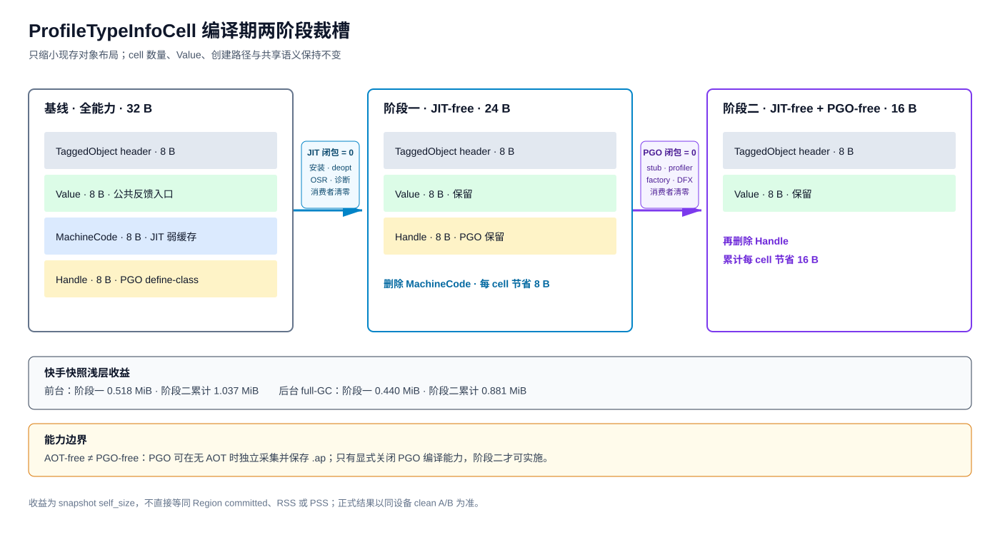

# ProfileTypeInfoCell 编译期裁槽 —— 方案设计（按架构特性设计模板）

## 1、特性需求/问题/动机的来源与价值

`ProfileTypeInfoCell` 当前固定为 32 B：8 B 对象头、8 B `Value`、8 B `MachineCode`、8 B `Handle`（`ic/profile_type_info_cell.h:34-40`）。其中：

1. `Value` 是解释器、IC、AOT、PGO 和 JIT 共用的反馈入口，必须保留；
2. `MachineCode` 是 cell 内的 JIT 弱缓存，消费者为 JIT 安装、deopt 清理和 JIT 诊断；编译期无 JIT 时可删除；
3. `Handle` 是 PGO define-class 的弱构造函数引用，profiler stub 写入、`PGOProfiler` 读取；只有编译期无 PGO 时可删除。

本特性只缩小现存 cell 的对象布局，不改变 cell 的创建时机、数量、父 slot 所有权或闭包共享行为。

**价值**：JIT-free 构建每个 cell 固定节省 8 B（32→24 B）；JIT-free + PGO-free 构建累计节省 16 B（32→16 B）。收益分别为 `8N` 和 `16N`，不依赖生命周期参数。

## 2、特性影响分析

### 2.1 系统位置

```text
JSFunction::RawProfileTypeInfo
          ↓
ProfileTypeInfoCell
  ├─ Value -----------------> ProfileTypeInfo（保留）
  ├─ MachineCode (weak) ----> JIT 缓存（JIT-free 删除）
  └─ Handle (weak) ---------> PGO define-class（PGO-free 删除）
```

本方案触碰 cell 定义、创建、GC 和工具对布局的解释，不触碰 `JSFunction` 布局、字节码格式或反馈协议。

### 2.2 环境依赖

- `ARK_PROFILE_CELL_HAS_MACHINE_CODE`：由 Fast JIT、Baseline JIT、OSR、JIT deopt 和使用 cell 缓存的诊断能力汇总；
- `ARK_PROFILE_CELL_HAS_HANDLE`：由 PGO profiler 采集能力决定；
- 三档布局仅由上述编译期能力闭包决定：全能力 32 B、JIT-free 24 B、JIT-free+PGO-free 16 B；
- AOT 与 PGO 是独立能力。PGO 可在无 AOT 时初始化、采集并保存 `.ap`，因此不能从 AOT-free 推导 `ARK_PROFILE_CELL_HAS_HANDLE=false`。

### 2.3 涉及模块

`ic/profile_type_info_cell.h`、`object_factory`、`shared_object_factory`、compiled `NewProfileTypeInfoCell` stub、JIT 安装/deopt/诊断、PGO profiler stub 与 `pgo_profiler`、GC visitor/xray、serializer/snapshot/AppSpawn、hprof/rawheap/debugger/profiler、`js_metadata_test`。

### 2.4 前后版本兼容性

- 不改变公开 API、字节码格式、JSFunction 布局和反馈语义；
- cell offset 和 `SIZE` 是内部 ABI，两个能力位必须纳入构建 feature fingerprint；
- snapshot/AOT/AI/AppSpawn 持久产物必须校验布局能力，16/24/32 B 产物双向稳定拒绝；
- 禁止 OTA 只更新 runtime 而保留旧 snapshot 或 AOT/AI 产物。

### 2.5 外部用户感知

无。JS 语义、IC 状态、PGO 画像和 JIT 行为在对应能力存在的构建中必须与基线一致。

### 2.6 性能影响

- `Value` 保持偏移 8 B，解释器和 IC 热路径无需增加运行时分支；
- 24 B 档每个 cell 少扫描一个 tagged 槽，16 B 档少扫描两个；
- 创建和状态转级流程不变，仅分配尺寸与初始化字段按编译期能力展开；
- 需验证 16/24 B 的 allocator 实际占用、GC 扫描时间和业务性能，不从 shallow bytes 推导固定 PSS 收益。

## 3、业界方案边界

本方案采用编译期裁剪内部元数据字段的通用做法：公共语义字段保持稳定，能力专用字段仅在对应构建存在。运行时 `--jit=false` 或单次未启用 PGO 不足以改变对象布局，因为同一进程堆中的 GC visitor、stub 和工具必须使用一致的 offset/size 契约。

不采用运行时可变长度 cell，也不在同一镜像中混合 16/24/32 B 三种尺寸。

字段外存存在业界先例：V8 `JSDispatchTable`（内联索引 + 行表 + 标记驱动回收，IR 可偏移访问）、V8 CPU profiler 的堆外记录（关联数据不入堆）——据此形成通用构建的字段外存备选路线（索引表 + 会话表），见 §4.7。

## 4、本特性的设计/实现方案



[可编辑 DrawIO 源文件](profile-type-info-cell-jitfree-architecture.drawio)

### 4.1 阶段一：JIT-free 目标布局（24 B）

```text
当前全能力（32 B）: header + Value + MachineCode + Handle
JIT-free（24 B）:   header + Value + Handle
```

布局约束：

```text
VALUE_OFFSET  = 8
HANDLE_OFFSET = 16
SIZE          = 24
```

仅当 `ARK_PROFILE_CELL_HAS_MACHINE_CODE=true` 时定义 `MACHINE_CODE_OFFSET` 和 `Get/SetMachineCode`。JIT-free 变体不提供空实现，残留安装、deopt 或诊断消费者直接构建失败。

### 4.2 阶段二：JIT-free + PGO-free 目标布局（16 B）

```text
JIT-free（24 B）:            header + Value + Handle
JIT-free + PGO-free（16 B）: header + Value
```

布局约束：

```text
VALUE_OFFSET = 8
SIZE         = 16
```

仅当 `ARK_PROFILE_CELL_HAS_HANDLE=true` 时定义 `HANDLE_OFFSET` 和 `Get/SetHandle`。16 B 档同时移除：

- profiler stub 对 Handle 的固定偏移读写（`compiler/profiler_stub_builder.cpp:155-160`）；
- `PGOProfiler::DumpDefineClass` 对 Handle 的读取（`pgo_profiler/pgo_profiler.cpp:1338`）；
- local/shared factory 的 Handle 初始化；
- dump/hprof/rawheap/debugger 对 Handle 的输出和元数据声明。

本阶段必须由 PGO 编译能力关闭触发。无 AOT、有 PGO 的产品仍使用 24 B 档。

### 4.3 通用布局（JIT-enabled 32 B）

`header + Value + MachineCode + Handle = 32 B`，行为不变。`CELL_0/1/N` 三类 HClass 在同一构建统一使用当前 `SIZE`；`UpdateProfileTypeInfoCellType` 只改变复用级别对应的 HClass，不改变实例尺寸。

### 4.4 单一布局定义

布局 offset、`SIZE`、GC visit end 和 factory 分配尺寸全部从 `profile_type_info_cell.h` 的同一组编译期常量派生，禁止各模块重复计算。建议增加：

```text
static_assert(VALUE_OFFSET == TaggedObject::SIZE)
static_assert(SIZE == EXPECTED_SIZE_FOR_CURRENT_FEATURES)
static_assert(SIZE % OBJECT_ALIGNMENT == 0)
```

compiled stub、汇编解释器、GC xray 和 metadata 测试必须引用同一常量。

### 4.5 保留的反馈与共享路径

以下路径不增加档位特判：

- `JSFunction::Get/SetProfileTypeInfo`；
- `UpdateProfileTypeInfoCellToFunction` 和 FunctionTemplate cell 关联；
- `RuntimeNotifyInlineCache`；
- interpreter/汇编解释器对 `Value` 的读取；
- `UpdateProfileTypeInfoCellType` 的 `CELL_0→1→N` 转级；
- 24 B 档的 PGO `Value` 和 `Handle` 读取。

两个裁槽阶段均不改变 DEFINEFUNC 分配或同 slot 多闭包共享语义。

### 4.6 方案利弊

| 方案 | 优点 | 代价/结论 |
|---|---|---|
| 阶段一：JIT-free 24 B（选） | 确定收益 `8N`；不依赖 PGO 产品决策 | 需完整闭合 JIT 消费者和内部 ABI |
| 阶段二：JIT-free+PGO-free 16 B（条件选择） | 累计收益 `16N`，cell shallow 降低 50% | 依赖显式 PGO-free 产品档位 |
| 运行时 `--jit=false` 切换布局（否决） | 无需多构建档位 | 同一镜像布局不可由运行时选项安全切换 |
| AOT-free 自动使用 16 B（否决） | 配置简单 | PGO 可脱离 AOT 工作，会删除仍有直接消费者的 Handle |
| 同镜像混合多尺寸 cell（否决） | 可按应用选择 | GC/metadata/stub 解释复杂，内部 ABI 风险高 |
| 字段外存单索引行表（备选，§4.7） | 通用构建 24 B（`8N`），两字段 IR 可偏移访问，profiler stub 保持内联 | 内联 4 B 索引 + 双弱列行表基础设施 + GC 行扫描；≤6G 档劣于裁槽（16 B） |

### 4.7 备选路线：字段外存（通用构建 24 B，单索引双列行表）

**定位**：裁槽两阶段只作用于能力闭包档位；本备选把 `MachineCode` 与 `Handle` **两字段一并外存到同一张索引行表**，使**通用构建（JIT+PGO 全开）得到 24 B cell（8N）**。≤6G 档裁槽可达 16 B、更优且无需表基础设施，维持首选；本路线仅当「通用构建也需收缩 cell」成为需求时立项，与裁槽共用能力闭包体系、构建期二选一，同镜像不混布。

**前提事实（消费者闭包）**：

- `MachineCode` 无任何生成代码消费者：仅 `jit_task.cpp` 安装、`deoptimizer.cpp` 复位、`runtime_stubs.cpp` 诊断三个 C++ 触点；
- `Handle` 唯一生成代码消费者是 profiler stub 对 `HANDLE_OFFSET` 的内联读取（DEFINECLASS 反馈事件，每会话 10⁴~10⁶ 次）——本设计以索引行表承载 Handle，使该访问**保持内联**，不转 runtime 调用。

**表结构：单索引 + 双列行表（人工选定形态）**

```text
cell 内联（24 B）                per-VM 行表（native，free-list，GC 跟踪弱容器）
┌──────────────────┐            ┌────────────────────────────────────────┐
│ header    8 B     │            │ Row[idx] {                              │
│ Value     8 B     │            │   weak MachineCode*;      ← 列1 安装/复位│
│ ExtIdx    4 B     │──idx─────► │   weak JSFunction ctor*;  ← 列2 PGO 关联│
│ (pad)     4 B     │            │   uint8 state }  24 B/行（8B 对齐）      │
└──────────────────┘            │ base + idx × 24                         │
                                └────────────────────────────────────────┘
```

- **单索引（4 B）+ 双列行表**：一个 write-once 的 `ExtIdx`（invalid → idx，永不回退）同时承载两个字段的外存；4 B 对齐 padding 为已知代价（双索引形态可用第二个 4 B 索引吃掉该 padding 并拆成两张单弱列表，代价是双用站点占两行 32 B——两者均为 24 B cell，取单表单索引以简化 GC 与并发面，人工选定）；
- **访问链（可编译为 IR 偏移指令）**：`load cell.ExtIdx`（固定偏移）→ `base + idx×24` → `load 列字段`——两次依赖 load、零分支、零哈希、读侧无锁。MachineCode 三触点为 C++ 消费同一链；profiler stub 的 Handle 守卫路径同链内联（首写经 runtime 慢路径，见下）；
- **为什么是索引表不是哈希表**（人工评审意见）：哈希查找无法被 JIT IR 编译为偏移指令序列；索引表使任何当前或未来的生成代码消费者（tiering 检查、profiler stub、诊断 stub 等）都能以固定指令数访问；
- **首写慢路径（EnsureRow）**：`ExtIdx == invalid` 时经 runtime 分配行、初始化双弱列、release 回填 `ExtIdx`（与 JSHClass AuxData 的 `EnsureAuxDataAndSet` 同款模式）；每 cell 至多触发一次（安装侧与 DEFINECLASS 首次命中同一行）；不允许在 `DISALLOW_GARBAGE_COLLECTION` 区间调用；
- **GC 集成（leaptiering 同款）**：cell visitor 标记所属行（活 cell 保行）；行是**双弱列容器**——两列弱值经既有 weak 处理清理与压缩更新；死 cell 的行不被标记 → 弱值清理后回 free-list；无 rehash/tombstone；
- **并发标记回收四机制**：① 行出生即标记（born-marked），防并发标记器漏看新行；② `ExtIdx` 发布屏障——发布前显式标记行（增量更新慢路径），write-once 使屏障只在此一次时刻生效；③ 弱列免 SATB——弱引用不保活，并发期间原子写新值不影响标记正确性；④ 未标行回收在标记后相位顺序扫（行 ≤10⁵，µs 级，计入 GC pause 预算门槛）；实施前须按 ArkVM CMC 相位契约核对弱容器更新时机（核验项）；
- **行分配并发**：free-list CAS；安装（JIT 线程）以 release 写列1；profiler 路径写列2；读侧无锁；
- **API 与现有触点对应**：`EnsureRow(cell)`（首写/安装）、`ClearCodeColumn(cell)`（deopt 复位）、`LoadRow(cell)`（诊断）；PGO dump 直接遍历活行列2；
- **容量**：人口 = 有 JIT 安装或 PGO 关联的定义点并集（10³~10⁵），行 24 B，表本体 ≤ 3 MiB；
- **业界对位**：V8 `JSDispatchTable`（内联 handle + 行表 + 标记驱动回收 + 并发标记支持）同构，本设计增加第二弱列。

**Handle 形态取舍**：选定行表列2（profiler stub 保持内联、无热路径回退）；堆外会话表（`(Method*, slotId)` 键、GC 零参与、会话结束丢弃）保留为**零 GC 参与变体**——仅当行表 GC 集成成本被证明过高时回退，代价是 profiler stub 转 runtime 调用；哈希键控变体（16 B cell）因不可被 IR 偏移指令访问而不采纳（人工评审意见）。

**收益与成本（对齐 02 §2.1 口径）**：通用构建 32→24 B = `8N`：前台 543,520 B（0.518 MiB）、后台 461,712 B（0.440 MiB）；成本 = 行表 ≤3 MiB（常驻）+ 首写慢路径（每 cell 一次）+ GC 行表扫描（µs 级/次，入 pause 预算门槛）。DEFINECLASS 密集场景与 GC 增量实测列入放行门槛。

**codegen 与兼容**：`Value` 偏移不变（IC 热路径零影响）；profiler stub 的 Handle 内联读写目标由 `HANDLE_OFFSET` 换为 `ExtIdx → 行列2` 同型内联链；安装/复位/诊断调用点即表 API；物理布局按构建期路线二选一（裁槽或外存），版本 fingerprint 与双向拒绝规则同 §2.4。

## 5、DFX 分析

- 可诊断性：heap dump 中 cell `self_size` 与当前档位一致；24 B 无 `MachineCode` 边，16 B 同时无 `Handle` 边；
- 可运维性：构建产物记录两个能力位，启动和加载持久产物时校验；
- 可测试性：目标档位构建扫描、布局断言、对象边界压力和 clean A/B 组成闭环。

## 6、可信分析

- **可靠性**：GC 严格按当前 `SIZE` 和 visit range 遍历，compaction 不越界；弱引用处理器只处理当前构建真实存在的字段；
- **安全性**：不涉及外部输入或权限边界；
- **隐私/无害**：不新增数据采集，PGO-free 档位反而删除 PGO 专用引用槽。

## 7、关键 DT 用例简述

| 测试用例名称 | 预置条件 | 用例关键步骤 | 预期结果 |
|---|---|---|---|
| JIT-free 静态校验 | 24 B 配置 | 扫描 `MACHINE_CODE_OFFSET`/cell MachineCode accessor | 目标变体残留引用为 0 |
| PGO-free 静态校验 | 16 B 配置 | 扫描 `HANDLE_OFFSET`/cell Handle accessor | 目标变体残留引用为 0 |
| 布局断言 | 三档构建 | 编译并检查 offset/size metadata | 分别为 32/24/16 B，`Value` 始终在 8 B |
| allocator 粒度 | 24/16 B 配置 | 压力分配 cell 并检查 Region used | 按目标尺寸下降，无额外取整抵消 |
| cell 状态转级 | 三档构建 | 同 slot 创建多个闭包 | `CELL_0→1→N` 与基线一致，实例尺寸不变 |
| IC 反馈回归 | 24/16 B 配置 | 属性 load/store/call 状态转换 | `Value` 语义不变 |
| PGO 回归 | 无 JIT + 有 PGO，24 B | 无 AOT 运行，采集 define-class 并保存/合并 `.ap` | Handle 读写和 PGO 输出完整 |
| PGO-free 回归 | 16 B | 执行相同业务并扫描产物 | 无 PGO stub、Handle 边和 `.ap` 采集 |
| JIT-enabled 回归 | 32 B | 安装弱缓存、deopt 清理、诊断 | 行为不变 |
| GC 对象边界 | 24/16 B 后放哨兵对象 | young/old/full/CMC/compaction | 无越界，哨兵内容不变 |
| 持久产物互拒 | 两套构建 | 跨档加载 snapshot/AOT/AI/AppSpawn 产物 | 双向稳定拒绝 |
| DFX 输出 | 24/16 B | hprof/rawheap/debugger dump | 字段和 self_size 与当前档位一致 |

## 8、结论

阶段一 JIT-free 24 B 裁槽可独立进入实现；阶段二 16 B 档等待显式 PGO-free 产品决策。两阶段只缩小 cell 尺寸，不改变数量、创建时机或共享语义。前台快照累计收益分别为 0.518 MiB 和 1.037 MiB，后台 full-GC 分别为 0.440 MiB 和 0.881 MiB。字段外存备选路线（§4.7，单索引双列行表）为通用构建提供 24 B（8N）选项，MachineCode 与 Handle 的访问链均可编译为 IR 偏移指令、profiler stub 保持内联；≤6G 档劣于裁槽（16 B），维持裁槽首选。

## 附录一：可测试性设计

- 构建矩阵：JIT-enabled+PGO（32 B）、JIT-free+PGO（24 B）、JIT-free+PGO-free（16 B）；额外覆盖无 AOT+有 PGO 的 24 B 组合；
- 正确性：Interpreter/IC、PGO/AOT 开关、async/generator/worker/AppSpawn、Empty/CELL_0/1/N、hook/debugger/profiler；
- JIT 回归：Fast/Baseline JIT、OSR、安装、deopt、诊断；
- GC：young/old/full/CMC、compaction、local/shared Empty cell 和弱引用；
- 兼容：snapshot/AOT/AI/AppSpawn/rawheap 双向拒绝，`js_metadata_test` 按档位维护断言。

## 附录二：评审范围

影响内部对象 ABI、GC 和编译 pipeline，需架构会议评审；可拆分为能力闭包+布局、JIT/PGO 条件编译、GC+序列化、DFX+测试四个子 AR 分 PR 上库。
