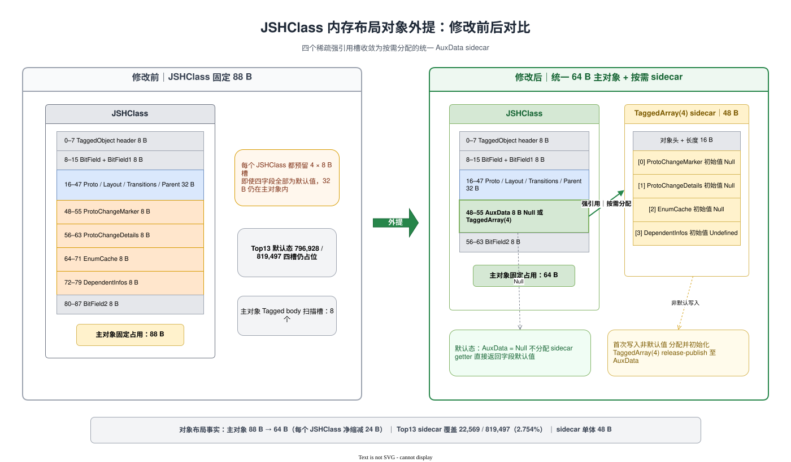
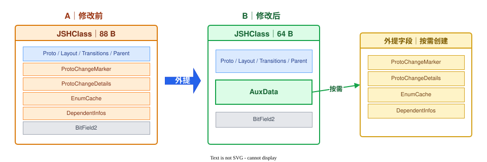

# JSHClass 对象布局优化方案
## 1. 方案结论

ArkVM `JSHClass` 当前固定为 88 B。Top13 基线快照包含 819,497 个 `JSHClass`，浅层堆合计 68.775 MiB。四个稀疏 Tagged 字段 `ProtoChangeMarker`、`ProtoChangeDetails`、`EnumCache` 和 `DependentInfos` 合计占每个对象 32 B，但四字段非默认值的并集仅覆盖 22,569 个 `JSHClass`，占 2.754%。

本方案采用统一强 sidecar：

- 所有 local、shared 和 read-only `JSHClass` 使用同一套 64 B 物理布局；
- 主对象删除四个独立槽，增加一个 8 B `AuxData` 强引用槽，单实例净缩减 24 B；
- `AuxData` 为空时四个 getter 返回各自默认值；首次写入非默认值时分配长度为 4 的现有 `TaggedArray`；
- 不按 JIT 开关、设备档位或运行时状态分档，完整保留 JIT lazy-deopt、IC、AOT、枚举缓存和原型通知语义；
- 不使用 VM 级弱表，不引入 weak-key/strong-value、ephemeron、不动点迭代、rehash、地址迁移或死键清理问题；
- compiled builder 统一改为 `AuxData` fast path，不再访问已删除字段的固定 offset。

Top13 稳态浅层内存模型如下。MiB 均按 1,048,576 B 计算。

| 指标 | 字节 | MiB |
|---|---:|---:|
| 当前 `JSHClass` | 72,115,736 | 68.775 |
| 64 B 主对象 | 52,447,808 | 50.018 |
| 主对象毛收益 | 19,667,928 | 18.757 |
| 22,569 个 `TaggedArray(4)` sidecar | 1,083,312 | 1.033 |
| 稳态净收益模型 | 18,584,616 | 17.724 |
| 优化后主对象加 sidecar | 53,531,120 | 51.051 |

该模型不计四个载荷对象本身，因为优化前后载荷对象数量和生命周期不变；也不把 allocator Region 空洞、committed/resident、PSS 和 GC 时间包装为已实现收益。最终放行以实现后的 clean 对照实验为准。

## 2. 现状与数据

### 2.1 当前对象布局

| 偏移 | 大小 | 字段 |
|---:|---:|---|
| 0 | 8 B | `TaggedObject` header |
| 8 | 4 B | `BitField` |
| 12 | 4 B | `BitField1` |
| 16 | 8 B | `Proto` |
| 24 | 8 B | `Layout` |
| 32 | 8 B | `Transitions` |
| 40 | 8 B | `Parent` |
| 48 | 8 B | `ProtoChangeMarker` |
| 56 | 8 B | `ProtoChangeDetails` |
| 64 | 8 B | `EnumCache` |
| 72 | 8 B | `DependentInfos` |
| 80 | 8 B | `BitField2` |
| **合计** | **88 B** | `JSHClass::SIZE` |

`HeapSnapshot` 的 `hclass.self_size=88` 只表示 `JSHClass` 自身浅层大小，不包含：

- 四个字段指向的独立堆对象；
- 业务对象的 in-object property 槽；
- Region committed/resident、进程 RSS 或 PSS；
- allocator 碎片和 GC 辅助结构。

因此本文只把 88 B 主对象与新增 sidecar 纳入同口径净收益模型。

### 2.2 四字段语义

| 字段 | 所有权与生命周期 | 主要路径 | 默认值 |
|---|---|---|---|
| `ProtoChangeMarker` | HClass 持有，记录原型链变化状态 | 原型注册、IC/AOT 失效通知 | `Null` |
| `ProtoChangeDetails` | HClass 持有，包含 listener 与注册索引 | 原型链注册、迁移、刷新用户 | `Null` |
| `EnumCache` | HClass 持有，按枚举路径创建并失效 | `for...in`、对象键枚举、原型变化 | `Null` |
| `DependentInfos` | HClass 持有，保存函数与依赖集合 | JIT lazy-deopt 依赖安装和触发 | `Undefined` |

`ProtoChangeMarker`、`ProtoChangeDetails` 和 `EnumCache` 不是 JIT 专用字段；关闭 JIT 不能删除这些语义。`DependentInfos` 明确服务 JIT lazy-deopt，但本方案也不删除它。Top13 快照实际观测到 5 个非默认 `DependentInfos` 槽，不能继续使用“Top13 为 0”或“无 JIT”作为布局前提。

### 2.3 Top13 四字段联合分布

统计单位是“`JSHClass` 命名字段边是否指向堆对象”，不是载荷对象节点数。baseline rawheap translator 对 `ZERO_VALUE`、整数和 double 返回空边，命名字段边仅在槽内是堆引用时生成，因此可以直接统计四个槽的非默认占用。

| 互斥组合 | JSHClass 数 |
|---|---:|
| 四字段均默认 | 796,928 |
| 仅 `EnumCache` | 5,455 |
| 仅 `ProtoChangeMarker` | 4,246 |
| 仅 `ProtoChangeDetails` | 1,809 |
| Marker + Details | 10,321 |
| Enum + Marker + Details | 733 |
| Marker + Details + DependentInfos | 4 |
| 四字段全部非默认 | 1 |
| **四字段非默认并集** | **22,569** |

边际统计为：

| 字段 | HClass 槽非默认数 | 占 819,497 个 HClass |
|---|---:|---:|
| `EnumCache` | 6,189 | 0.755% |
| `ProtoChangeMarker` | 15,305 | 1.868% |
| `ProtoChangeDetails` | 12,868 | 1.570% |
| `DependentInfos` | 5 | 0.0006% |
| 四字段并集 | 22,569 | 2.754% |

此前按对象节点名得到的 `ProtoChangeMarker=15,631` 是 marker 载荷对象数，不等于 HClass 槽占用数；其中 326 个 marker 节点没有对应的 HClass `ProtoChangeMarker` 命名边。sidecar 人口必须按所有者槽联合分布计算，不能把四个边际数相加。

Top13 通过 shared 实例反推得到 10,036 个 shared HClass，四字段非默认并集为 0。该结果用于验证当前 shared 路径，不作为永久语义假设。

## 3. 目标布局



[可编辑 Draw.io 源文件](./jshclass-layout-sidecar-comparison.drawio)

PPT 极简版：



[PPT 极简版可编辑 Draw.io 源文件](./jshclass-layout-sidecar-comparison-compact.drawio)

### 3.1 单一 64 B 布局

```text
0   TaggedObject header       8 B
8   BitField                  4 B
12  BitField1                 4 B
16  Proto                     8 B
24  Layout                    8 B
32  Transitions               8 B
40  Parent                    8 B
48  AuxData                   8 B
56  BitField2                 8 B
64  end
```

对应约束：

```text
JSHClass::AUX_DATA_OFFSET = 48
JSHClass::BIT_FIELD2_OFFSET = 56
JSHClass::SIZE = 64
```

`DECL_VISIT_OBJECT` 仍从 `PROTOTYPE_OFFSET` 扫描至 `BIT_FIELD2_OFFSET`，主对象被扫描的 Tagged body 槽由 8 个降为 5 个：`Proto`、`Layout`、`Transitions`、`Parent`、`AuxData`。

local、shared、read-only、AOT 和普通 HClass 都使用该布局，不允许同一 `JSType::HCLASS` 在一个进程中混用 64 B/88 B 或按运行时状态切换尺寸。factory、meta-HClass、visitor、heap verification、rawheap metadata 和 compiled offset 因而只维护一套尺寸。

### 3.2 AuxData 编码

`AuxData` 只能是 `Null` 或长度为 4 的 `TaggedArray`：

| 索引 | 载荷 | 初始化值 |
|---:|---|---|
| 0 | `ProtoChangeMarker` | `Null` |
| 1 | `ProtoChangeDetails` | `Null` |
| 2 | `EnumCache` | `Null` |
| 3 | `DependentInfos` | `Undefined` |

不采用“单值直接编码、多值 sidecar”。`DependentInfos` 继承 `WeakVector`，没有独立 `JSType`，仅靠运行时类型不能无歧义区分四种载荷；再引入 tag 会扩大 compiled path 和迁移风险。

使用现有 `TaggedArray` 而不新增专用 `JSType`，原因如下：

- `TaggedArray::DATA_OFFSET=16 B`；4 个 Tagged 槽共 32 B，对象尺寸精确为 48 B；
- 现有 visitor、移动 GC、write barrier、heap verification、dump 和 rawheap 已覆盖该对象；
- compiled builder 已有按索引读取和写入 `TaggedArray` 的 helper；
- 不新增 sidecar meta-HClass，也不引入额外全局容器或根。

### 3.3 Getter 与 setter

四个公开 getter/setter 名称和返回语义保持不变，内部统一转到 helper：

```text
GetAuxField(hclass, index, default):
    aux = acquire-load hclass.AuxData
    if aux is Null:
        return default
    return aux[index]

SetAuxField(hclass, index, value, default):
    aux = acquire-load hclass.AuxData
    if aux is Null and value == default:
        return
    if aux is Null:
        EnsureAuxDataAndSet(hclass, index, value)
        return
    aux[index] = value with write barrier
```

`EnsureAuxDataAndSet` 的规则：

1. local HClass 使用 `NewOldSpaceTaggedArray(4)`，避免每次首次写入都把长生命周期 sidecar 放入 young generation；
2. `AuxData` 使用 acquire/release 访问器；首次写入在 VM 级 mutex 下二次检查。若仍为空，先初始化四个槽并写入首值，最后 release-publish `AuxData`，禁止发布半初始化数组；
3. 若二次检查发现其他线程已发布 sidecar，则在 mutex 内把当前值写入既有数组。mutex 只覆盖首次创建竞争，已有 sidecar 的普通 getter/setter 不加锁；
4. sidecar 四个槽通过 `TaggedArray::Set` 写入，保留 old-to-young、SATB 和 shared 检查所需屏障；
5. 不允许在 `DISALLOW_GARBAGE_COLLECTION` 区间首次分配。调用点必须在进入 no-GC 区域前确保 sidecar 已存在，或转 runtime slow path；
6. shared/read-only HClass 当前四字段必须保持默认。shared setter 保留现有 ShareToLocal 禁止语义并在 debug 构建断言；若未来要给 shared HClass 增加非默认辅助状态，必须单独设计 shared sidecar、并发和 shared write barrier，不得回落到 local sidecar。

VM mutex 和其固定内存未计入 1.033 MiB sidecar 对象成本，实测 PSS 会包含该成本。

### 3.4 Clone、transition 与状态迁移

不得整体共享 sidecar。`EnumCache`、marker、details 和 JIT dependency 的复制/迁移规则不同，共享一个可变 `TaggedArray` 会导致新旧 HClass 互相污染。

| 路径 | 目标 AuxData 行为 |
|---|---|
| `JSHClass::Initialize` | `Null` |
| `JSHClass::Clone` / `CloneWithNewSizeAndType` | 默认 `Null`，不复制 EnumCache、Marker 或 DependentInfos |
| `CopyAllHClass` | 目标 `AuxData=Null` |
| 普通属性 transition | 沿用现有路径，仅在明确需要时处理 ProtoChange 状态 |
| AOT HClass transition | 通过现有通知流程重建 marker；不得复制整个 sidecar |
| `RefreshUsers` | 只把 `ProtoChangeDetails` 从 old 移到 new，并清空 old 对应槽 |
| lazy-deopt 安装 | 在当前 HClass 的 slot 3 创建或追加 `DependentInfos` |

迁移后必须断言 old/new sidecar 不是同一数组，除非二者都为 `Null`。

## 4. GC 与生命周期

### 4.1 强引用闭环

对象图为：

```text
JSHClass --strong AuxData--> TaggedArray(4) --strong slots--> runtime payloads
```

生命周期由普通 GC 可达性闭合：

- HClass 存活时，sidecar 和非默认载荷存活；
- HClass 死亡后，sidecar 无其他根时自然回收；
- moving GC 更新 `AuxData` 和 sidecar 内的对象引用；
- full/young/old GC 复用现有对象 visitor；
- 不存在 weak key、ephemeron fixpoint、死键清理、rehash 峰值或 owner 地址迁移。

该语义与当前四个内联强引用槽一致，不改变 `DependentInfos` 内部对函数使用弱引用的既有设计。

### 4.2 扫描成本模型

不计对象头的 class pointer，当前 JSHClass body 扫描槽为：

```text
819,497 × 8 = 6,555,976 slots
```

目标布局加 sidecar 数据槽为：

```text
819,497 × 5 + 22,569 × 4 = 4,187,761 slots
```

静态模型减少 2,368,215 个 body slots，降幅 36.123%。这不是 GC 时间收益承诺；新增 22,569 个对象头、分散访问和 card-table 行为可能抵消部分收益，必须测量 young/full/shared GC 的扫描字节、暂停和 CPU 时间。

### 4.3 shared 与 read-only 边界

Top13 的 10,036 个 shared HClass 没有非默认辅助槽，且源码路径已有以下边界：

- shared HClass 不注册原型 listener；
- shared 原型不安装 local lazy-deopt dependency；
- shared 对象枚举路径不创建 local EnumCache；
- marker 写入路径禁止 ShareToLocal。

实现时把这些分散条件集中到 `SetAuxField` shared guard，并加入 shared GC、heap verification 和并发测试。read-only HClass 在冻结后不得首次创建 sidecar；serializer 和 snapshot 构建后 `AuxData` 保持 `Null`。

## 5. Compiled 路径与内部布局契约

### 5.1 固定 offset 改造

当前源码存在直接使用四个旧 offset 的路径：

- `CircuitBuilder::GetEnumCacheFromHClass` 直接加载 `ENUM_CACHE_OFFSET`；
- `CircuitBuilder::GetProtoChangeMarkerFromHClass` 直接加载 `PROTO_CHANGE_MARKER_OFFSET`；
- `StubBuilder` 直接读写 `PROTO_CHANGE_DETAILS_OFFSET`、`ENUM_CACHE_OFFSET` 和 `DEPENDENT_INFOS_OFFSET`；
- serializer 按旧 offset 将四个运行时字段重置为默认值。

改造后 compiled getter 统一生成：

```text
aux = Load(hclass + AUX_DATA_OFFSET)
if aux == Null:
    return field_default
return Load(aux + TaggedArray::DATA_OFFSET + index * 8)
```

compiled setter 规则：

- `aux != Null`：使用现有 `SetValueToTaggedArray` helper 写槽；
- `aux == Null && value == default`：直接返回；
- `aux == Null && value != default`：调用 runtime `EnsureHClassAuxDataAndSet`，不得在机器码中手写分配和发布协议。

仓库级静态检查要求：除布局兼容测试外，`PROTO_CHANGE_MARKER_OFFSET`、`PROTO_CHANGE_DETAILS_OFFSET`、`ENUM_CACHE_OFFSET`、`DEPENDENT_INFOS_OFFSET` 在实现后均不存在；所有访问收敛到 `AUX_DATA_OFFSET` 和统一 helper。

### 5.2 兼容性边界

本方案不改变公开 API、字节码格式或 JSFunction 对象布局。JSHClass 没有已知的用户侧指针复制兼容约束，因此不是公开 ABI 阻塞项。

但 JSHClass offset 是 ArkVM 内部编译契约：旧 AOT/JIT 机器码可能嵌入旧 offset，不能与新运行时混用。实现必须：

1. bump `.an/.ai` 版本并利用 strict match 拒绝旧产物；
2. clean rebuild 系统 snapshot、AOT image、内置 stub 和相关预编译产物；
3. 新旧版本混用测试必须稳定拒绝加载，不允许静默执行；
4. rawheap metadata 更新为 64 B 布局和 `AuxData` 字段，旧 translator 对新 rawheap 必须因版本不匹配而失败；
5. 添加 `static_assert(JSHClass::SIZE == 64)`、关键 offset 断言和 metadata 单测。

## 6. Serializer、dump 与诊断工具

当前 serializer 会把 `Transitions`、`Parent`、`DependentInfos` 写为 `Undefined`，把 marker、details 和 EnumCache 写为 `Null`。新布局不序列化运行时 sidecar：

- `SerializeHClassFieldIndividually` 遇到 `AUX_DATA_OFFSET` 时写 `Null`；
- 反序列化后的 `AuxData` 为 `Null`，四字段在运行时按需重建；
- `dumpHClass` 通过四个逻辑 getter 输出原字段名，不能只打印一个无语义的数组；
- heap snapshot/rawheap 中保留 `AuxData` 边和 sidecar 元素，分析工具将索引 0–3 映射回四个逻辑字段；
- debugger、profiler、heap verification 和 AppSpawn fork 均覆盖有/无 sidecar 两种状态。

## 7. 收益计算

### 7.1 主对象毛收益

```text
当前主对象 = 819,497 × 88 B
             = 72,115,736 B
             = 68.774925 MiB

目标主对象 = 819,497 × 64 B
             = 52,447,808 B
             = 50.018127 MiB

毛收益 = 819,497 × 24 B
       = 19,667,928 B
       = 18.756798 MiB
```

### 7.2 Sidecar 成本

`TaggedArray(4)` 的尺寸由源码公式确定：

```text
TaggedArray::DATA_OFFSET = 16 B
4 × JSTaggedValue::TaggedTypeSize() = 32 B
单个 sidecar = 48 B
```

Top13 四字段非默认并集为 22,569：

```text
sidecar 稳态浅层成本 = 22,569 × 48 B
                     = 1,083,312 B
                     = 1.033127 MiB
```

### 7.3 净收益模型

```text
稳态净收益 = 19,667,928 - 1,083,312
           = 18,584,616 B
           = 17.723671 MiB

相对当前 JSHClass 浅层堆降幅
           = 18,584,616 / 72,115,736
           = 25.771%
```

sidecar 覆盖率低于 50% 时对象字节模型为正：`24N - 48U > 0`。Top13 实测覆盖率为 2.754%，距离 break-even 仍有余量，但该条件不替代 PSS 和性能测试。

### 7.4 被否决的弱表成本

VM 级 `WeakLinkedHashMap` 不作为实施方案。用于核对旧估算时：

- 6,189 项需要 capacity 16,384，数组约 0.500 MiB，不是 0.189 MiB；
- 22,569 项需要 capacity 65,536，数组本体约 2.000 MiB，尚未包含 value sidecar、根、同步和 rehash 峰值；
- weak table 还要求 ephemeron fixpoint、死键清理和 shared heap 特殊处理。

强 sidecar 通过主对象回指直接定位，以一个固定 8 B 槽换取确定生命周期和无哈希查询，解决上述低置信问题。

## 8. 实现范围

### 8.1 Runtime

- 重排 `JSHClass` 字段、访问器、`SIZE` 和 visitor 区间；
- 实现 `HClassAuxSlot`、四个逻辑 getter/setter 和 `EnsureAuxDataAndSet`；
- factory 初始化 local/shared/read-only HClass 的统一 64 B 尺寸；
- old-space sidecar 分配、首次发布 mutex 和 write barrier；
- Clone、Copy、transition、`RefreshUsers` 和 AOT 通知按字段处理；
- `EnumCache` 创建/失效、ProtoChange listener 和 lazy-deopt 全链改造。

### 8.2 Compiler

- CircuitBuilder、StubBuilder、HCR/MCR builder 和 builtins stub 改为 AuxData fast path；
- null/default 分支和 runtime slow path；
- 删除四个旧 offset 的全部直接 load/store；
- AOT/JIT 产物版本和 clean build 规则。

### 8.3 GC 与工具

- visitor、heap verification、full/young/old/CMC GC；
- serializer、snapshot processor、heap dump、rawheap metadata/translator；
- debugger、profiler、AppSpawn fork；
- 新旧 rawheap/AOT 版本拒绝加载测试。

## 9. 验证与放行门槛

### 9.1 正确性

以下矩阵必须 100% 通过：

- interpreter、IC、PGO、AOT、baseline JIT 和 fast JIT；
- lazy-deopt dependency 安装、追加、触发和函数回收；
- `for...in`、`Object.keys/values/entries`、JSON 枚举顺序与缓存失效；
- 函数、class、继承、`setPrototypeOf`、原型属性增删改和 accessor 变化；
- Clone、属性 transition、AOT transition、listener 注册/注销和 `RefreshUsers`；
- local/shared/read-only HClass；
- young/old/full/shared/CMC GC、heap verification 和并发首次写入；
- serializer、heap dump、rawheap、debugger、profiler、AppSpawn；
- 旧 AOT/snapshot/rawheap 与新运行时双向不兼容时稳定拒绝。

专门故障注入：

- 两线程同时首次写不同 AuxData 槽，最终两个值都存在；
- 首次写入前后强制 young/full GC；
- old HClass 指向 young 载荷，验证 remembered set；
- HClass 死亡后 sidecar 和载荷均可回收；
- Clone 后 old/new sidecar 不共享；
- shared/read-only HClass 非法写入在 debug 构建触发断言。

### 9.2 静态与构建门槛

- `JSHClass::SIZE == 64`，`BIT_FIELD2_OFFSET == 56`；
- `TaggedArray::ComputeSize(8, 4) == 48`；
- 旧四 offset 的仓库级引用数为 0；
- 全量 clean build 通过，旧增量产物不得参与比较；
- runtime、compiler、serializer、hprof 和 GC 单元测试通过；
- ASAN、TSAN、heap verification 和 release 构建通过。

### 9.3 内存门槛

同设备、同应用版本、同 workload、同构建配置，baseline/patch 各执行不少于 5 次：

- Top13 新快照中所有 `JSHClass.self_size=64 B`；
- Top13 主对象加 sidecar 浅层堆不高于 51.1 MiB，净下降不低于 17.0 MiB；
- 每个应用的主对象加 sidecar 浅层堆均为正收益；
- Top13 每应用 PSS 中位数不得回退，13 个中位数下降之和不低于 10 MiB；
- 分别报告 main object、sidecar、载荷、committed、resident、PSS 和 GC metadata，不用浅层堆替代 PSS；
- 报告首次 sidecar 分配峰值和 GC 后稳态，不能只测峰值前或只测 GC 后。

### 9.4 性能门槛

相同设备固定频率、预热轮数和 workload，报告中位数及 95% 置信区间：

| 指标 | 放行门槛 |
|---|---:|
| `for...in` / Object keys 重复枚举 | 中位数回退不超过 3%，任一 workload 不超过 5% |
| prototype 修改与失效 | 中位数回退不超过 3%，任一 workload 不超过 5% |
| lazy-deopt 安装与触发 | 中位数回退不超过 3%，无漏失效 |
| AOT/JIT 综合基准 | 几何平均回退不超过 1% |
| 应用冷启动 | P50 不超过 1%，P95 不超过 2% |
| GC 总 CPU / P50 pause | 不超过 2% |
| GC P99 pause | 不超过 5% |

任一 correctness、内部版本拒绝、PSS 或性能硬门槛失败，方案不合入；不得以其他应用收益抵消单项 correctness 失败。

## 10. 工作量与排期

| 任务 | 设计 | 开发 | 测试 | 小计 |
|---|---:|---:|---:|---:|
| 64 B 布局、AuxData helper、分配与发布 | 2 | 6 | 4 | 12 |
| Circuit/Stub/HCR/MCR 全部 fixed-offset 改造 | 3 | 10 | 7 | 20 |
| Enum/ProtoChange/lazy-deopt/Clone 语义迁移 | 3 | 8 | 7 | 18 |
| GC、serializer、AOT/snapshot 版本与 shared/read-only | 2 | 6 | 5 | 13 |
| heap dump、rawheap、debugger、profiler、AppSpawn | 1 | 4 | 3 | 8 |
| Top13 clean 内存与性能实验 | 1 | 1 | 7 | 9 |
| **合计** | **12** | **35** | **33** | **80 人日** |

人员配置：2 名 runtime/compiler 开发、1 名 GC/工具开发、1 名测试工程师。并行排期 7–9 周：

1. 第 1–2 周：布局、helper、factory、单元测试；
2. 第 2–4 周：compiled path、Enum/ProtoChange/lazy-deopt；
3. 第 4–6 周：GC、serializer、版本、rawheap 和诊断工具；
4. 第 6–8 周：全量构建、correctness、ASAN/TSAN、Top13 实测；
5. 第 9 周预留性能回归修正和复测。

## 11. 可复现实验

### 11.1 输入与脚本

基线输入是 `D:\docker\invest\tmp-napi-scan` 下 13 份官方 rawheap translator 生成的 `.heapsnapshot`。联合分布脚本和冻结输出为：

- `scripts/hclass_auxdata_union.py`
- `evidence/top13-hclass-auxdata-union.json`

执行命令：

```bash
python scripts/hclass_auxdata_union.py \
  D:/docker/invest/tmp-napi-scan/*.heapsnapshot \
  --output evidence/top13-hclass-auxdata-union.json
```

脚本使用 `json.loads(..., strict=False)`，因为部分官方转换结果的字符串包含未转义控制字符；不修改原始快照。结果必须满足：

```text
hclass = 819,497
union_nonempty = 22,569
enum_total = 6,189
marker_total = 15,305
details_total = 12,868
dependent_total = 5
shared_hclass = 10,036
shared_union_nonempty = 0
```

### 11.2 实现后复测

实现后的 rawheap metadata 只暴露 `AuxData`，复测工具需把 sidecar 索引 0–3 映射回四个逻辑字段，并同时验证：

- baseline 88 B HClass 与 patch 64 B HClass 数量相同；
- 四字段边际数和联合分布在相同 workload 下语义一致；
- sidecar 数等于四字段非默认并集；
- 不存在全默认 sidecar；setter 把最后一个非默认槽清空后可选择释放 sidecar，但释放策略必须单独测量，首版不要求实现；
- dump、rawheap 和 debugger 显示逻辑字段名，而不是要求使用者手工解释数组索引。

## 附录 A：源码证据

冻结源码基线：`arkcompiler/ets_runtime@4ad6583a30981259b857579c61b5cc83b3530381`。当前多仓工作树缺少可解析的本地 `HEAD` 引用，因此本文不把工作树状态冒充新的 commit。

| 事实 | 源码位置 |
|---|---|
| 当前 JSHClass 字段、offset 与 88 B 尺寸 | `ecmascript/js_hclass.h:2214-2227` |
| local/read-only HClass 按 `JSHClass::SIZE` 分配 | `ecmascript/object_factory.cpp:145-184` |
| shared/read-only HClass 按同一 `JSHClass::SIZE` 分配 | `ecmascript/shared_object_factory.cpp:109-180` |
| 初始化四字段默认值 | `ecmascript/js_hclass.cpp:145-157` |
| Clone 默认初始化后复用 Layout | `ecmascript/js_hclass.cpp:220-269` |
| EnumCache 按需创建 | `ecmascript/js_object.cpp:742-750` |
| shared 枚举路径不创建 local EnumCache | `ecmascript/js_object.cpp:785-796` |
| ProtoChange marker 创建与 ShareToLocal 防护 | `ecmascript/js_hclass.cpp:1080-1123` |
| ProtoChangeDetails 创建与迁移 | `ecmascript/js_hclass.cpp:1288-1296,1310-1325` |
| DependentInfos 声明及弱函数载荷 | `ecmascript/dependent_infos.h:28-80` |
| lazy-deopt 依赖安装写回 HClass | `ecmascript/compiler/lazy_deopt_dependency.cpp:43-54` |
| shared 原型不安装 local dependency | `ecmascript/compiler/lazy_deopt_dependency.cpp:182-191` |
| CircuitBuilder 直接读 Enum/Marker offset | `ecmascript/compiler/circuit_builder.cpp:763-774` |
| StubBuilder 直接读写 Details/Enum/Dependent offset | `ecmascript/compiler/stub_builder-inl.h:2459-2493` |
| compiled TaggedArray indexed helper | `ecmascript/compiler/stub_builder-inl.h:2719-2732` |
| serializer 按旧 offset 重置运行时字段 | `ecmascript/serializer/base_serializer.cpp:158-200` |
| TaggedArray 48 B 计算公式与 visitor | `ecmascript/tagged_array.h:80-84,126-132` |
| TaggedArray 槽写屏障 | `ecmascript/tagged_array-inl.h:28-42` |
| local old/non-movable 分配接口 | `ecmascript/object_factory.cpp:2976-3009` |
| shared TaggedArray 分配接口 | `ecmascript/shared_object_factory.cpp:484-509,808-825` |
| synchronized Tagged accessor acquire/release | `ecmascript/ecma_macros.h:243-268` |
| Heap Snapshot self_size 写出 | `ecmascript/dfx/hprof/heap_snapshot.cpp:672-687`；`ecmascript/dfx/hprof/heap_snapshot_json_serializer.cpp:118-132` |
| rawheap V2 空槽不生成边 | `ecmascript/dfx/hprof/rawheap_translate/rawheap_translate.cpp:1776-1797,1822-1844` |
| AOT/AI strict version | `ecmascript/compiler/aot_file/aot_version.h:24-31` |

## 附录 B：逐应用模型

| 应用 | JSHClass | 四字段并集 | 毛收益 MiB | Sidecar MiB | 净收益 MiB |
|---|---:|---:|---:|---:|---:|
| alipay | 58,508 | 497 | 1.339 | 0.023 | 1.316 |
| bilibili | 23,340 | 515 | 0.534 | 0.024 | 0.511 |
| douyin | 133,401 | 3,820 | 3.053 | 0.175 | 2.878 |
| gaodeditu | 27,083 | 876 | 0.620 | 0.040 | 0.580 |
| jingdong | 83,345 | 2,395 | 1.908 | 0.110 | 1.798 |
| jrtt | 68,103 | 1,825 | 1.559 | 0.084 | 1.475 |
| kuaishou | 76,848 | 2,164 | 1.759 | 0.099 | 1.660 |
| meituan | 61,146 | 1,263 | 1.400 | 0.058 | 1.342 |
| meituanzhongbao | 43,415 | 876 | 0.994 | 0.040 | 0.954 |
| pinduoduo | 63,222 | 1,361 | 1.447 | 0.062 | 1.385 |
| taobao | 32,373 | 1,034 | 0.741 | 0.047 | 0.694 |
| wechat | 40,753 | 3,984 | 0.933 | 0.182 | 0.750 |
| weibo | 107,960 | 1,959 | 2.471 | 0.090 | 2.381 |
| **合计** | **819,497** | **22,569** | **18.757** | **1.033** | **17.724** |

## 附录 C：低置信问题闭环矩阵

| 早期低置信问题 | 本方案处理 | 闭环状态 |
|---|---|---|
| 6,189 项弱表真实成本为约 0.500 MiB，不是 0.189 MiB | 第 7.4 节按 `ComputeCapacity` 复算 6,189/22,569 项成本；主方案取消弱表，改用 48 B `TaggedArray(4)` 强 sidecar | 设计与计算闭环；实现后以 PSS 复核 |
| 不能因无 JIT 外迁或删除 ProtoChange/EnumCache | 第 2.2 节按语义分类；四字段全部迁入统一 sidecar，JIT/IC/AOT/枚举/原型能力均保留；Top13 实测 `DependentInfos=5` | 闭环 |
| local 72 B / shared 88 B 双尺寸要求 meta-HClass、visitor、factory 分离 | 第 3.1 节规定所有 local/shared/read-only HClass 使用同一 64 B 布局，禁止运行期混用尺寸 | 设计闭环；全量 clean build 与 shared GC 是硬门槛 |
| compiled builder 固定读写四个旧 offset | 第 5.1 节给出 AuxData fast path、runtime slow path和旧 offset 引用数归零门槛 | 设计闭环；实现后静态扫描和 AOT/JIT 测试放行 |
| 一表/两表与 value 编码未冻结 | 第 3.2 节冻结为一个主对象 `AuxData` 强引用和一个长度为 4 的 `TaggedArray`；拒绝直接值多态编码 | 闭环 |
| ephemeron fixpoint、弱键清理、地址移动和 rehash 峰值 | 第 4.1 节通过普通强引用对象图消除该问题；moving GC 复用现有 visitor/barrier | 设计闭环；GC/heap verification 实测放行 |
| serializer/AOT/rawheap 内部布局契约未闭合 | 第 5.2、6 节规定版本 bump、旧产物拒绝、clean rebuild、serializer 重置和 metadata 更新 | 设计闭环；新旧版本拒绝测试放行 |
| for-in/lazy-deopt 原型与排期不足 | 第 9 节给出 correctness/内存/性能硬门槛；第 10 节按 runtime/compiler/GC/工具/Top13 重估为 80 人日、7–9 周 | 验收与工作量闭环 |

人工评审已确认 JSHClass 不存在 JSFunction 指针复制式的用户侧兼容问题。本文因此不把公开 ABI 作为阻塞项，但仍把 AOT/JIT 固定 offset、serializer、snapshot 和 rawheap 作为必须版本化的 ArkVM 内部布局契约。
