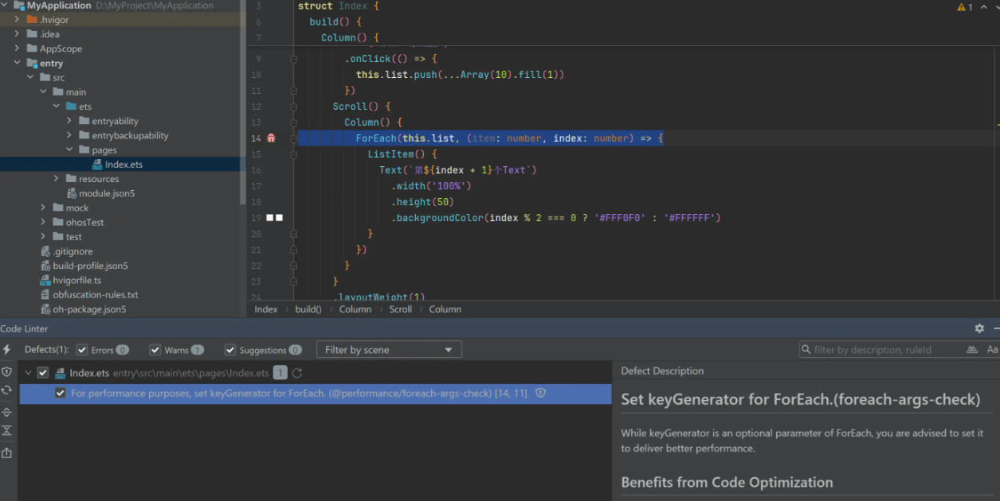
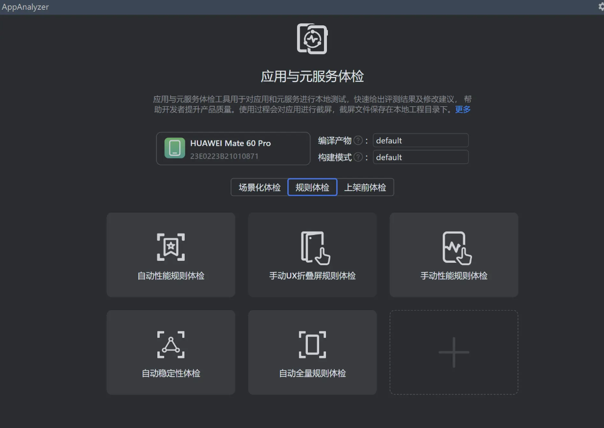
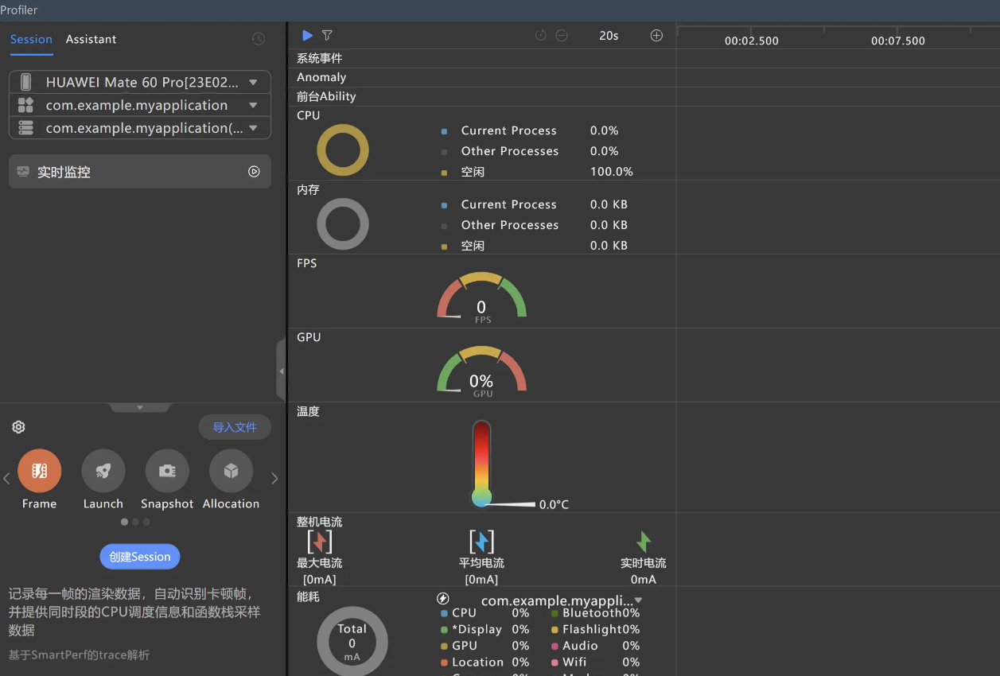

# 鸿蒙 ArkTS 检查能力调研补充

> 本文件基于 `鸿蒙ArkTS检查能力.md` 中原始章节要求生成，未修改源文件。
> 结论中的 `√` 表示有明确对应能力，`〇` 表示同领域存在部分能力但不等价，`×` 表示未在公开资料中找到直接对应能力。

## 一、鸿蒙性能调优工具简介

鸿蒙 ArkTS 侧的工程质量与性能调优能力主要由 DevEco Studio、Code Linter、AppAnalyzer、DevEco Profiler 以及 HiChecker 等工具共同承载。不同工具的定位并不完全相同：Code Linter 更偏静态规则扫描，AppAnalyzer 和 Profiler 更偏构建产物分析与运行期性能分析，HiChecker 则属于开发期运行检测能力。

### Code Linter

Code Linter 是 DevEco Studio 提供的代码检查工具。它可以在工程开发过程中对 ArkTS/TS 代码进行静态扫描，发现编码规范、代码坏味道、安全、性能、预览器、一多适配、正确性和兼容性等问题。

### AppAnalyzer

AppAnalyzer 用于分析应用包结构、资源、依赖与构建产物，帮助定位包体、资源使用和产物结构相关问题。它不等同于语言级静态检查，但可以作为性能调优与工程治理的补充工具。

### DevEco Profiler

DevEco Profiler 用于运行期性能剖析，包括 CPU、内存、帧率、启动、渲染等运行时表现分析。它主要服务于性能调优闭环，不属于编译期静态检查。

## 二、能力 GAP 总览

| 能力域 | ArkTS 支持 | ArkTS 承载工具 | 仓颉支持 | 仓颉承载工具 | GAP 结论 |
| --- | --- | --- | --- | --- | --- |
| `@typescript-eslint` 通用语言规则 | √ | Code Linter / codelinter | √ | cjlint / cangjie fmt | 双方都有语言级规范、坏味道、导入、命名、复杂度等治理能力，但规则体系不同。 |
| `@security` 安全规则 | √ | Code Linter / codelinter | 〇 | cjlint | ArkTS 覆盖 HarmonyOS/ArkTS 加密算法与接口误用；仓颉公开 cjlint 更偏通用安全编码，如外部输入、日志、序列化、敏感信息。 |
| `@performance` 性能规则 | √ | Code Linter / AppAnalyzer / Profiler / HiChecker | × | 未见直接对应 | ArkTS 有面向 ArkUI 与 HarmonyOS 的专项性能检查；仓颉公开 cjlint 未见框架性能专项规则。 |
| `@previewer` 预览器规则 | √ | Code Linter / DevEco Studio Previewer | × | 未见直接对应 | ArkTS 独有，服务 ArkUI 组件预览可用性。 |
| `@cross-device-app-dev` 一多/多端适配规则 | √ | Code Linter / DevEco Studio | × | 未见直接对应 | ArkTS 独有，服务 HarmonyOS 多设备 UI/窗口/断点适配。 |
| `@hw-stylistic` 风格规则 | √ | Code Linter / codelinter | √ | cangjie fmt / cjlint | 双方均有风格与格式化能力，但 ArkTS 规则依托 ESLint 风格体系，仓颉以 fmt 与 cjlint 命名/格式规则承载。 |
| `@correctness` 正确性规则 | √ | Code Linter / codelinter | × | 未见直接对应 | ArkTS 覆盖媒体、网络、图片、ArkUI 状态管理、依赖等 HarmonyOS 应用正确性场景；仓颉公开 cjlint 未见同类框架规则。 |
| `@compatibility` API 兼容性规则 | √ | Code Linter / DevEco Studio | × | 未见直接对应 | ArkTS 可按 `compatibleSdkVersion` 检查 HarmonyOS API 版本兼容；仓颉公开 cjlint 未见 SDK API 版本兼容扫描。 |

## 三、GAP 能力项详细展开

### 3.1 `@security` 安全规则

ArkTS 的 `@security` 规则集中有大量面向 HarmonyOS 加密 API、密钥长度、摘要算法、分组模式、填充模式和 HUKS 调用的专项检查。仓颉公开 cjlint 资料中可以看到通用安全编码能力，例如外部输入校验、日志敏感信息、序列化安全、硬编码敏感信息等，但未看到与 ArkTS 下列规则一一对应的加密算法误用检查。

| ArkTS 规则 | 检查内容 | 仓颉 cjlint 判定 | GAP 说明 |
| --- | --- | --- | --- |
| `@security/no-commented-code` | 不使用的代码段建议直接删除，不允许通过注释方式长期保留。 | × | 未见“注释保留废弃代码”的直接规则。 |
| `@security/no-cycle` | 禁止模块间循环依赖，避免加载顺序、初始化和维护风险。 | × | 仓颉公开规则有导入与依赖治理，但未见循环依赖专项检查。 |
| `@security/no-unsafe-aes` | 禁止 AES 使用 ECB 等不安全加密模式。 | × | 未见算法模式级别的 AES 误用规则。 |
| `@security/no-unsafe-dh` | 禁止不安全 DH 密钥协商，例如 DH 模数长度小于 2048 bit。 | × | 未见 DH 参数强度检查。 |
| `@security/no-unsafe-dsa` | 禁止不安全 DSA 签名，例如模数长度不足或使用 SHA1。 | × | 未见 DSA 签名参数检查。 |
| `@security/no-unsafe-dh-key` | 禁止不安全 DH 密钥，例如 DH 模数长度小于 2048 bit。 | × | 未见 DH 密钥强度检查。 |
| `@security/no-unsafe-dsa-key` | 禁止不安全 DSA 密钥，例如 DSA 模数长度小于 2048 bit。 | × | 未见 DSA 密钥强度检查。 |
| `@security/no-unsafe-ecdsa` | 禁止 ECDSA 使用 SHA1 摘要。 | × | 未见 ECDSA 摘要算法专项检查。 |
| `@security/no-unsafe-hash` | 禁止 MD5、SHA1 等不安全哈希算法。 | × | 未见摘要算法黑名单式规则。 |
| `@security/no-unsafe-mac` | 禁止 MAC 消息认证使用 SHA1 等不安全哈希算法。 | × | 未见 MAC 摘要强度检查。 |
| `@security/no-unsafe-rsa-encrypt` | 禁止不安全 RSA 加密，例如模数不足、PKCS1、MD5/SHA1 摘要或掩码摘要。 | × | 未见 RSA 加密参数、填充、摘要组合检查。 |
| `@security/no-unsafe-rsa-key` | 禁止不安全 RSA 密钥，例如模数小于 2048 bit。 | × | 未见 RSA 密钥长度检查。 |
| `@security/no-unsafe-rsa-sign` | 禁止不安全 RSA 签名，例如模数不足或使用 MD5/SHA1 摘要。 | × | 未见 RSA 签名参数检查。 |
| `@security/no-unsafe-3des` | 禁止 3DES 使用 ECB 等不安全模式，建议使用更安全模式。 | × | 未见 3DES 模式检查。 |
| `@security/specified-interface-call-chain-check` | 标识指定接口调用链，便于接口管理，调用链数量有上限。 | × | 未见接口调用链抽取/管理类 cjlint 规则。 |
| `@security/no-unsafe-kdf` | 禁止 `PBKDF2|SHA1`、`HKDF|SHA1` 等不安全 KDF 组合。 | × | 未见 KDF 摘要算法检查。 |
| `@security/no-unsafe-sm4` | 禁止 SM4 使用 ECB 等不安全模式，建议 CBC/PKCS5/PKCS7 等组合。 | × | 未见国密 SM4 模式检查。 |
| `@security/no-unsafe-sm2-key` | 禁止不安全 SM2 非对称密钥类型，推荐更安全的 SM2/RSA 类型。 | × | 未见 SM2 密钥类型检查。 |
| `@security/no-unsafe-sm2-cipher` | 禁止 SM2 使用 MD5/SHA1 摘要，推荐 SHA256。 | × | 未见 SM2 摘要算法检查。 |
| `@security/no-unsafe-ecdh` | 禁止不安全 ECC 非对称密钥类型，推荐 ECC256。 | × | 未见 ECDH/ECC 密钥强度检查。 |
| `@security/no-unsafe-huks` | 禁止 HUKS 中使用 ECB、MD5、SHA1、NONE、PKCS1-V1_5 等不安全模式/摘要/填充。 | × | 未见 HUKS 专项规则；HUKS 是 HarmonyOS 侧接口场景。 |

仓颉 cjlint 在安全领域不是完全空白，但公开资料中的能力重点与 ArkTS `@security` 差异较大：

| 仓颉规则方向 | 代表规则 | 做什么 | 与 ArkTS `@security` 的关系 |
| --- | --- | --- | --- |
| 外部输入校验 | `G.CHK.01`、`G.CHK.02`、`G.CHK.04` | 约束跨信任边界数据、日志使用外部数据、正则构造等风险。 | 属于通用安全编码，不覆盖 ArkTS 加密参数误用。 |
| 异常与日志敏感信息 | `G.ERR.02`、`G.OTH.01` | 避免异常或日志泄露敏感信息。 | 与 ArkTS 安全规则同属安全治理，但检查对象不同。 |
| 序列化安全 | `G.SER.01`、`G.SER.02`、`G.SER.03` | 约束敏感数据序列化、反序列化类型一致性等。 | ArkTS 源文件列出的安全规则中未体现对应规则。 |
| 敏感信息存储 | `G.OTH.02`、`G.OTH.04` | 禁止硬编码敏感信息，避免使用 String 长期保存敏感数据。 | 是仓颉侧补充优势，但非加密 API 误用检查。 |

结论：`@security` 大类建议记为 ArkTS `√`、仓颉 `〇`。如果逐条对齐 ArkTS 已列规则，仓颉侧均应按 `×` 处理，因为公开 cjlint 规则未见直接对应的算法/API 专项检查。

### 3.2 `@performance` 性能规则

`@performance` 是本次补充后最值得关注的 GAP。ArkTS Code Linter 公开页面列出 76 个性能规则目录项，其中 5 个标注“已下线”。这些规则覆盖 ArkUI 渲染与刷新、列表/瀑布流滑动、动画、Web、媒体、资源释放、后台资源、启动时延、ArkTS 高性能编码实践、C/C++ FFRT worker 等场景。仓颉公开 cjlint 资料未见等价的性能专项规则集，因此逐条对齐时均按 `×` 处理；少数语言层规则可归入“仓颉语言无此语义或公开规则未见性能等价”，不建议记为 `√`。

| ArkTS 规则 | 检查内容 | 仓颉 cjlint 判定 | GAP 说明 |
| --- | --- | --- | --- |
| `@performance/avoid-overusing-custom-component-check` | 建议可用 `@Builder` 替代自定义组件，减少后端 FrameNode 节点，缩短加载和渲染时长。 | × | ArkUI 组件树/渲染性能专项。 |
| `@performance/bad-deep-clone-check` | 避免 `JSON.parse(JSON.stringify())`、`_.cloneDeep()` 等不合理深拷贝。 | × | 仓颉公开 cjlint 未见深拷贝性能规则。 |
| `@performance/constant-property-referencing-check-in-loops` | 循环内频繁访问不会变化的常量属性时，建议提取到循环外。 | × | 仓颉公开 cjlint 未见循环属性访问性能规则。 |
| `@performance/crypto-replacement-check` | 第三方 `@ohos/crypto-js` 接口若有系统原生实现，建议使用 `cryptoFramework`。 | × | HarmonyOS 加密库替换专项。 |
| `@performance/custom-node-memory-leak-check` | 自定义节点创建后应主动释放，避免内存泄漏。 | × | ArkUI `BuilderNode` 生命周期专项。 |
| `@performance/dark-color-mode-check` | 应用需适配深色模式，以降低能耗。 | × | HarmonyOS UI 能耗/深色模式专项。 |
| `@performance/datashare-query-unrelease-check` | `DataShareHelper.query` 查询后必须关闭结果集，防止内存泄漏。 | × | HarmonyOS DataShare 资源释放专项。 |
| `@performance/foreach-args-check` | `ForEach` 参数建议设置 `keyGenerator`，降低滑动丢帧风险。 | × | ArkUI 列表 diff/复用专项。 |
| `@performance/foreach-index-check` | `ForEach` 的 `keyGenerator` 不建议使用 index 作为 key。 | × | ArkUI 列表 key 稳定性专项。 |
| `@performance/gif-hardware-decoding-check` | 使用 `@ohos/gif-drawable` 解码 GIF 时建议开启硬解码。 | × | HarmonyOS GIF 解码性能专项。 |
| `@performance/hp-arkui-avoid-update-auto-state-var-in-aboutToReuse` | 避免在 `aboutToReuse` 中更新自动更新值的状态变量。 | × | ArkUI 复用组件刷新专项。 |
| `@performance/hp-arkui-avoid-empty-callback` | 避免设置空的系统回调监听。 | × | ArkUI 回调注册冗余专项。 |
| `@performance/hp-arkui-combine-same-arg-animateto` | 动画参数相同时建议合并使用同一个 `animateTo`。 | × | ArkUI 动画调度专项。 |
| `@performance/hp-arkui-image-async-load` | 大图片建议异步加载。 | × | ArkUI 图片加载专项。 |
| `@performance/hp-arkui-load-on-demand` | 建议使用按需加载，降低滑动丢帧风险。 | × | ArkUI 列表/内容按需加载专项。 |
| `@performance/hp-arkui-limit-refresh-scope`（已下线） | 建议减少组件刷新范围。 | × | 已下线；仓颉无等价公开规则。 |
| `@performance/hp-arkui-no-func-as-arg-for-reusable-component` | 复用自定义组件入参中避免使用函数。 | × | ArkUI 组件复用性能专项。 |
| `@performance/hp-arkui-no-high-freq-log`（已下线） | 正式发布版本建议删除或注释高频日志。 | × | 已下线；仓颉有日志安全规则但非高频性能等价。 |
| `@performance/hp-arkui-no-stringify-in-lazyforeach-key-generator` | `LazyForEach` 的 key 生成器中不要使用 `stringify`。 | × | ArkUI 列表 key 生成性能专项。 |
| `@performance/hp-arkui-no-state-var-access-in-loop` | 避免在循环中频繁读取状态变量。 | × | ArkUI 状态变量访问与刷新专项。 |
| `@performance/hp-arkts-no-use-any-export-current` | 避免 `export *` 导出当前模块定义的类型和数据，降低冷启动时延。 | × | 仓颉无 ArkTS `export *` 性能等价规则。 |
| `@performance/hp-arkts-no-use-any-export-other` | 避免 `export *` 导出其他模块定义的类型和数据，降低冷启动时延。 | × | 仓颉有导入依赖治理，但未见同类冷启动性能规则。 |
| `@performance/hp-arkui-remove-container-without-property` | 减少无属性容器和视图嵌套层次。 | × | ArkUI 组件层级专项。 |
| `@performance/hp-arkui-replace-nested-reusable-component-by-builder` | 建议用 `@Builder` 替代嵌套自定义组件。 | × | ArkUI 复用组件/Builder 专项。 |
| `@performance/hp-arkui-reduce-pangesture-distance` | 建议设置合理拖动距离，降低点击响应时延。 | × | ArkUI 手势响应专项。 |
| `@performance/hp-arkui-remove-redundant-nest-container` | 避免冗余嵌套。 | × | ArkUI 组件树冗余专项。 |
| `@performance/hp-arkui-remove-redundant-state-var` | 移除不关联 UI 组件的状态变量。 | × | ArkUI 状态变量与刷新专项。 |
| `@performance/hp-arkui-remove-unchanged-state-var` | 移除未改变的状态变量设置。 | × | ArkUI 状态变量冗余专项。 |
| `@performance/hp-arkui-set-cache-count-for-lazyforeach-grid` | `Grid` 下使用 `LazyForEach` 时设置合理 `cacheCount`。 | × | ArkUI Grid/LazyForEach 缓存专项。 |
| `@performance/hp-arkui-suggest-cache-avplayer` | 建议缓存 `AVPlayer` 实例减少起播时延。 | × | HarmonyOS 媒体起播专项。 |
| `@performance/hp-arkui-suggest-reuseid-for-if-else-reusable-component` | 不同结构复用组件建议使用 `reuseId` 标记。 | × | ArkUI 组件复用专项。 |
| `@performance/hp-arkui-suggest-use-effectkit-blur` | 建议使用 `effectKit.createEffect` 实现模糊效果。 | × | HarmonyOS 图形效果性能专项。 |
| `@performance/hp-arkui-suggest-use-get-anonymousid-async` | 主线程中建议异步获取 IFAA 免密认证匿名化 ID。 | × | HarmonyOS 高耗时接口异步化专项。 |
| `@performance/hp-arkui-use-attributeUpdater-control-refresh-scope` | 使用 `attributeUpdater` 精准控制组件属性刷新。 | × | ArkUI 刷新范围控制专项。 |
| `@performance/hp-arkui-use-grid-layout-options` | 指定位置时使用 `GridLayoutOptions` 提升 Grid 性能。 | × | ArkUI Grid 布局性能专项。 |
| `@performance/hp-arkui-use-id-in-get-resource-sync-api` | `getColorSync`、`getStringSync` 建议使用带 id 版本。 | × | HarmonyOS 资源同步接口专项。 |
| `@performance/hp-arkui-use-local-var-to-replace-state-var` | 建议用临时变量替换状态变量，减少刷新开销。 | × | ArkUI 状态变量访问专项。 |
| `@performance/hp-arkui-use-onAnimationStart-for-swiper-preload` | `Swiper` 预加载建议结合 `onAnimationStart` 回调。 | × | ArkUI Swiper 预加载专项。 |
| `@performance/hp-arkui-use-object-link-to-replace-prop` | 建议用 `@ObjectLink` 替代 `@Prop`，减少不必要深拷贝。 | × | ArkUI 状态装饰器性能专项。 |
| `@performance/hp-arkui-use-row-column-to-replace-flex` | 建议用 `Column` / `Row` 替代 `Flex`。 | × | ArkUI 布局组件性能专项。 |
| `@performance/hp-arkui-use-reusable-component` | 复杂组件建议使用组件复用。 | × | ArkUI 复用组件专项。 |
| `@performance/hp-arkui-use-scale-to-replace-attr-animateto` | 组件布局改动时建议使用图形变换属性动画。 | × | ArkUI 动画性能专项。 |
| `@performance/hp-arkui-use-taskpool-for-web-request` | 网络资源请求和返回建议使用 taskpool 异步处理。 | × | HarmonyOS TaskPool/Web 请求专项。 |
| `@performance/hp-arkui-use-transition-to-replace-animateto` | 组件转场动画建议使用 `transition` 替代 `animateTo`。 | × | ArkUI 转场动画专项。 |
| `@performance/hp-arkui-use-word-break-to-replace-zero-width-space` | 建议用 `word-break` 替换零宽空格。 | × | ArkUI 文本排版性能/规范专项。 |
| `@performance/hp-arkui-wrap-waterflow-if-else-footer`（已下线） | 建议用容器包裹 WaterFlow footer 中的 if-else 逻辑。 | × | 已下线；ArkUI WaterFlow 专项。 |
| `@performance/high-frequency-log-check` | 不建议在 `onTouch`、滚动、拖拽等高频函数中使用 Hilog。 | × | 仓颉有日志安全治理，但非 UI 高频性能等价。 |
| `@performance/hp-ffrt-no-use-std` | 禁止在 FFRT worker 中使用 `std::xxx` 同步接口；仅检查 C/C++ 文件。 | × | 不是仓颉 cjlint 规则；属于 C/C++/FFRT 性能专项。 |
| `@performance/hp-performance-no-closures` | 函数内部变量建议尽量通过参数传递，减少闭包带来的性能成本。 | × | 仓颉公开 cjlint 未见闭包性能规则。 |
| `@performance/hp-performance-no-dynamic-cls-func` | 避免动态声明 function 与 class；仅适用于 JS/TS。 | × | 仓颉无 JS/TS 动态声明语义。 |
| `@performance/init-list-component` | `List` 组件建议同时定义 `width` 和 `height`。 | × | ArkUI List 初始化布局专项。 |
| `@performance/js-code-cache-by-interception-check` | 资源拦截场景建议生成 JavaScript 字节码缓存，降低 Web 非首次加载时间。 | × | ArkWeb/JS 字节码缓存专项。 |
| `@performance/js-code-cache-by-precompile-check` | 建议通过预编译生成 JavaScript 字节码缓存，降低 Web 首次/二次加载时间。 | × | ArkWeb/JS 预编译缓存专项。 |
| `@performance/lazyforeach-args-check`（已下线） | `LazyForEach` 参数建议设置 `keyGenerator`。 | × | 已下线；ArkUI LazyForEach 专项。 |
| `@performance/lottie-animation-destroy-check` | 使用 lottie 加载动画后需在合适时机销毁，避免资源浪费。 | × | 三方动画库生命周期专项。 |
| `@performance/multiple-associations-state-var-check` | 多组件关联同一数据时建议使用 `@Watch` 添加更新条件。 | × | ArkUI 状态更新范围专项。 |
| `@performance/monitor-invisible-area-in-image-animation` | `ImageAnimation` 帧动画建议显式调用 `monitorInvisibleArea`，不可见时停止播放。 | × | ArkUI 动画可见性/能耗专项。 |
| `@performance/no-use-any-import` | 建议按需 import，避免 `import *` 增加 `.ets` 执行耗时和初始化成本。 | × | 仓颉有导入治理，但未见性能等价规则。 |
| `@performance/no-high-loaded-frame-rate-range` | 不允许锁定最高帧率运行。 | × | HarmonyOS 帧率/功耗专项。 |
| `@performance/number-init-check` | 检查 number 是否按 ArkTS 高性能实践正确使用。 | × | ArkTS 数值类型性能专项；仓颉无等价公开规则。 |
| `@performance/nested-post-frame-callback-check` | 避免循环嵌套调用 `postFrameCallback` 导致持续请求 vsync。 | × | ArkUI 渲染调度专项。 |
| `@performance/object-creation-check`（已下线） | 建议使用字面量进行对象创建；仅支持 TS，已下线。 | × | 已下线；仓颉无 TS 对象创建等价规则。 |
| `@performance/reasonable-audio-use-check` | 无长时任务应用退后台时禁止使用麦克风或扬声器。 | × | HarmonyOS 后台音频资源专项。 |
| `@performance/reasonable-gps-use-check` | 无长时任务应用退后台时禁止使用定位服务。 | × | HarmonyOS 后台定位资源专项。 |
| `@performance/reuse-date-instances-check` | 检测循环或高频方法中重复创建 `Date`，建议复用实例或时间戳。 | × | 仓颉公开 cjlint 未见 Date 实例复用性能规则。 |
| `@performance/reasonable-sensor-use-check` | 应用退后台时禁止使用传感器资源。 | × | HarmonyOS 后台传感器资源专项。 |
| `@performance/sparse-array-check` | 建议避免使用稀疏数组。 | × | ArkTS/JS 数组性能专项；仓颉无等价公开规则。 |
| `@performance/start-window-icon-check` | 启动页图标分辨率建议不超过 256 × 256，降低冷启动响应时延。 | × | HarmonyOS 启动资源专项。 |
| `@performance/state-variable-usage-in-ui-format-check` | 建议删除不使用的 UI 变量。 | × | ArkUI 状态变量/组件代码专项。 |
| `@performance/typed-array-check` | 数值数组推荐使用 `TypedArray`。 | × | ArkTS/JS 数值数组性能专项；仓颉无等价公开规则。 |
| `@performance/timezone-interface-check` | 获取非本地时间时建议使用统一标准的 `i18n.Calendar` 接口。 | × | HarmonyOS i18n 接口性能/规范专项。 |
| `@performance/tabs-on-change-check` | 推荐使用 `onAnimationStart` 设置切换标签动效，避免 `onChange` 延迟。 | × | ArkUI Tabs 动效专项。 |
| `@performance/update-state-var-between-animatetos-check` | 不建议在两次 `animateTo` 之间更新状态变量，避免冗余脏节点更新。 | × | ArkUI 动画与状态刷新专项。 |
| `@performance/web-cache-mode-check` | Web 组件 `cacheMode` 不建议设置为 `Online`。 | × | ArkWeb 缓存模式专项。 |
| `@performance/web-on-active-check` | 使用 Web 预渲染后建议在首屏有意义绘制后调用 `onInactive` 停止渲染。 | × | ArkWeb 预渲染生命周期专项。 |
| `@performance/waterflow-data-preload-check` | WaterFlow 子组件建议进行数据预加载。 | × | ArkUI WaterFlow 滑动性能专项。 |

按能力意图归纳，`@performance` 的差异可以拆成几组：

| 子类 | 代表规则 | 做什么 | 仓颉侧差异 |
| --- | --- | --- | --- |
| ArkUI 渲染与刷新范围 | `use-attributeUpdater-control-refresh-scope`、`remove-redundant-state-var`、`no-state-var-access-in-loop` | 减少状态变量访问、脏节点刷新和组件刷新范围。 | 仓颉公开 cjlint 未见 ArkUI 刷新模型规则。 |
| 列表/滑动/瀑布流 | `foreach-args-check`、`set-cache-count-for-lazyforeach-grid`、`waterflow-data-preload-check` | 优化 key、缓存、预加载和复用，降低滑动丢帧。 | 仓颉公开 cjlint 未见 HarmonyOS 列表组件性能规则。 |
| 动画与帧调度 | `combine-same-arg-animateto`、`use-transition-to-replace-animateto`、`nested-post-frame-callback-check` | 减少动画调度和 vsync 冗余。 | 仓颉公开 cjlint 未见 ArkUI 动画性能规则。 |
| Web/JS 缓存 | `js-code-cache-by-precompile-check`、`web-cache-mode-check`、`web-on-active-check` | 通过字节码缓存、缓存模式和预渲染生命周期降低 Web 加载成本。 | 仓颉公开 cjlint 未见 ArkWeb 性能规则。 |
| 资源/后台/能耗 | `reasonable-audio-use-check`、`reasonable-gps-use-check`、`reasonable-sensor-use-check`、`dark-color-mode-check` | 约束后台资源、深色模式、硬解码和启动资源。 | 仓颉公开 cjlint 未见 HarmonyOS 资源能耗规则。 |
| ArkTS 高性能编码 | `bad-deep-clone-check`、`typed-array-check`、`sparse-array-check`、`no-use-any-import` | 约束 ArkTS/JS 代码写法中的性能坏味道。 | 仓颉语言语义不同，公开 cjlint 未见一一对应性能规则。 |

结论：`@performance` 应记为 ArkTS `√`、仓颉 `×`。如果用户关注“鸿蒙应用性能调优前置”，这是当前最突出的 GAP 能力域。

### 3.3 `@previewer` 预览器规则

`@previewer` 是 DevEco Studio / ArkUI 预览器场景下的专项规则，目标是保证组件可被正确预览、预览入口可初始化、页面级生命周期不被误用。仓颉公开 cjlint 文档未见与 ArkUI Previewer 对应的规则体系。

| ArkTS 规则 | 检查内容 | 仓颉 cjlint 判定 | GAP 说明 |
| --- | --- | --- | --- |
| `@previewer/mandatory-default-value-for-local-initialization` | 支持本地初始化的组件属性需要合法默认值，且默认值不能依赖运行时环境。 | × | ArkUI 组件预览初始化专项能力。 |
| `@previewer/no-page-method-on-preview-component` | 禁止在非路由组件中实例化 `onPageShow`、`onPageHide`、`onBackPress` 等页面级方法。 | × | ArkUI 页面生命周期与预览器专项能力。 |
| `@previewer/no-unallowed-decorator-on-root-component` | 不允许直接预览包含 `@Consume`、`@Link`、`@ObjectLink`、`@Prop` 等装饰器的子组件。 | × | ArkUI 状态装饰器与预览器约束，仓颉无对应公开规则。 |

结论：`@previewer` 应记为 ArkTS `√`、仓颉 `×`。

### 3.4 `@cross-device-app-dev` 一多/多端适配规则

`@cross-device-app-dev` 聚焦 HarmonyOS 一多开发中的颜色、字号、尺寸单位、栅格、断点、侧边导航、窗口变化和沉浸式布局等问题，属于应用框架和多设备体验能力。仓颉公开 cjlint 文档未见同类 HarmonyOS UI 多端适配规则。

| ArkTS 规则 | 检查内容 | 仓颉 cjlint 判定 | GAP 说明 |
| --- | --- | --- | --- |
| `@cross-device-app-dev/color-contrast` | 文本与背景颜色对比度至少达到 4.5:1，保障可读性。 | × | UI 可访问性/视觉适配专项能力。 |
| `@cross-device-app-dev/color-value` | 颜色值应从 `color.json` 通过 `$r` 引用，避免固定颜色导致深浅色模式不适配。 | × | HarmonyOS 资源引用与系统颜色模式专项能力。 |
| `@cross-device-app-dev/font-size-unit` | 字体大小单位建议使用 `fp`，适配不同设备显示。 | × | ArkUI 尺寸单位专项能力。 |
| `@cross-device-app-dev/font-size` | 字体大小至少 8fp，避免过小不可读。 | × | UI 可读性专项能力。 |
| `@cross-device-app-dev/grid-columns-span` | 不推荐所有 `GridCol` 只设置 `span` 且等于父 `columns`，避免栅格失效和组件树复杂。 | × | ArkUI 栅格布局专项能力。 |
| `@cross-device-app-dev/grid-span-value` | `GridCol` 的 `span`、`offset` 不建议使用小数。 | × | ArkUI 栅格布局参数专项能力。 |
| `@cross-device-app-dev/one-multi-breakpoint-check` | 一多特性必须通过系统断点判断，不通过设备类型、方向或可折叠属性判断。 | × | HarmonyOS 一多断点模型专项能力。 |
| `@cross-device-app-dev/sidebar-navigation` | 对 2in1/tablet 等设备，`Tabs` 应设置为侧边导航栏。 | × | 多设备导航形态专项能力。 |
| `@cross-device-app-dev/size-unit` | `width`、`height`、`size` 等尺寸应使用 `vp` 单位。 | × | ArkUI 尺寸单位专项能力。 |
| `@cross-device-app-dev/touch-target-size` | `responseRegion` 点击热区需满足最小尺寸要求。 | × | 触控可用性专项能力。 |
| `@cross-device-app-dev/window-size-change-listener-check` | 创建 `window` 实例后建议监听 `windowSizeChange`。 | × | HarmonyOS 窗口变化适配专项能力。 |
| `@cross-device-app-dev/immersive-effect-check` | 使用 `setWindowLayoutFullScreen()` 后，建议调用 `getWindowAvoidArea()` 并监听 `avoidAreaChange` 动态调整布局。 | × | HarmonyOS 沉浸式布局与安全区域专项能力。 |

结论：`@cross-device-app-dev` 应记为 ArkTS `√`、仓颉 `×`。

### 3.5 `@correctness` 正确性规则

`@correctness` 主要检查 HarmonyOS 应用开发中容易导致功能异常或体验问题的场景，包括音视频会话、音频焦点、图片格式、网络切换、相机预览流、依赖配置和 ArkUI 状态管理。仓颉公开 cjlint 文档虽然有通用语言正确性、并发和导入依赖治理能力，但未见下列 HarmonyOS 应用框架专项规则。

| ArkTS 规则 | 检查内容 | 仓颉 cjlint 判定 | GAP 说明 |
| --- | --- | --- | --- |
| `@correctness/avsession-buttons-check` | 音乐、视频、听书类应用应通过 AVSession 监听播放、暂停、停止、上一首、下一首等按键事件并响应。 | × | HarmonyOS AVSession 专项能力。 |
| `@correctness/audio-interrupt-check` | 播放或录制音频时应监听音频焦点中断回调并正确处理。 | × | HarmonyOS 音频焦点专项能力。 |
| `@correctness/audio-pause-or-mute-check` | 播放声音场景应监听音频发声设备变化。 | × | HarmonyOS 音频设备变化专项能力。 |
| `@correctness/avsession-metadata-check` | 接入 AVSession 时应提供封面、标题、作者/副标题、时长、播放状态、播放位置等元数据。 | × | HarmonyOS 媒体会话元数据专项能力。 |
| `@correctness/image-pixel-format-check` | 使用 Image `createPixelMap` 时不建议选择 `RGB_565`，避免色阶问题。 | × | HarmonyOS 图片像素格式专项能力。 |
| `@correctness/image-interpolation-check` | 使用 Image `interpolation` 时不建议使用最邻近插值，避免锯齿。 | × | HarmonyOS 图片渲染质量专项能力。 |
| `@correctness/listen-default-network-change` | 应监听默认网络变化，关闭原网络数据传输并使用新网络。 | × | HarmonyOS 网络切换专项能力。 |
| `@correctness/listen-multi-network-concurrent` | 建议订阅连接迁移通知，获取 WiFi/蜂窝切换前后状态。 | × | HarmonyOS 多网络并发/迁移专项能力。 |
| `@correctness/multimedia-use-stride-in-image-receiver` | 使用 ImageReceiver `readNextImage` 时建议处理 `rowStride`，避免相机预览流数据异常。 | × | HarmonyOS 相机/图像流专项能力。 |
| `@correctness/redundant-dependency-check` | 建议删除冗余依赖配置，避免增加依赖加载和解析时间。 | × | 仓颉有导入/依赖治理规则，但未见 HarmonyOS 工程依赖冗余专项规则。 |
| `@correctness/v1-nested-object-property-change-format-check` | 不要直接修改普通 V1 状态变量中嵌套对象属性，应使用 `@Observed`、`@ObjectLink` 等机制。 | × | ArkUI 状态管理专项能力。 |
| `@correctness/v1-state-object-member-used-in-function-parameter-check` | 在 `build()` 内避免将 `@Observed`、`@ObjectLink` 装饰类对象的状态变量直接作为参数传给方法。 | × | ArkUI 状态刷新与组件构建专项能力。 |

结论：`@correctness` 应记为 ArkTS `√`、仓颉 `×`。若只看语言级正确性，仓颉 cjlint 有自身规则；但源文件该项指向的是 HarmonyOS 应用框架正确性，不能直接等同。

### 3.6 `@compatibility` API 兼容性规则

`@compatibility/api-compatibility-check` 是 DevEco Studio 6.0.1 Beta1 起提供的版本兼容性规则扫描能力。它会检查工程代码调用的 HarmonyOS API 版本是否高于工程 `compatibleSdkVersion`，并提示通过 SDK 版本判断、判空或 `try-catch` 等方式规避低版本运行风险。

| ArkTS 规则 | 检查内容 | 仓颉 cjlint 判定 | GAP 说明 |
| --- | --- | --- | --- |
| `@compatibility/api-compatibility-check` | 检查 HarmonyOS API 调用版本是否超过工程 `compatibleSdkVersion`，防止低版本设备兼容性问题。 | × | 仓颉公开 cjlint 未见基于 HarmonyOS SDK API 版本的兼容性扫描规则。 |

结论：`@compatibility` 应记为 ArkTS `√`、仓颉 `×`。

## 四、思考总结

性能规则当前最值得关注：
1、lint功能补齐？  
2、提取出具体规则，融入到skill中？

无论是做到lint中还是做到skill中，都需要先把具体的规则先整理出来，这些内容是不变的。
## 五、来源与边界

本次补充主要依据以下官方/公开资料整理：

- ArkTS Code Linter 安全规则：https://developer.huawei.com/consumer/cn/doc/harmonyos-guides/ide-security
- ArkTS Code Linter 性能规则：https://developer.huawei.com/consumer/cn/doc/harmonyos-guides/ide-performance
- ArkTS Previewer 规则：https://developer.huawei.com/consumer/cn/doc/harmonyos-guides/ide-previewer
- ArkTS 一多/多端适配规则：https://developer.huawei.com/consumer/cn/doc/harmonyos-guides/ide-cross-device-app-dev
- ArkTS 正确性规则：https://developer.huawei.com/consumer/cn/doc/harmonyos-guides/ide-codelinter-correctness
- ArkTS API 兼容性规则：https://developer.huawei.com/consumer/cn/doc/harmonyos-guides/ide-api-compatibility-check
- 仓颉 cjlint 华为文档入口：https://developer.huawei.com/consumer/cn/doc/cangjie-guides/cj-cjlint_manual
- 仓颉公开资料与 cangjie_tools/cjlint 规则说明，用于辅助判断公开可见的 cjlint 能力边界。

