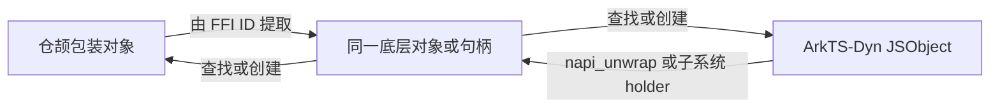

# 仓颉与 ArkTS-Dyn 系统对象转换方案

## 1. 方案摘要

系统对象是同一底层 C++ 对象或句柄在仓颉和 ArkTS-Dyn 两侧的不同语言包装。转换必须让两侧包装继续访问该底层对象并遵守其既有生命周期，不能复制可见属性构造另一个对象。

本方案定义独立的系统对象双向转换协议，并提供两个面向目标侧命名的泛型入口：

```cangjie
public interface SystemObjectInteropType<T> {
    static func fromJSValue(context: JSContext, input: JSValue): T
    func toJSValue(context: JSContext): JSValue
}

public func transferCangjie<T>(context: JSContext, input: JSValue): T
    where T <: SystemObjectInteropType<T>

public func transferArkTSDyn<T>(context: JSContext, input: T): JSValue
    where T <: SystemObjectInteropType<T>
```

调用者通过目标仓颉类型选择转换实现。各子系统为自己的公开类型实现协议，在 FFI 层完成底层对象提取、目标包装创建和对象复用。统一层负责类型约束、上下文检查和错误归一化。

当前源码确认的结论如下：

- ArkTS 静动态转换已经覆盖 133 个唯一 type key，全部支持双向转换；
- 仓颉互操作库已经提供 `JSValue`、`JSObject`、`JSContext`、global handle 生命周期管理和 NAPI 帮助接口；
- Ability Context 家族已经提供 API Level 22 的仓颉与 ArkTS-Dyn 双向转换接口，但正反向入口不统一；
- ArkTS IPC `MessageSequence` 已实现共享 `MessageParcel` 的静动态双向转换；当前仓颉 `MessageSequence` 是公开 FFI ID wrapper，但尚无 `JSValue` 双向入口；
- 其他候选对象必须逐子系统确认两侧包装是否访问同一个底层对象，以及是否存在双向转换 FFI，不能依据同名 API 自动纳入。

## 2. 问题边界

### 2.1 系统对象判据

对象同时满足以下条件才纳入本方案：

1. 仓颉和 ArkTS-Dyn 提供不同的语言包装；
2. 两侧包装绑定同一个底层 C++ 业务对象或句柄；
3. 对象包含行为、资源或对象同一性语义，不是可安全复制的普通值；
4. 当前仓颉 API 与 ArkTS-Dyn API 均存在相关接口；
5. 子系统能够提供双向包装转换并定义生命周期规则。

普通 DTO、枚举、结构化参数和纯值类型继续使用现有值转换能力。

### 2.2 转换目标



“双向包装访问同一个底层对象”具体表示：从任一侧包装取得的 native 指针、智能指针目标或稳定句柄指向同一业务对象。转换后在一侧执行的状态修改应能由另一侧观察到；对象释放后的行为应符合子系统既有生命周期契约。

双向转换保证：

- 两侧包装访问同一个底层对象或句柄；
- 已存在的目标包装优先复用；
- 新包装纳入子系统已有引用和销毁机制；
- 不从可见属性重建底层状态；
- 不跨 `JSContext`、runtime 或线程搬运动态句柄。

### 2.3 不支持范围

以下场景不由通用系统对象转换接口支持：

- 两侧对象没有共同底层对象或句柄；
- DTO、枚举、结构体、数组、Map 等值拷贝对象；
- 仅在 ArkTS transfer 清单中存在、但仓颉侧尚无公开类型的对象；
- 仓颉类型为 `protected`、`internal` 或仅存在于实现层的对象；
- 只有单向转换、没有反向包装能力的对象；
- 尚未确认回调有效期和持有规则的短生命周期事件对象；
- 不同 `JSContext`、runtime 或线程之间的 `JSValue` 搬运；
- 跨设备、跨进程对象序列化；
- 应用自定义对象自动取得系统 API 能力。

## 3. ArkTS 静动态转换基线

### 3.1 公共分发层

ArkTS `transfer` 模块在加载时注册全部转换器。对外入口为：

```text
transferStatic(dynamicObject, typeKey) -> staticObject
transferDynamic(staticObject, typeKey) -> dynamicObject
```

注册表按方向分离。转换器可以直接注册函数，也可以登记模块、类和方法，由运行时反射加载并缓存。未注册、类不存在或方法不存在统一抛出错误码 `10200067`。

注册表包含 133 个唯一 type key，全部同时注册 static 和 dynamic 方向，没有单向项或跨文件重复 key。按领域统计如下：

| 领域 | 数量 | 领域 | 数量 |
|---|---:|---|---:|
| AbilityKit | 6 | ArkUI | 29 |
| ArkWeb | 23 | ArkGraphics2D（文本、绘制、效果） | 19 |
| CameraKit | 9 | ImageKit | 7 |
| ArkGraphics3D | 6 | IPC | 5 |
| MediaLibraryKit | 5 | UDMF | 6 |
| BasicServices | 3 | CoreFileKit | 3 |
| Window / Display / Screen | 4 | 其他独立领域 | 3 |
| Account | 3 | Pasteboard | 2 |
| **合计** | **133** | | |

完整 type key 见附录 A。

### 3.2 子系统职责

公共 `transfer` 只按 type key 找到回调。每个子系统自行实现：

1. 校验源包装类型；
2. 提取 native payload；
3. 查找已有目标包装；
4. 必要时创建目标包装；
5. 把目标包装绑定到底层对象；
6. 将失败映射为统一异常。

ArkTS 的注册表可作为候选发现清单，不能替代仓颉侧转换实现，也不要求仓颉覆盖全部 133 项。

### 3.3 仓颉现有转换边界

当前仓颉源码中，Ability Context 家族已经提供 `JSValue` 双向转换；其他公开 native wrapper 尚未形成跨子系统统一入口。Ability 的 NAPI、FFI 和底层对象同一性链路见附录 C.2。

## 4. 仓颉现有能力与缺口

### 4.1 可复用能力

| 能力 | 当前实现 | 本方案用法 |
|---|---|---|
| 动态值 | `JSValue` | 泛型入口的动态载体 |
| 动态对象安全引用 | `JSObject` | 对象校验和动态调用 |
| 动态模块加载 | `JSContext.requireArkModule()` | 取得 ArkTS-Dyn API 返回对象 |
| 类型扩展 | `extend T <: Interface` | 子系统为既有类型接入协议 |
| 动态对象保活 | `JSHeapObject` global handle | 保持 ArkTS 对象生命周期 |
| NAPI 桥接 | `arktsValuetoNapiValue()` | `JSValue -> napi_value` |
| 底层反向包装 | `napiValueToArkTsValue()` | 受控实现 `napi_value -> JSValue` |
| API 版本 | `@!APILevel` | 标注新增接口及兼容关系 |

`JSInteropType<T>` 已定义 `fromJSValue()`、`toJSValue()` 和 `toArktsType()`，其源码注释说明该协议服务于声明式互操作宏。系统对象入口复用前两个方法的签名，但不继承该协议：本方案没有声明式宏或 ArkTS 类型名消费者，强制实现 `toArktsType()` 只会引入无用户场景的接口。

### 4.2 当前缺口

1. 没有跨子系统统一的系统对象双向协议；
2. Ability 只有公共正向接口，反向使用四个类型专属函数；
3. `napi_value -> JSValue_` 的底层函数为 `protected`，缺少返回安全 `JSValue` 的公共受控接口；
4. IPC、Window、Image、Camera 等公开 wrapper 尚未逐项提供 `JSValue` 双向 FFI；
5. 缺少统一的上下文检查、错误映射和对象同一性测试门禁；
6. `@Interop` 当前不支持泛型声明，统一入口不能依赖宏生成。

## 5. 接口设计

### 5.1 公共协议

```cangjie
public interface SystemObjectInteropType<T> {
    static func fromJSValue(context: JSContext, input: JSValue): T
    func toJSValue(context: JSContext): JSValue
}
```

协议新增的系统对象语义是：实现必须让转换前后的两侧包装访问同一个底层对象或句柄，并使用子系统既有引用和销毁机制。协议不包含 type key、ABI 版本或 ArkTS 类型字符串。

### 5.2 应用调用入口

```cangjie
public func transferCangjie<T>(context: JSContext, input: JSValue): T
    where T <: SystemObjectInteropType<T> {
    context.checkLifecycleAndThread()
    return T.fromJSValue(context, input)
}

public func transferArkTSDyn<T>(context: JSContext, input: T): JSValue
    where T <: SystemObjectInteropType<T> {
    context.checkLifecycleAndThread()
    return input.toJSValue(context)
}
```

命名直接表达目标侧：`transferCangjie()` 返回仓颉包装，`transferArkTSDyn()` 返回 ArkTS-Dyn 动态对象。ArkTS 现有 `transferStatic()` / `transferDynamic()` 名称只描述 ArkTS 自身静动态类型，不用于仓颉新接口。

泛型约束在编译期限制可接入类型；运行时仍由子系统校验输入 `JSValue` 的实际包装类型。

### 5.3 非 UI 接入示例：IPC MessageSequence

`MessageSequence` 用于展示子系统接入方式。以下协议实现和两个 FFI 是方案待新增接口，不是当前仓颉 SDK 已有能力：

```cangjie
package ohos.rpc

foreign {
    func FfiRpcMessageSequenceFromNapi(env: napi_env, value: napi_value): Int64
    func FfiRpcMessageSequenceToNapi(env: napi_env, id: Int64): napi_value
}

extend MessageSequence <: SystemObjectInteropType<MessageSequence> {
    public static func fromJSValue(
        context: JSContext,
        input: JSValue
    ): MessageSequence {
        let env = context.getNapiEnv()
        let napiValue = arktsValuetoNapiValue(env, input)
        let id = unsafe { FfiRpcMessageSequenceFromNapi(env, napiValue) }
        if (id <= 0) {
            throw SystemObjectTransferException.sourceTypeMismatch()
        }
        return MessageSequence(id)
    }

    public func toJSValue(context: JSContext): JSValue {
        let value = unsafe {
            FfiRpcMessageSequenceToNapi(context.getNapiEnv(), getID())
        }
        return systemObjectFromNapi(context, value)
    }
}
```

新增 FFI 的职责边界如下：

| 方向 | 接口 | 层级 | 处理内容 | 当前状态 |
|---|---|---|---|---|
| Dyn -> CJ | `arktsValuetoNapiValue()` | 互操作 helper | `JSValue -> napi_value` | 已有，API Level 22 |
| Dyn -> CJ | `FfiRpcMessageSequenceFromNapi()` | IPC C ABI | `napi_unwrap`、取得 `MessageParcel`、创建仓颉 FFI ID | 待新增 |
| Dyn -> CJ | `MessageSequence(id)` | 仓颉 IPC wrapper | 构造仓颉包装 | 已有构造能力，需由适配代码调用 |
| CJ -> Dyn | `FfiRpcMessageSequenceToNapi()` | IPC C ABI | 由 FFI ID 取得 `MessageParcel`、创建或复用 NAPI 包装 | 待新增 |
| CJ -> Dyn | `systemObjectFromNapi()` | 互操作 helper | `napi_value -> JSValue` | 待新增受控接口 |

ArkTS IPC 已有 `RpcTransferStaicImpl()` / `RpcTransferDynamicImpl()`：前者从动态包装取得 `NAPI_MessageSequence` 和 `MessageParcel`，后者以同一 `MessageParcel` 创建 NAPI 包装。该实现证明 IPC 的对象共享模型可行，但它使用 Taihe/ANI 对象表示，不能直接替代当前仓颉 FFI ID wrapper 所需的两个新 C ABI。

### 5.4 受控 NAPI 反向桥接

```cangjie
package ohos.ark_interop_helper

public func systemObjectFromNapi(
    context: JSContext,
    value: napi_value
): JSValue {
    if (value.isNull()) {
        throw SystemObjectTransferException.wrapperCreationFailed()
    }
    return JSValue(context, napiValueToArkTsValue(value))
}
```

`napiValueToArkTsValue()` 当前为 `protected`，公共帮助函数与它位于同一帮助包内。子系统取得绑定当前 `JSContext` 的 `JSValue`，不直接构造原始 `JSValue_`。

## 6. 使用角色与完整流程

### 6.1 互操作库开发者

互操作库开发者完成以下工作：

1. 在 `ohos.ark_interop` 定义 `SystemObjectInteropType<T>`、`transferCangjie<T>()` 和 `transferArkTSDyn<T>()`；
2. 在 `ohos.ark_interop_helper` 提供 `systemObjectFromNapi()`；
3. 在两个泛型入口执行 `JSContext` 生命周期和线程检查；
4. 将无效 ID、空 `napi_value`、源类型不匹配和底层对象失效映射为统一异常；
5. 按目标 SDK 版本为新增公共 API 标注 `@!APILevel`；
6. 为协议、桥接和错误路径提供单元测试。

### 6.2 应用开发者

应用开发者从动态模块调用或回调参数取得 `JSValue`，指定目标仓颉类型完成转换，再将仓颉对象转换为 ArkTS-Dyn 参数。

#### 6.2.1 ArkTS-Dyn 对象转仓颉对象

以下示例完整展示 `JSValue` 来源。`MessageSequence` 协议适配完成后，应用可加载 `@ohos.rpc`，调用 ArkTS-Dyn 的 `MessageSequence.create()`，再转换为仓颉对象：

```cangjie
func createSequenceFromArkTSDyn(jsContext: JSContext): MessageSequence {
    let rpc = jsContext.requireArkModule("@ohos.rpc").asObject()
    let messageSequenceClass = rpc["MessageSequence"].asObject()
    let dynamicSequence = messageSequenceClass.callMethod("create", [])

    let sequence = transferCangjie<MessageSequence>(
        jsContext,
        dynamicSequence
    )
    sequence.writeInt(42)
    return sequence
}
```

执行路径为：

1. `requireArkModule()` 返回 ArkTS 模块的 `JSValue`；
2. `callMethod("create")` 返回动态 `MessageSequence`；
3. `transferCangjie<MessageSequence>()` 检查 `JSContext`；
4. IPC 适配层把 `JSValue` 转为 `napi_value` 并 unwrap `NAPI_MessageSequence`；
5. IPC 适配层取得 `MessageParcel`，创建指向该对象的仓颉 FFI ID；
6. `MessageSequence(id)` 返回仓颉包装。

`requireArkModule()` 只能在 ArkTS 绑定线程调用，且不能在仓颉模块初始化和模块导出流程中调用；系统模块在 worker 上还受模块自身可用性限制。

#### 6.2.2 仓颉对象转 ArkTS-Dyn 对象

```cangjie
func passSequenceToArkTSDyn(
    jsContext: JSContext,
    sequence: MessageSequence
): Unit {
    let dynamicSequence = transferArkTSDyn<MessageSequence>(
        jsContext,
        sequence
    )
    let rpcConsumer = jsContext
        .requireArkModule("entry/src/main/ets/RpcConsumer")
        .asObject()
    rpcConsumer.callMethod("consume", [dynamicSequence])
}
```

执行路径为：

1. `transferArkTSDyn()` 检查 `JSContext`；
2. IPC 适配层从仓颉 FFI ID 取得 `MessageParcel`；
3. IPC 适配层创建或复用绑定该 `MessageParcel` 的 NAPI 包装；
4. `systemObjectFromNapi()` 返回当前 `JSContext` 下的 `JSValue`；
5. 应用把该 `JSValue` 传给 ArkTS-Dyn 接口。

#### 6.2.3 应用业务封装

```cangjie
public class RpcRequest {
    public let sequence: MessageSequence

    public init(sequence: MessageSequence) {
        this.sequence = sequence
    }

    public static func fromArkTSDyn(
        context: JSContext,
        value: JSValue
    ): RpcRequest {
        RpcRequest(transferCangjie<MessageSequence>(context, value))
    }

    public func toArkTSDyn(context: JSContext): JSValue {
        transferArkTSDyn<MessageSequence>(context, sequence)
    }
}
```

### 6.3 子系统 API 开发者

子系统 API 开发者完成以下工作：

1. 确认仓颉公开类型和 ArkTS-Dyn 包装访问同一个底层对象或句柄；
2. 实现从动态包装提取底层对象的 unwrap FFI；
3. 实现从仓颉 FFI ID 创建或复用动态包装的 wrap FFI；
4. 沿用子系统既有对象缓存、引用和释放机制；
5. 为公开仓颉类型实现 `SystemObjectInteropType<T>`；
6. 增加双向、往返、失效对象、错误类型、跨 context 和跨线程测试；
7. 按目标 SDK 版本标注 `@!APILevel` 并完成 API 门禁。

## 7. 当前对象范围

### 7.1 现有专用双向能力

| ArkTS type key | 仓颉类型 | 当前能力 | 统一协议处理 |
|---|---|---|---|
| `AbilityKit.UIAbilityContext` | `UIAbilityContext` | API Level 22 双向 FFI和公开专用函数 | 接入新协议，旧函数保留并转调 |
| `AbilityKit.Context` | `Context` | API Level 22 双向 FFI和公开专用函数 | 基类保留正向分派，反向使用目标类型 |
| `AbilityKit.ApplicationContext` | `ApplicationContext` | API Level 22 双向 FFI和公开专用函数 | 接入新协议，旧函数保留并转调 |
| `AbilityKit.AbilityStageContext` | `AbilityStageContext` | API Level 22 双向 FFI和公开专用函数 | 接入新协议，旧函数保留并转调 |

现有专用双向能力为 4 类。新协议尚未写入 SDK，因此本表不表示统一泛型入口当前已经可用。

### 7.2 明确候选，需子系统补转换适配

以下类型在 ArkTS transfer 注册表和当前仓颉 API 中同时存在，并在仓颉 wrapper 中以 FFI ID 或 native holder 表示：

- IPC：`MessageSequence`、`Ashmem`；
- Window：`WindowStage`、`Window`；
- ImageKit：`ImageSource`、`ImagePacker`、`ImageReceiver`、`PixelMap`；
- CameraKit：`CameraInput`、`PhotoOutput`、`PreviewOutput`、`VideoOutput`、`VideoSession`、`PhotoSession`；
- ArkWeb：`BackForwardList`、`PermissionRequest`；
- BasicServices：`CommonEventSubscriber`；
- MediaLibraryKit：`PhotoAsset`、`AbsAlbum`、`Album`、`FetchResult`；
- LocalizationKit：`ResourceManager`；
- Display：`Display`。

候选类型必须补齐双向 FFI 和对象同一性测试后才能进入公开支持清单。

### 7.3 当前不支持对象

| 对象或场景 | 不支持原因 |
|---|---|
| `AbilityKit.Caller` | 当前仓颉公开源码没有对应类型 |
| `AbilityKit.Callee` | 只有非公开仓颉实现 |
| `RemoteObject`、`RemoteProxy` | native 双向 FFI 已存在，但仓颉类型为 `protected` |
| `MessageOption` | 当前仓颉侧无可供应用指定的公开目标类型 |
| `WebResourceRequest` | 仓颉构造代码复制 URL、method、headers 等值字段，不持有持续底层对象 |
| ArkUI 事件参数 | 回调有效期和长期持有规则尚未核清 |
| ArkUI / Graphics / Screen 同名类型 | 只有名称命中，尚无底层对象和双向转换证据 |
| ArkTS 清单其余对象 | 当前未同时满足公开仓颉类型、底层 holder、双向转换三项证据 |
| 跨 context/runtime/thread | `JSValue` 与创建它的 `JSContext` 和线程绑定 |
| 跨进程/设备 | 属于序列化或 IPC 传输，不属于语言包装转换 |

## 8. 生命周期、线程与错误

### 8.1 生命周期

- `JSValue` 和 `JSObject` 绑定创建它们的 `JSContext`；
- ArkTS 堆对象由 global handle 保活，仓颉引用析构时释放；
- 底层对象和包装缓存由所属子系统管理；
- 动态包装使用弱引用时，底层对象失效必须返回明确异常；
- 往返转换优先复用已有包装；新建包装也必须访问同一个底层对象。

### 8.2 线程和 runtime

- 入口执行 `JSContext` 生命周期与线程检查；
- 输入 `JSValue` 必须属于传入的 `JSContext`；
- NAPI 转换使用该 `JSContext` 对应的 `napi_env`；
- 子系统专用跨线程能力不由通用入口自动替代。

### 8.3 错误契约

| 错误 | 条件 |
|---|---|
| `SourceTypeMismatch` | 动态对象不是目标系统对象类型 |
| `NativeObjectExpired` | weak/native holder 已失效 |
| `ContextMismatch` | `JSValue` 与 `JSContext` 不属于同一 runtime |
| `ThreadMismatch` | 在错误线程访问动态对象 |
| `WrapperCreationFailed` | 子系统无法创建目标包装 |

未实现 `SystemObjectInteropType<T>` 的类型由泛型约束在编译期拒绝，不设置运行时 `TypeNotRegistered`。本方案使用 OpenHarmony 现有 `@!APILevel` 标注新增接口，不增加私有 `abiVersion()` 或对应运行时错误。

## 9. Ability 现有能力迁移

Ability Context 家族当前已经公开：

- `SystemObjectInteropTypeToJS.toJSValue()`；
- `createUIAbilityContextFromJSValue()`；
- `createAbilityStageContextFromJSValue()`；
- `createApplicationContextFromJSValue()`；
- `createContextFromJSValue()`。

这些 API 均标注 `since: "22"`。迁移处理如下：

1. 四类 Context 实现新的 `SystemObjectInteropType<T>`；
2. 现有 `toJSValue()` 方法同时满足旧接口和新协议，不复制实现；
3. 四个 `create*FromJSValue()` 保持 API Level 22 签名，内部转调 `transferCangjie<T>()`；
4. 新协议、泛型入口和受控 NAPI 帮助函数使用目标 SDK 分配的 `@!APILevel`；
5. 旧 API 的废弃与移除遵循 SDK 兼容策略，本方案不直接删除。

Ability 的实现链路和对象同一性断言见附录 C.2，不作为正文的通用调用示例。

## 10. 验证方案

### 10.1 单元测试

每个接入类型至少覆盖：

- 仓颉转 ArkTS-Dyn；
- ArkTS-Dyn 转仓颉；
- 仓颉 -> ArkTS-Dyn -> 仓颉往返；
- ArkTS-Dyn -> 仓颉 -> ArkTS-Dyn 往返；
- 错误源类型；
- 底层对象失效；
- context 不匹配；
- 线程不匹配；
- 空 NAPI 包装和 FFI ID 创建失败。

### 10.2 对象同一性断言

测试不能只比较公开属性。子系统测试钩子分别从仓颉 FFI ID 和 ArkTS-Dyn holder 取得底层对象地址或稳定句柄，并断言相同。

以 Ability 为例：

```text
CJ UIAbilityContext(id)
    -> FFIData::GetData<CJAbilityContext>(id)
    -> GetAbilityContext().get()

ArkTS-Dyn UIAbilityContext
    -> napi_unwrap()
    -> weak_ptr<AbilityContext>::lock().get()

assert(cjObject == arktsObject)
```

以 `MessageSequence` 为例，两侧均应取得同一个 `MessageParcel*`。测试还应验证一侧写入后另一侧读取可见，以及一侧回收后的行为符合 IPC 生命周期契约。

### 10.3 兼容性

- 保留 Ability API Level 22 的旧专用函数并内部转调新协议；
- 新泛型入口不改变 `JSInteropType<T>` 的普通值和声明式互操作行为；
- 新接口使用 `@!APILevel` 管理版本；
- 首批只开放具备完整双向 FFI、生命周期说明和对象同一性测试的类型。

## 11. 实施与工作量

| 阶段 | 设计 | 开发 | 测试 | 小计 |
|---|---:|---:|---:|---:|
| 公共协议、错误和受控 NAPI 桥接 | 3 人日 | 7 人日 | 5 人日 | 15 人日 |
| Ability 兼容迁移 | 2 人日 | 5 人日 | 4 人日 | 11 人日 |
| IPC `MessageSequence` / `Ashmem` 适配 | 3 人日 | 6 人日 | 5 人日 | 14 人日 |
| Window、Image、Camera 候选复核与首批适配 | 2 人日 | 4 人日 | 4 人日 | 10 人日 |
| 文档、APILevel 和兼容门禁 | 1 人日 | 0 人日 | 1 人日 | 2 人日 |
| **合计** | **11 人日** | **22 人日** | **19 人日** | **52 人日** |

建议排期：

| 周期 | 工作内容 |
|---|---|
| 第 1 周 | 公共协议、错误模型、受控 NAPI 桥接、Ability 协议实现 |
| 第 2 周 | Ability 旧接口转调与兼容测试、IPC 双向 C ABI |
| 第 3 周 | IPC 对象同一性 E2E、Window/Image/Camera 逐项复核 |
| 第 4 周 | 首批候选适配、负向测试、APILevel 门禁和文档 |

按 2 名开发与 1 名测试并行安排为 4 周。其他 ArkTS 已注册类型不计入本期，必须按子系统复核后单独估算。

## 12. 评审决策点

1. 是否采用独立的 `SystemObjectInteropType<T>`，复用 `JSInteropType<T>` 的双向签名但不继承其声明式类型元数据；
2. 是否采用面向目标侧的 `transferCangjie()` / `transferArkTSDyn()` 命名；
3. 是否由泛型目标类型承担类型选择，不增加字符串 type key；
4. 是否以 Ability 四类 Context 作为兼容迁移基线，以 IPC `MessageSequence` 作为非 UI 新适配样板；
5. 是否坚持每个公开类型必须通过底层对象同一性和生命周期测试；
6. 是否保留 API Level 22 的 Ability 专用函数并内部转调新协议。

---

# 附录

## 附录 A：ArkTS transfer 注册清单

### A.1 AbilityKit（6）

`AbilityKit.UIAbilityContext`、`AbilityKit.Context`、`AbilityKit.ApplicationContext`、`AbilityKit.AbilityStageContext`、`AbilityKit.Caller`、`AbilityKit.Callee`

### A.2 ArkGraphics2D（19）

文本：`FontCollection`、`ParagraphBuilder`、`Paragraph`、`TextLine`、`Run`

Drawing：`SamplingOptions`、`Canvas`、`ColorFilter`、`Pen`、`Brush`、`Typeface`、`Font`、`Lattice`、`Matrix`、`Path`、`Region`、`RoundRect`

Effect：`Filter`、`ColorPicker`

### A.3 ArkUI（29）

`NavDestinationInfo`、`NavigationInfo`、`RouterPageInfo`、`Matrix4`、`Animator`、`ComponentContent`、`ReactiveComponentContent`、`FrameNode`、`UIContext`、`LengthMetrics`、`ShapeClip`、`ColorMetrics`、`ShapeMask`、`Global.Resource`、`RenderNode`、`ColorFilter`、`MutableBinding`、`Binding`、`TouchEvent`、`MouseEvent`、`AxisEvent`、`ClickEvent`、`HoverEvent`、`DragEvent`、`KeyEvent`、`TouchTestInfo`、`EventTargetInfo`、`ScrollableTargetInfo`、`DrawableDescriptor`

### A.4 ArkWeb（23）

`ScreenCaptureHandler`、`FileSelectorParam`、`JsGeolocation`、`JsResult`、`EventResult`、`FileSelectorResult`、`WebContextMenuParam`、`WebContextMenuResult`、`HttpAuthHandler`、`WebResourceResponse`、`WebResourceRequest`、`ConsoleMessage`、`DataResubmissionHandler`、`ClientAuthenticationHandler`、`SslErrorHandler`、`PermissionRequest`、`WebKeyboardController`、`ControllerHandler`、`BackForwardList`、`WebMessagePort`、`WebResourceHandler`、`WebSchemeHandlerRequest`、`NativeMediaPlayerHandler`

### A.5 其他领域（56）

- BasicServices/CommonEvent：`CommonEventSubscriber`、`StaticSubscriberExtensionContext`、`Emitter`；
- CameraKit：`CameraInput`、`PhotoOutput`、`PreviewOutput`、`VideoOutput`、`MetadataOutput`、`VideoSession`、`SecureSession`、`PhotoSession`、`Photo`；
- CoreFileKit：`IncrementalBackupSession`、`BackupSession`、`RestoreSession`；
- Display：`Display`；
- ImageKit：`ImageSource`、`ImagePacker`、`Picture`、`AuxiliaryPicture`、`ImageReceiver`、`ImageCreator`、`PixelMap`；
- IPC：`MessageSequence`、`Ashmem`、`RemoteObject`、`RemoteProxy`、`MessageOption`；
- MediaLibraryKit：`PhotoAsset`、`Album`、`AbsAlbum`、`FetchResult`、`MovingPhoto`；
- Account：`IInputData`、`AppAccountManager`、`AuthCallback`；
- Pasteboard：`PasteData`、`PasteDataRecord`；
- PiPWindow：`PiPController`；
- LocalizationKit：`ResourceManager`；
- ArkGraphics3D：`Scene`、`SceneResourceFactory`、`Camera`、`Node`、`Animation`、`Environment`；
- Screen：`Screen`；
- UDMF：`SystemDefinedRecord`、`SystemDefinedForm`、`SystemDefinedAppItem`、`SystemDefinedPixelMap`、`ApplicationDefinedRecord`、`Summary`；
- Window：`WindowStage`、`Window`；
- ArkTS 特殊项：`InteropTransferHelper`。

## 附录 B：对象盘点方法与状态

### B.1 状态定义

| 状态 | 判据 |
|---|---|
| 现有专用能力 | 仓颉公开 API 和双向动态转换入口均存在，但尚未迁移到统一协议 |
| 可适配 | 底层双向转换实现已存在，仍需连接当前仓颉 wrapper |
| 候选 | 两侧 API 存在，仍需核实底层对象、生命周期或补齐双向 FFI |
| 不支持 | 无公开仓颉对象、属于纯值类型或证据不足 |

名称命中仅用于发现候选。公开支持需要公开类型声明、底层 holder、双向转换和对象同一性测试四项证据。

### B.2 当前确认结果

| 类型组 | 现有专用能力 | 可适配/候选 | 不支持边界 |
|---|---:|---:|---|
| AbilityKit | 4 | 0 | Caller 无公开类型，Callee 为非公开类型 |
| IPC | 0 | 2 | RemoteObject/Proxy 为 `protected`，MessageOption 无公开目标类型 |
| Window | 0 | 2 | 尚无仓颉 `JSValue` 双向转换 |
| ImageKit | 0 | 4 | 尚无仓颉 `JSValue` 双向转换 |
| CameraKit | 0 | 6 | 尚无仓颉 `JSValue` 双向转换 |
| MediaLibraryKit | 0 | 4 | 尚无仓颉 `JSValue` 双向转换 |
| ArkWeb | 0 | 2 | `WebResourceRequest` 属于值复制对象 |
| BasicServices | 0 | 1 | 尚无仓颉 `JSValue` 双向转换 |
| LocalizationKit | 0 | 1 | 尚无仓颉 `JSValue` 双向转换 |
| ArkUI / Graphics / Display / Screen | 0 | 待逐项 | 只有名称命中时不计入支持范围 |

## 附录 C：源码证据

### C.1 ArkTS transfer

- `commonlibrary/ets_utils/base_sdk/transfer/@ohos.transfer.ets:17-19,30-69`：模块初始化、双向入口和错误处理；
- `commonlibrary/ets_utils/base_sdk/transfer/register.ets:16-68`：双注册表和两种注册方式；
- `commonlibrary/ets_utils/base_sdk/transfer/kitRegister/registerMain.ets:39-61`：22 个注册单元；
- `commonlibrary/ets_utils/base_sdk/transfer/kitRegister/*.ets`：133 个唯一 type key；
- `commonlibrary/ets_utils/base_sdk/transfer/kitRegister/ipc.ets:17-27`：IPC 五类对象双向注册。

### C.2 Ability 现有双向能力和对象同一性

- `foundation/ability/ability_cangjie_wrapper/ohos/app/ability/ui_ability/system_object_interop_type_to_js.cj:23-42`：API Level 22 的现有单向公共协议；
- `foundation/ability/ability_cangjie_wrapper/ohos/app/ability/ui_ability/context_interop.cj:25-67`：仓颉 Context 由 FFI ID 转 NAPI/JSValue；
- 同文件 `81-140`：四类 Context 从 JSValue 创建仓颉对象；
- `foundation/ability/ability_runtime/frameworks/native/ability/native/ability_runtime/cj_ability_context_object.cpp:1040-1101`：`UIAbilityContext` 从 FFI ID 创建 NAPI 包装，以及从 NAPI holder 创建仓颉 FFI ID；
- `foundation/ability/ability_runtime/frameworks/cj/ffi/context/cj_context.cpp:246-305`：基础 `Context` 双向 NAPI FFI；
- `foundation/ability/ability_runtime/frameworks/cj/ffi/cj_application_context_ffi.cpp:303-368`：`ApplicationContext` 双向 NAPI FFI；
- `foundation/ability/ability_runtime/frameworks/native/appkit/ability_runtime/app/cj_ability_stage.cpp:136-196`：`AbilityStageContext` 双向 NAPI FFI；
- `foundation/ability/ability_runtime/frameworks/ets/ani/app/ability_context/src/ets_ability_context_module.cpp:43-109`：unwrap 动态包装、取得 `AbilityContext`、查找 `ani_ref` 和按需创建。

### C.3 仓颉互操作基础

- `arkcompiler/cangjie_ark_interop/ohos/ark_interop/js_interop_type.cj:33-71`：`JSInteropType<T>` 的三个方法及声明式互操作用途；
- `arkcompiler/cangjie_ark_interop/ohos/ark_interop/jscontext.cj:1064-1088`：`requireArkModule()`、API Level 和线程/生命周期检查；
- `arkcompiler/cangjie_ark_interop/ohos/ark_interop/jsobject.cj:152-193`：动态属性读取和方法调用；
- `arkcompiler/cangjie_ark_interop/ohos/ark_interop/js_heap.cj:34-82`：global handle 和 context/thread 检查；
- `arkcompiler/cangjie_ark_interop/ohos/ark_interop_helper/ark_interop_helper.cj:47-61`：`JSValue -> napi_value`；
- `arkcompiler/cangjie_ark_interop/ohos/ark_interop_helper/ark_system_obj.cj:18-22`：受保护的 `napi_value -> JSValue_` 包装。

### C.4 IPC

- `foundation/communication/communication_cangjie_wrapper/ohos/rpc/message_sequence.cj:28-71`：API Level 22 的公开 `MessageSequence` FFI ID wrapper；
- 同文件 `127-137,369-378`：`getSize()` 和 `writeInt()` 公开接口；
- `foundation/communication/ipc/interfaces/innerkits/cj/include/message_sequence_impl.h:32-129`：当前仓颉 FFI ID 对应的 `MessageSequenceImpl` 和 `MessageParcel`；
- `foundation/communication/ipc/interfaces/innerkits/cj/src/message_sequence_impl.cpp:26-51`：`MessageParcel` 所有权与取得接口；
- `foundation/communication/ipc/ipc/native/src/taihe/idl/ohos.rpc.rpc.taihe:338-346`：ArkTS 静动态转换与 `create()` 声明；
- `foundation/communication/ipc/ipc/native/src/taihe/src/ohos.rpc.rpc.impl.cpp:847-872`：动态对象 unwrap 后取得 `MessageParcel`；
- 同文件 `874-927`：由同一 `MessageParcel` 创建并 wrap 动态对象；
- `foundation/communication/communication_cangjie_wrapper/ohos/rpc/iremote_object.cj:22-38`：`IRemoteObject` 为 `protected`；
- `foundation/communication/ipc/interfaces/innerkits/cj/include/ipc_ffi.h:145-147`、`src/ipc_ffi.cpp:1616-1737`：RemoteObject 双向 NAPI FFI。

### C.5 仓颉 API 与 wrapper 候选

- `foundation/window/window_cangjie_wrapper/ohos/window/window.cj`、`window_stage.cj`：Window FFI ID 包装；
- `foundation/multimedia/multimedia_cangjie_wrapper/ohos/multimedia/image/*.cj`：ImageKit FFI ID 包装；
- `foundation/multimedia/multimedia_cangjie_wrapper/ohos/multimedia/camera/*.cj`：CameraKit FFI ID 包装；
- `foundation/multimedia/multimedia_cangjie_wrapper/ohos/file/photo_access_helper/photo_asset.cj:28-91`、`album.cj:33-43,201-215`、`fetch_result.cj:23-89`：MediaLibraryKit FFI ID 包装；
- `base/web/arkweb_cangjie_wrapper/ohos/web/webview/back_forward_list.cj:20-37`：BackForwardList FFI ID 包装；
- `foundation/arkui/arkui_cangjie_wrapper/ohos/arkui/component/web/web.cj:506-600`：PermissionRequest native 指针、函数表和释放；
- `base/notification/notification_cangjie_wrapper/ohos/common_event_subscriber/common_event_subscriber.cj:20-37`：CommonEventSubscriber FFI ID 包装；
- `base/global/global_cangjie_wrapper/ohos/resource_manager/resource_manager.cj:28-60`：ResourceManager FFI ID 和 Context 缓存。

## 附录 D：知识库索引交叉验证

- `team_interop/AI互操作知识库/03-互操作方向/仓颉-ArkTS.md:10-17,48-55`：仓颉互操作到 C FFI、NAPI 和 ArkTS Runtime 的分层关系；
- `team_interop/AI互操作知识库/04-运行时与依赖/ArkTS运行时.md:18-32`：ArkTS Runtime 与 NAPI 依赖边界；
- `team_interop/AI互操作知识库/09-参考索引/OpenHarmony仓颉互操作文档.md:53-91`：`requireArkModule()`、动态调用流程及线程限制；
- `team_interop/AI互操作知识库/00-治理/待验证问题.md:13`：精确 API 边界和提交兼容关系仍需源码核验；
- `team_interop/AI互操作知识库/05-构建测试与验证/HLE工具.md:3-7,55-75`：HLE 证据等级与生成胶水边界，未证明系统对象协议可用。

知识库用于定位和交叉验证；接口存在性、可见性和调用链结论以本地 OpenHarmony 源码为准。

## 附录 E：权威资料

- ArkTS 静动态系统对象转换：<https://gitcode.com/openharmony/docs/blob/OpenHarmony_feature_sta_20260331/zh-cn/application-dev/reference/apis-arkts/js-apis-transfer.md>
- 仓颉 API 文档：<https://gitcode.com/openharmony/docs_cangjie/tree/master/zh-cn/application-dev/reference>
- OpenHarmony 源码：<https://gitcode.com/openharmony>

## 附录 F：验证边界

本文接口代码是方案级定义，尚未写入 SDK 或执行仓颉编译。当前可直接确认的是既有仓颉互操作基础、Ability API Level 22 专用双向转换、ArkTS IPC `MessageSequence` 静动态实现和 ArkTS 133 项注册表。IPC 面向当前仓颉 wrapper 的两个 C ABI、统一协议、泛型入口、统一异常和 `systemObjectFromNapi()` 均为待实现能力；其他类型按“候选”呈现，不作为当前已经可用的系统对象转换能力。
